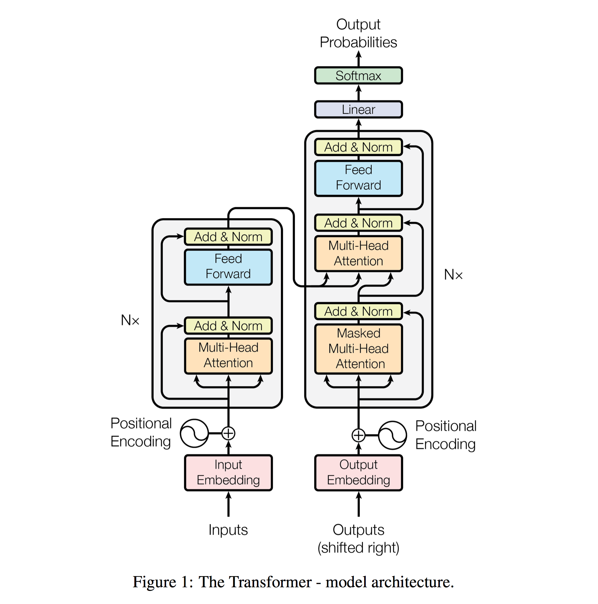

[TOC]

### 极简归纳

Attention并非一个具体的网络或者层，它是一种“机制”，一种在encoder-decoder结构中计算上下文向量的思路。Transformer则是一个具体的网络，其中一个重要的部分是self-attention，这里的self-attention可以当成一个模块。

要搞明白attention的提出，可以沿着“翻译器”的发展史来学习。首先出现了RNN网络，接下来为了实现不等长输入输出，出现了encoder-decoder结构和上下文向量，再之后为了拓展上下文向量的记录能力，出现了attention思想。attention在具体实现中还有很多细节问题可以讨论。

建立在上述内容的基础上，transformer是一个非常复杂的模型，它对attention思想的具体实现被称为self-attention结构。

### 参考 

从RNN到Encoder-Decoder，再到Attention：https://zhuanlan.zhihu.com/p/28054589

对于Attention中的权重$a_{ij}$如何计算，给出了细节；之后还给出了attention的更多种类：https://zhuanlan.zhihu.com/p/380892265

上文中关于global attention和local attention说的不够清楚，这个清楚一些：https://blog.csdn.net/weixin_40871455/article/details/85007560

transformer讲解，侧重attention的矩阵乘法：https://zhuanlan.zhihu.com/p/311156298

self-attention的内在原理讲解：https://www.zhihu.com/column/p/410776234

同样是self-attention，内容不多，但有很多好看的无水印图：https://blog.csdn.net/Lamours/article/details/125192046

transformer的另一个讲解，细节很多：https://zhuanlan.zhihu.com/p/338817680

更多关于transformer的图：https://blog.csdn.net/weixin_44305115/article/details/101622645

Transformer全过程详解：《BERT基础教程：Transformer大模型实战》

位置编码的性质分析：https://blog.csdn.net/m0_37605642/article/details/132866365

## Transformer

机器翻译（Machine Translation, MT）的发展可以追溯到20世纪40年代，经历了几个主要阶段。早期的机器翻译尝试基于规则，依靠语言学家编写的大量语法和词汇规则来转换源语言到目标语言。随着计算能力的增强和数字文本数据的爆炸性增长，基于统计的方法开始流行。这种方法不再依赖于硬编码的语言规则，而是通过分析大量的双语文本语料库（称为平行语料库）来学习词汇之间的统计关系。

随着深度学习技术的兴起，基于神经网络的机器翻译开始发展，特别是循环神经网络（RNN）和长短期记忆网络（LSTM）被用来处理序列到序列的任务。NMT能够学习从源语言到目标语言的端到端映射，而不需要复杂的特征工程。这种方法又统一采用了编码器-解码器（encoder-decoder）架构。这种架构是为了处理序列到序列（Seq2Seq）的任务，可以理解为编码器将输入翻译成某种“机器语言”，解码器再将“机器语言”翻译出需要的输出。

Transformer模型同样处理序列到序列的任务，当然也包括机器翻译。大体上讲，它依然遵循encoder-decoder架构，但编码解码过程与过去完全不同。接下来我们详细描述Transformer的过程。摆一个全流程图镇楼：

### 准备工作

#### 词向量嵌入

将一个句子拆解成多个token（一个token可以看作是一个“词素”，它未必是一个词，但在理解时可以等同视之），每个token转变成一个向量，设其维数为$d$。那么一个句子（作为一个样本）实际上表示为token数$×d$的矩阵。为了方便，将token数记为$c$。

#### 位置编码

当机器见到句子的嵌入矩阵的时候，矩阵的行与行之间实际上是相互独立的。但作为语言，词汇的顺序非常重要，因此除了嵌入矩阵还得把单词的顺序也送进模型。这就是位置编码的作用，每个token的位置编码同样是一个维数为$d$的向量。

“Attention Is All You Need”的作者使用了正弦函数来计算位置编码：

$$
P(pos, 2i) = \sin \left( \frac{pos}{10000^{\frac{2i}{d}}} \right) \\
P(pos, 2i+1) = \cos \left( \frac{pos}{10000^{\frac{2i}{d}}} \right) \\
$$

其中pos表示该词在句子中的位置（从0开始计数），$i$是分量编号。位置pos处的token转化为位置编码是$P(pos)=\big(P(pos,0),P(pos,1),P(pos,2),\cdots\big)$。

一个句子经过位置编码，得到的也是一个$c\times d$的矩阵。

### 编码器Encoder

Transformer中的编码器不止一个，而是由一组N个编码器串联而成，一个编码器的输出作为下一个编码器的输入。每一个编码器的构造都是相同的，并且包含两个部分：多头注意力层和前馈网络层。

输入编码器的是句子的嵌入矩阵+位置编码矩阵，仍是一个$c\times d$的矩阵。

#### 自注意力机制

根据输入矩阵$X$，分别计算查询（query）矩阵$Q=XW_Q$、键（key）矩阵$K=XW_K$，以及值（value）矩阵$V=XW_V$三个矩阵。权重矩阵$W_Q,W_K,W_V$都是$d\times d_1$的矩阵，因而$Q,K,V$是$c\times d_1$的矩阵。关于$d_1$是多少，是否等于$d$，不同教程中给的例子不一样。为了便于理解和描述就当作一样吧。

我们先计算$QK^T$，它是$c\times c$的矩阵，它的第$(i,j)$元描述的是第$i$个词对于第$j$个词的相关性（依赖度）。注意该矩阵并不对称。

接下来计算注意力矩阵
$$
Z = \text{softmax} \left( \frac{QK^T}{\sqrt{d}} \right) V
$$
其中softmax函数是对行计算，也即其结果每一行的和为1。它也是$c\times d_1$的矩阵。它可以看作是用归一化后的$QK^T$对$V$做了一次加权平均，也即将输入根据其自身元之间的相关性进行了值的调整。如果将矩阵中每个元理解为“信息”，那么计算后的矩阵中每一行（每个词）都会向更相关的信息方向变化。

> 为什么要除以$\sqrt d$？假设$Q,K$都服从标准正态分布，那么$QK^T$的结果会拥有均值0和方差$d$，如果$d$大则$Z$中的元可能过大，因此需要除以$d$来进行归一化。

#### 多头注意力层（编码）

每一个(Q, K, V)组可以看作是从一个角度来衡量词之间的相关性，如同CNN的卷积要进行很多次来捕捉不同的特征，计算注意力也会进行很多次，来提高注意力矩阵的准确性。

假设我们有8个注意力矩阵，即Z~1~到Z~8~，那么可以直接将所有的注意力头（注意力矩阵）串联起来，并将结果乘以一个新的权重矩阵$W_0$，从而得出最终的注意力矩阵，也即Multi-head attention = Concatenate(Z~1~,...,Z~8~) W~0~。

串联后的矩阵Concatenate(Z~1~,...,Z~8~) 形状为$c\times8d_1$，权重矩阵$W_0$则可以调节其维数。我看到的教程中同样没有强调$W_0$的维数，我们把它设成$8d_1\times d_2$，这样依赖多头注意力层给出的结果实际上是$c\times d_2$的矩阵。

#### 前馈网络层

前馈网络由两个有ReLU激活函数的全连接层组成。前馈网络的参数在句子的不同位置上是相同的，但在不同的编码器模块上是不同的。

#### 叠加与归一化

对应图中”Add & Norm“部分，分别在多头注意力以及前馈网络层后出现。叠加和归一组件实际上是先进行残差连接，再进行归一化（这里是Layer Normalization）。公式为
$$
\text{LayerNorm}(X+ \text{MultiHeadAttention}(X))\\
\text{LayerNorm}((X+ \text{FeedForward}(X))
$$
关于残差连接，有一个问题是万一MultiHeadAttenion层FeedForward层之后，X的形状变了该怎么加？这个问题的答案以及Layer Normalization的详细讲解，请看其他笔记（[神经网络训练的技巧](神经网络训练的技巧.md)）。

#### 编码器总结

上面讲述了一个编码器的工作过程，实际上我们有N个编码器，编码器1中得到的输出作为输入，又传入下一个编码器（编码器2），如此循环往复。

这样可以将N个编码器一个接一个地叠加起来。从最后一个编码器（顶层的编码器）得到的输出将是给定输入句子的特征值。

让我们把从最后一个编码器得到的特征值表示为$R$，每个句子（$c\times d$）算出的$R$是一个$c\times d_2$的矩阵。我们把$R$作为输入传给解码器，解码器将基于这个输入生成目标句。

### 解码器Decoder

在编码器部分，我们了解到可以叠加N个编码器。同理，解码器也可以有N个叠加在一起，一个解码器的输出会被作为输入传入下一个解码器。

值得注意的是，编码器将原句的特征值（编码器的输出）$R$作为输入传给所有解码器，而非只给第一个解码器。因此，一个解码器（第一个除外）将有两个输入：一个是来自前一个解码器的输出，另一个是编码器输出的特征值。

解码器的工作过程是，逐步给出下一个词的预测值，这一过程中每一步都要**考虑之前已经给出的词**。也即，第0步，根据特征$R$给出预测的第一个词；第1步，根据$R$和第0步预测的结果给出预测的下一个词……第t步，根据$R$和第0,1,...,t-1步预测的结果给出预测的下一个词……

> 值得说明的是，这个步骤在训练和推理时有所不同。这个“之前已经给出的词”，在训练时由已知的标注/目标句充当，而在推理时才使用自己预测出的句子。训练时，目标句是完整的，需要把“模型不应该接触”的部分遮住才合理，这就是后文“带掩码的多头注意力层”的意义。推理时则是逐步的将之前预测出的结果输入解码器。

这个过程意味着，解码器不仅要接收$R$作为输入，还要接收已有/已知的预测结果，它有两个输入。

#### 带掩码的多头注意力层

考虑训练时的情况，我们要把英语句子I am good转换成法语句子Je vais bien。此时作为句子，它们都是$3\times d$的矩阵，$d$是token的嵌入维度。

解码器将输入的<sos>作为第一个标记（代表“start of sequence”），并在每一步将下一个预测词与输入结合起来，以预测目标句，直到遇到<eos>标记（代表“end of sequence”）为止。因此，我们只需将<sos>标记添加到目标句的开头，再将整体作为输入发送给解码器。也即在目标句的开头加上<sos>标记，并将<sos> Je vais bien作为输入发送给解码器。希望解码器预测输出为Je vais bien <eos>。

输入目标句时，也不是将输入直接送入解码器，而是将其转换为嵌入矩阵并添加位置编码，然后再送入解码器。由于添加了开头标记<sos>，输入的矩阵实际上是$4\times d$形状的。解码器的第一部分同样是个多头注意力层，与编码器的别无二致。

然而，模型预测时的注意力应该只与待预测词之前的单词有关，而不是目标句中的所有单词。比如预测vais时应该只知道当前已有的目标句是<sos> Je（而不是<sos> Je vais bien或者<sos> Je vais）。所以需要在过程中加入一些掩码来避免模型“看到”目标句后面的单词。

考虑到$QK^T$描述了词和词之间的相关性，掩码加在它上面最好不过了。只要将该矩阵变成下三角阵，右上角全部遮住，就实现了“预测第$i$元时只能看到前$i$个元”。注意主对角线是保存的，因为加了起始符<sos>的缘故，第$i$个要预测的词实际上是句子里的第$i+1$个词，它需要用到第$i$个词。在实现中，通过将非下三角位置的元全部设为-∞来实现掩码。不用担心数值过小的问题，因为接下来的softmax会让数据分布正规化。

用这个带掩码的$QK^T$同样可以计算出注意力矩阵Z，叠加多个得到$M=\text{Concatenate}(Z'_1,...,Z'_h) W'_0$。它的形状记为$s\times d_3$，其中$s$可以看作是目标句的单词数。

上述是训练的情况，测试时呢？书上没有明确写。我认为是这样的：模型需要逐步生成输出序列，每一步生成一个词，并使用之前所有步骤的输出作为下一步的输入。这个过程是迭代的，每一步的输出依赖于之前所有步骤的输出。第0步，输入句仅仅是起始符<sos>；第1步，将起始符+第0步生成的词作为输入，预测序列中的第二个词；依此类推，直到生成序列结束标记或达到预定的序列最大长度。

#### 多头注意力层（解码）

是的，解码器需要两个多头注意力层。它有两个输入，一个来自带掩码的多头注意力层，另一个是编码器输出的特征值。让我们用$R$来表示编码器输出的特征值，用$M$来表示由带掩码的多头注意力层输出的注意力矩阵。由于涉及编码器与解码器的交互，因此这一层也被称为编码器−解码器注意力层。

让我们详细了解该层究竟是如何工作的。多头注意力机制的第1步仍然是创建查询矩阵、键矩阵和值矩阵。我们已知可以通过将输入矩阵乘以权重矩阵来创建查询矩阵、键矩阵和值矩阵。但在这一层，我们有两个输入矩阵：一个是R（编码器输出的特征值），另一个是M（前一个子层的注意力矩阵）。应该使用哪一个呢？

答案是：我们使用从上一个子层获得的注意力矩阵M创建查询矩阵Q，使用编码器输出的特征值R创建键矩阵K和值矩阵V。

为什么要用M计算查询矩阵，而用R计算键矩阵和值矩阵呢？因为查询矩阵是从M求得的，所以本质上包含了目标句的特征。键矩阵和值矩阵则含有原句的特征，因为它们是用R计算的。

现在注意一下它们的维数，用M算出来的Q维数是$s\times d_4$（$d_4$是我们给出的第四个维度数记号了，但你还是可以把它当作嵌入维度来简单理解），用R计算出的K、V维数是$c\times d_4$，$QK^T$现在是$s\times c$的，$Z$的形状等同于$QK^TV$也即$s\times d_4$。

又同样，我们可以计算出多个注意力矩阵，将它们串联起来。然后，将结果乘以一个新的权重矩阵，得出最终的注意力矩阵。这个权重矩阵可以调节维数。

#### 解码器总结

前馈网络层&叠加&归一化都与编码器中的完全一样，就不细说了。

由于解码器也是堆叠起来的，所以实际上只有第一个解码器获取到了（经过嵌入和位置编码的）输入矩阵X，后面的解码器获取的都是上一解码器的输出作为这个“X”。

在训练时，目标句已知，可以直接传入解码器。在推理时，则要进行很多次，反复将已经预测出的句子作为输入。

### 后续处理

看看前面给出的结构图，只剩下线性层和softmax层了。此时我们的原句经过编码器和解码器，变成了一个$s\times d_4$的矩阵。

现在，针对$s\times d_4$的矩阵的每一行（视为一个“预测局面”，也即第$i$意味着“我们该预测第$i+1$个词了”），线性层将生成一个logit向量，其维数等于单词表中的词汇量，设为$\alpha$吧。接下来，使用softmax函数将logit向量转换成概率。我们于是得到了$s\times \alpha$的矩阵，其每一行是对一个局面的预测，说明这局面下应该输出什么单词。

在训练时，每个预测单词（概率）会一次性给出，而目标句的长相我们也是知道的，这就可以计算loss了。而推理时，我们要反复进行预测，直到生成序列结束标记或达到预定的序列最大长度。
