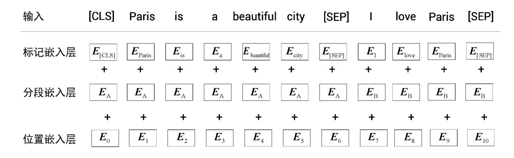

[TOC]

# 思路

BERT是Bidirectional Encoder Representations from Transformers的缩写，意为多Transformer的双向编码器表示法，它是由谷歌发布的嵌入模型。我们可以把BERT看作只有编码器的Transformer，它的目标是将文本转化成合适的嵌入向量，以便接入下游功能头进行其他任务。

BERT的优势在于，相比word2vec这样的嵌入模型（word2vec是一类生成词向量的模型的总称。这类模型多为浅层或者双层的神经网络，通过训练建立词在语言空间中的向量关系），BERT是一个基于上下文的模型，它先理解语境，然后根据上下文生成该词的嵌入值。在不同的句子里，同一个单词可能含义不同，但word2vec会为单词计算出相同的嵌入值，BERT则会根据语境给出不同的嵌入结果。

# 使用

BERT的使用过程中有预训练和微调两个重要环节。假设我们有一个模型m。，首先，我们使用一个大型数据集针对某个具体的任务来训练模型m，并保存训练后的模型。然后，对于一个新任务，我们不再使用随机的权重来初始化新模型，而是用已经训练过的模型m的权重来初始化新模型。也就是说，由于模型m已经在一个大型数据集上训练过了，因此我们不用为一个新任务从头开始训练模型，而是使用预训练的模型m，并根据新任务调整（微调）其权重。

## 预训练

BERT通过在大规模无标注文本上进行预训练来学习通用的语言表示。这一步利用的语料库虽然没有标注，但可以人为创造很多有标注的数据以及训练任务。预训练任务包括两种类型：遮蔽语言模型（Masked Language Model, MLM）和下一句预测（Next Sentence Prediction, NSP）。不过在描述这些任务之前，需要说明一下BERT如何输入。

### 词元分析器WordPiece

计算嵌入向量，首先要把一个句子拆解成很多token，BERT在这一步使用了WordPiece技术。

当使用WordPiece进行分词时，我们首先会检查该词是否存在于词表中。如果该词已经在词表中了，那么就把它作为一个标记。如果该词不在词表中，那么就继续将该词分成子词，检查子词是否在词表中。如果该子词在词表中，那么就把它作为一个标记。但如果子词还是不在词表中，那么继续分割子词。我们通过这种方式不断地进行拆分，检查子词是否在词表中，直到字母级别（无法再分）。这一技术可以处理未登记词（out-of-vocabulary word，OOV word）。

比如，pretraining一词可能不在词表中，但`pre`,`##train`,`##ing`分别在词表中。符号##表示该词是一个子词，而且前面有其他的词。

> WordPiece的词表如何创建？这值得深入描述一下。
>
> 假设我们有一个训练数据集。我们希望根据这个训练数据集创建一张词表，在创建过程中，一些词将被拆开成为子词/词元，以期未来遇到的没见过的词可以被词元组成。
>
> （待完善）

### BERT的输入嵌入

要将一段话输入BERT，仅仅把这段话拆解成token并映射成嵌入向量矩阵是不够的。实际上BERT会首先给每个句子添加标记，然后用了标记嵌入层、分段嵌入层、位置嵌入层三种嵌入，最后输入的是其三种嵌入向量之和。一个例子如下图：

`[CLS]`和`[SEP]`分别标记了段落的开头和句子的结尾。

### 遮蔽语言模型/掩码语言模型/完形填空任务（Masked Language Model, MLM）

在掩码语言模型构建任务中，对一个已知的句子，我们随机掩盖其中15%的单词，并训练模型来预测被掩盖的单词。为了预测被掩盖的单词，模型从两个方向阅读该句，也即正着反着都输入一遍。

前面说了，BERT是计算句子/token的特征向量的，它怎么进行预测？其实是要接一个分类器作为预测头，这个分类器接收BERT计算出的特征向量，给出预测结果。BERT+预测头这个整体训练好了，就算是BERT训练好了。

把一个句子拆解成tokens之后，随机选一些替换成标记`[mask]`，然后让BERT去计算替换后的句子每个token的嵌入向量$R_{token}$。使用softmax激活函数的前馈网络层作为预测头，将$R_{[mask]}$作为输入，并返回词表中所有单词为被掩盖单词的概率。

需要注意的是，如果被遮盖的token是一个子词，比如`##train`，它是pretraining这个词的一部分，那么该子词对应的单词也将被掩盖，这一策略被称为**全词掩码**。同时为了保持15%的掩码率，可以忽略本来选中的其他掩码。

### 下一句预测（Next Sentence Prediction, NSP）

在下句预测任务中，我们向BERT模型提供两个句子，它必须预测第二个句子是否是第一个句子的下一句。

将句子对（句子A和句子B）送入BERT模型，训练它预测句子B与句子A的关系。如果句子B紧跟句子A，则模型返回isNext，否则返回notNext。可见，下句预测本质上是二分类任务。

可以从任何一个单语言语料库中生成数据集。比如，我们有多份文档，从一个文档中抽取任意两个连续的句子，将其标记为isNext；从一个文档中抽取一个句子，并从一个随机文档中抽取另一个句子，将其标记为notNext。需要注意，我们要保证isNext类别和notNext类别的数据各占50%。

将AB句直接拼起来（就像一段话），同样加入`[CLS]`和`[SEP]`标记后送入标记嵌入层、分段嵌入层和位置嵌入层，得到嵌入值，再将嵌入值送入BERT模型，得到每个token的特征值。为了进行分类，只需将`[CLS]`标记的特征值通过softmax激活函数将其送入前馈网络层，然后返回句子对分别是isNext和notNext的概率。

为什么只需要取`[CLS]`标记的嵌入，而不是其他标记的嵌入？因为`[CLS]`标记基本上汇总了所有标记的特征，它可以表示句子的总特征。事实上在设计的时候我们就希望它代表这个段落的“类别”属性。

## 微调

微调并非需要我们从头开始训练BERT模型，而是使用预训练的BERT模型，并根据任务需要更新模型的权重。常见的任务包括文本分类任务、自然语言推理任务、问答任务、命名实体识别任务等等。

对于每个任务，需要给训练好的BERT接一个下游功能头，根据BERT给出的特征向量计算结果。在微调阶段，BERT与下游功能头的参数都会更新。

> 虽然在预训练阶段我们更加关注编码器的更新，在微调阶段我们更加关注任务特定头的更新，但这并不意味着在任一阶段只有编码器或任务特定头的参数被更新。实际上，两个阶段都会对整个模型的参数进行更新，只是焦点和优化目标有所不同。