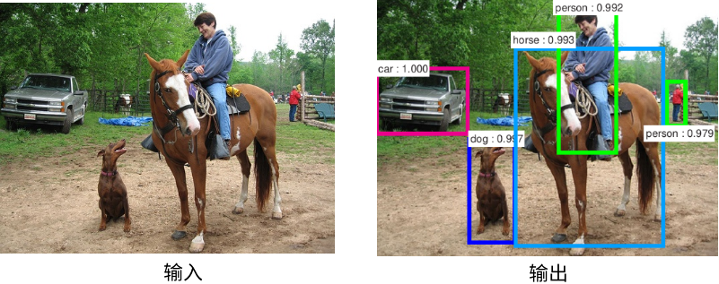
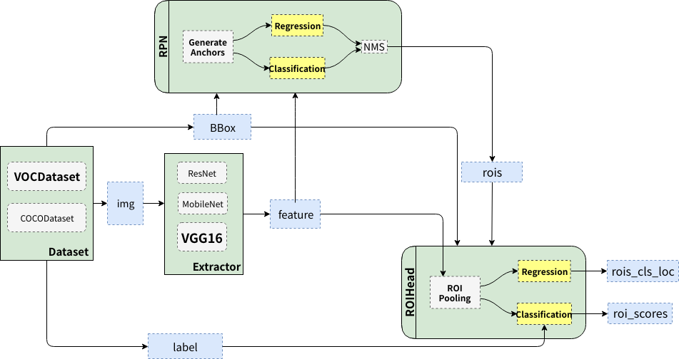
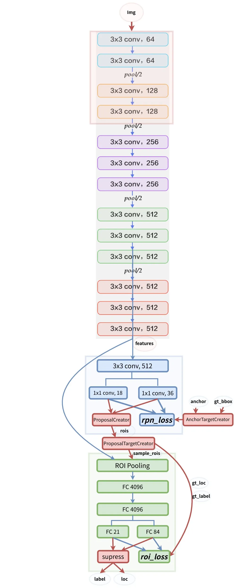
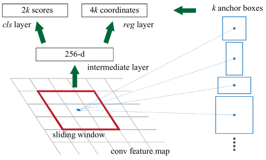
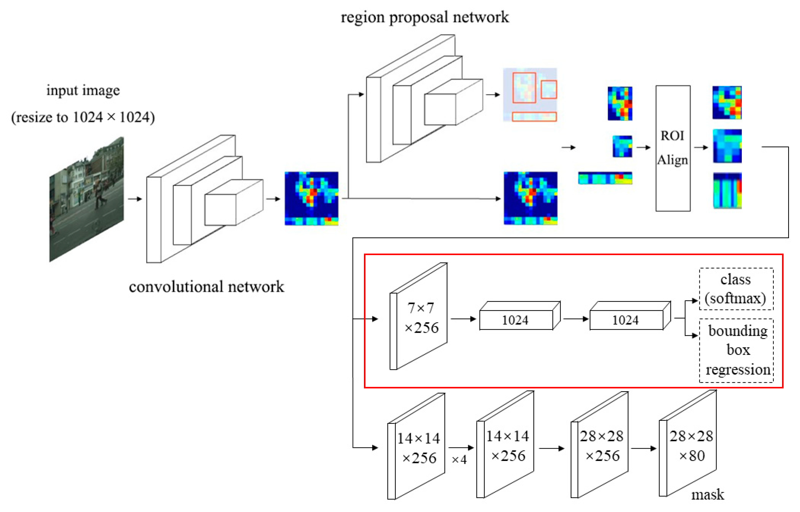

[toc]

# 参考

介绍四种方法：https://zhuanlan.zhihu.com/p/658024219

《PyTorch教程：21个项目玩转PyTorch实践》（王飞 等）

详细说了R-CNN的细节：https://zhuanlan.zhihu.com/p/95097250

非极大值抑制：https://zhuanlan.zhihu.com/p/382831616

Faster RCNN的细节：https://zhuanlan.zhihu.com/p/31426458

Mask RCNN的结构图：https://zhuanlan.zhihu.com/p/651009999

结合代码进行Faster-RCNN的全过程讲解：https://zhuanlan.zhihu.com/p/32404424

讲述了torchvision的nms函数用法：https://blog.csdn.net/level_code/article/details/131245680

pytorch实现Faster R-CNN：https://github.com/chenyuntc/simple-faster-rcnn-pytorch/tree/master

# R-CNN

Region-CNN是目标检测领域的第一个深度学习模型。其核心思路如下图

RCNN算法流程可分为4个步骤，对每张图片：

1、生成多个候选区域（使用Selective Search方法）；
2、对每个候选区域，使用卷积层提取图片特征；
3、特征送入SVM 分类器，判别该选区属于的类别，顺便删除重复候选框；
4、对特征使用回归方法，精细修正候选框位置。

接下来介绍一些环节中的细节。为了便于直观理解，设定一些值：检测出的目标共有20个类别（外加一类是背景）；初始划分出2000个目标候选区。

### 寻找候选区(Region of interest，Proposal)

最传统的做法只能处理单一目标图片，使用不同大小的滑窗，依次滑过图片，每次计算当前位置的得分（可用分类任务的概率得分），最终留下得分高的窗口。这是种非常暴力的方法。

R-CNN利用了 Selective Search 算法来生成候选区，这一算法的主要思想：图像中物体可能存在的区域应该是有某些相似性或者连续性的。于是，首先对输入图像进行分割算法产生许多小的子区域；其次，根据这些子区域之间相似性（相似性标准主要有颜色、纹理、大小等等）进行区域合并，不断的进行区域迭代合并。每次迭代过程中对这些合并的子区域做bounding boxes（外切矩形），这些子区域外切矩形就是通常所说的候选框。

现在还有个疑问：最开始的小区域是怎么来的？这是根据[Efficient Graph-Based Image Segmentation](https://link.zhihu.com/?target=http%3A//people.cs.uchicago.edu/~pff/papers/seg-ijcv.pdf)得到的，就不细讲了。

在合并小区域时，相似度具体怎么计算？参考https://zhuanlan.zhihu.com/p/95097250。

### 提取图片特征

把候选区看作一个新的图片，可以套用成熟的CNN类网络来提取特征。值得注意的是成熟的网络往往限制了输入的图片尺寸，在R-CNN中，当区域尺寸与CNN输入不一致时，会直接将区域变换到成合适的尺寸。变换也就是伸缩与裁剪，这当然导致了精度的丢失。

### 判定选区类别并删除重复选区

用SVM对候选区的特征进行分类是乏善可陈的。在原论文中，有20个SVM来分别计算候选区属于20个类别的概率，归入概率最大的一类。（这样的SVM如何训练？好像只能用一些人工标注好的数据提前训练好）

值得关注的是，Selective Search 得到的候选框很可能是在一定程度上重合，同一个物体被多个候选框选中了多次，这时我们用非极大值抑制（Non-Maximum Suppress，NMS）算法来解决这个问题。对于2000个候选框应用SVM后，得到的应该是2000*20的矩阵，记录了每个框属于每个类别的概率。采用如下的流程来处理：

1、对于每一个集合类别，按类别分数从高到低对选区进行排序，得到20个降序列表 list；
2、从 list 中取得第一个元素（分数最高），逐个计算该元素与列表中剩余元素的IoU（交并比），若IoU大于给定阈值则将该元素从列表总剔除，同时将第一个元素保留；
3、对处理过后的降序列表 list 重复执行步骤2，直至 list 为空；
4、对每一个类别都执行步骤2~3，直接遍历完所有的类别。

这样操作之后，重复度高的选区都被删除了，只剩下寥寥几个候选区。

### 使用回归器精细修正候选框位置

对 NMS（非极大值抑制）处理后剩余的候选框进行进一步处理，我们希望它的位置更精确。具体来说，我们希望训练一个回归器，它接收候选框（以绝对位置x,y与高宽h,w来表示），输出x和y方向的偏移量，以及高度和宽度的缩放值。（这又如何训练？好像只能用一些人工标注好的数据提前训练）

### 损失函数

对预测概率p=(p~1~,...p~20~)，真实类别标签u，预测边框t=(t~x~,t~y~,t~w~,t~h~)，实际边框v=(v~x~,v~y~,v~w~,v~h~)，损失函数为

$$
L(p,u,t,v)=L_{cls}(p,u)+\lambda I[u\ge1] L_{loc}(t,v)
$$

其中L~cls~是分类的损失，用交叉熵来计算。但这里是20个分类器一起判断，只考虑分对的那个，也即$L_{cls}=-log(p_u)$.

后半部分是边界框的回归损失，λ是一个平衡系数，$I[u\ge1]$表示当u≥1 时为1，否则为 0。u≥1说明候选区域确实是目标，u=0说明该框内是背景，就不用管损失了。L~loc~由描述边框的四个分量的 smooth-L1损失相加而成。

# Fast R-CNN

顾名思义，Fast R-CNN比R-CNN快得多，算法流程分三个步骤：

1、一张图像生成1k～2k个候选区域（使用 Selective Search 方法）；
2、对整个图像使用卷积层，得到特征图，再将 Selective Search 算法生成的候选框投影到特征图上获得相应的特征矩阵；
3、将每个特征矩阵通过 RoI pooling 层缩放为$ 7 \times 7$大小的特征图，接着将特征图展平通过一系列全连接层获得预测结果；
4、特征送入SVM 分类器，判别该选区属于的类别，顺便删除重复候选框
5、对特征使用回归方法，精细修正候选框位置

实际上是将R-CNN的步骤2（每个选区分别提取特征）换成了新的步骤2、3（在总特征图上划分特征）来加速特征提取，其余部分不变。接下来着重说2、3步骤也就是RoI pooling做的事情。

### RoI pooling

RoI pooling的目的是将原图缩放到统一的大小。在RoI pooling之前，得到的应该是一系列选框（称为RoI, region of interest，或者叫Proposal），每个RoI实际是五维张量(id,x,y,w,h)。此外还有全图的特征图（原图尺寸*多个通道）。

通过在特征图上按照RoI的(x,y,w,h)划出区域，就得到了属于该RoI的投影——一个多通道的RoI特征图（形状为(x',y',w',h')）。这一步称为RoI投影。

> 举个例子，比如通过RPN得到了一个目标区域，它在原图上的左上角坐标是(10,10)，右下角的坐标是(124,124)，对应要映射的特征层相对原图的放缩规模为32。那么要在特征图上抠出来的区域左上角就是(0,0)，右下角是(4,4)，这分别是由10/32=0和124/32=4四舍五入而来。

接下来要通过RoI池化来将投影转化成定长的特征向量。

> RoI池化的前身是SPP Net中的金字塔池化（Spatial Pyramid Pooling，SPP），它的过程可以用如下例子理解：一张特征图的形状为(w,h,c)，首先将它均分成4×4的网格，每个网格的形状是(w/4,h/4,c)，针对4×4的网格做一次最大值池化，则每个通道获得16个值，共得到16c个特征。同理再划分出2×2和1×1来做最大值池化，最后共得到16c+4c+c=21c个特征。由于c是固定值，所以针对不同尺寸的特征图所得出的特征向量长度是固定的。

RoI池化与SPP不同，它面对每个形状为(w,h,c)的特征图（投影），将其划分成7×7的网格，执行最大值池化，得到了49c维的特征向量。现在，经过RoI pooling层后，形状为(id,x,y,w,h)的五维张量RoI和形状为(w,h,c)的特征图，得出了形状为(id, 49c)的RoI特征。

### 末端改变

此外，Fast R-CNN在末端使用全连接层+softmax来取代SVM作为分类器，回归器也用全连接层。

关于末端网络层如何根据特征图P得出调整后的边界框参数，参见下图：

# Faster R-CNN

为了进一步加快模型训练，Faster R-CNN用区域生成网络（Region Proposal Network, RPN）取代了selective search算法。

与Fast R-CNN相比，不同之处仅仅在于改变了检测框的提取方式。下面描述Faster-RCNN的工作全过程。

代码参考的是：https://github.com/chenyuntc/simple-faster-rcnn-pytorch/tree/master。它与原文的实现不完全相同，但自称效果一样好。

## 数据处理

本例子采用的数据集是VOC2007。训练使用的每张图片含有多个标注好的识别对象，用bounding boxes框起来，每个bounding box有对应的标签。

对每张图片，需要进行如下数据处理：

- 图片进行缩放，使得长边小于等于1000，短边小于等于600（至少有一个等于）。
- 对相应的 bounding boxes 也也进行同等尺度的缩放。
- 对于Caffe 的VGG16 预训练模型，需要图片位于0-255，BGR格式，并减去一个均值，使得图片像素的均值为0。

最后，对于一个有K个目标的图片，返回四个值供模型训练：

- images ： 3×H×W ，BGR三通道，宽W，高H
- bboxes： 4×K ,   K个bounding boxes，每个bounding box的左上角和右下角的坐标，形如（Y_min,X_min, Y_max,X_max）,第Y行，第X列。
- labels：K， 对应K个bounding boxes的label（对于VOC取值范围为[0-19]）
- scale：缩放的倍数, 原图H' ×W'被resize到了HxW（scale=H/H' ）

## 整体架构

以下两图来自[陈云](https://zhuanlan.zhihu.com/p/32404424)。前者描述思路，后者描述程序。

> 第二张图描述的是训练过程，而不是推理。

Faster R-CNN整体的流程可以分为三步：

1. 提特征： 将图片（`img`）输入预训练的网络（`Extractor`），提取出图片的特征（`feature`）。在实现中，Extractor采用的是VGG16。

2. Region Proposal： 利用提取的特征（`feature`），经过RPN网络，找出一定数量的`rois`（region of interests）。这一部分除了要用到Extractor提取出来的特征，还要用到数据的bbox这一标签。

3. 分类与回归：将`rois`和图像特征`features`，输入到`RoIHead`，对这些`rois`进行筛选和分类，判断都属于什么类别，同时对这些`rois`的位置进行微调，得出最终预测框位置。

### Extractor

这一部分将原图片集转化成特征图集，它输出的一个batch形状应该为(N,C,H,W)。

### Region Proposal

这一步利用区域生成网络RPN实现。RPN可以拆解为卷积、锚框生成、计算锚框评分和修正值、生成RoI几个部分。另外，根据RPN的结果可以计算RPN损失。

#### 卷积

RPN的输入是原图特征图（在卷积的作用下会有多个），输出多个候选框坐标。设原始图片的一张特征图记为F1，形状为(c,w,h)，c是特征图个数。在F1上再使用一次$3\times3$的卷积得到(m,w,h)的特征图F2，现在F2上的一个点(x,y)代表原图的一个区域，它拥有一个512维的向量作为特征。（值得说明的是，这里的m其实是可以指定的，原文中是512，它与backbone的通道数一致，如果用VGG16为512个通道，ZF网络则是256个通道。）

这里为什么要再用一次卷积？不知道。猜测是将特征空间改变一下，使之更适合当前任务。

#### 锚框生成

对于F2上的一个点(x,y)，我们考虑以他为中心的$k$个不同大小的锚框（anchor box）。在论文中，锚框的面积为{128^2^,256^2^,512^2^}三种，长宽比为{0.5,1,2}三种，实际用了k=3*3=9个锚框。对特征图上的每一个点都要考虑如此的多个锚框，对于大小为h×w=K的特征图，实际得到K×9个框，还要计算出它们在原图上的坐标。最终得到的RoI是在锚框基础上修正而来的。

> 在代码层面，如果说标准的anchor的长宽都是base_size，那它就是(0,base_size,0,base_size)。指定变化规模scale和长宽比ratio，则中心点(py=base_size/2,  px=base_size/2)不变，anchor的尺寸要变为原本的scale倍，同时要在面积不变的情况下将长宽比拉成ratio。
>
> 变为原本的scale倍意味着h,w乘以scale，长宽比拉成ratio意味着h乘以√ratio、w除以√ratio。变形后的anchor就是(py-h’/2,px-w‘/2,py+h’/2,px+w‘/2)
>
> 遍历一切ratio和scale进行上述操作，就会得到k个四维向量，表示一切锚框的坐标。
>
> 另外，由于特征图和原图的尺寸不一样，一个“框”在二者上面有不同的标记。如果将特征图上的框用loc记，原图上的用bbox记， 代码中会根据需要将loc转化成bbox，但后面描述思路的时候可能不会特地指出这一点，需要注意。

#### 计算锚框评分和修正值

对每个点(x,y)的每一个锚框，都要计算出2个分数（前景or背景的概率）和4个坐标（loc，它是预测框的位置修正值）。分数会用来筛选锚框以及计算loss；预测框修正值用于修改锚框的边界，使之更合理。在具体实施中，是对F2分别施加以两个$1\times1$的卷积层，各自得到(w,h,2k)与(w,h,4k)的“特征”，分别描述了k个锚框捕捉到的RoI的类别与修正值。

#### 生成RoI

这一步根据每个点(x,y)、每个锚框的(w,h,2k)与(w,h,4k)的“特征”，计算出RoI。

目前我们有w×h个点，每个点k个锚框。代码层面使用ProposalCreator进行下面的工作。首先将修正值应用于锚框，此时锚框的大小已经和设定的“标准”不同了，此时把他们称为候选RoI更合适。候选RoI总数应该是w×h×k这么多。

> 关于修正值与边界的运算关系，与Fast-RCNN的末端改变部分所述是类似的，但不同文章的记号不同，所以这里再啰嗦一下：
>
> 把一个锚框看作识别候选框，用四条边的位置$(p_{ymin},p_{xmin},p_{ymax},p_{xmax})$来表示，我们希望得到修正值$(t_y,t_x,t_h,t_w)$，有了修正值后，最终得到的RoI由以下公式确定
> $$
> \begin{aligned}
> 	p_h &= p_{ymax}-p_{ymin} \\
> 	p_w &= p_{xmax}-p_{xmin} \\
> 	p_{ycenter} &= p_{ymin} + 0.5p_h \\
> 	p_{xcenter} &= p_{xmin} + 0.5p_w \\
> 	g_{ycenter} &= t_y p_h + p_y \\
> 	g_{xcenter} &= t_x p_w + p_x \\
> 	g_h &= p_h \exp(t_h) \\
> 	g_w &= p_w \exp(t_w) \\
> \end{aligned}
> $$
> 现在$(g_{ycenter},g_{xcenter},g_h,g_w)$描述的就是修正后的RoI框框了。
>
> 为什么修正值不是直接作为系数乘或者加在原本的$p_h,p_w$等等上面，我也不知道，推测是为了控制修正值的幅值不要太大。但不得不说这个修正不太直观。讲解中只说这样比直接回归坐标更好。

接下来要对这么多的RoI进行筛选。首先去除长宽过小的（需要设定参数min_size）；其次去除前景得分低的，只保留前景分数最高的n_pre_nms个（这个值是超参数，且训练与推理时设不同值）；最后使用NMS算法，得到最终保留的RoI.

> 关于NMS算法，可以调用[torchvision.ops.nms](https://pytorch.org/vision/stable/generated/torchvision.ops.nms.html)。其原理此处不再赘述。
>

RPN网络最终的返回值当然是找到的全部RoI，此外每个点每个锚框的坐标、前景/背景得分、修正值等也会返回。

### RoIHead

RoIHead是一个预测头，它将进一步对RPN得出的RoI进行筛选，得出最终的预测框，计算它们属于各个类别的得分，同时计算RoI loss。

RoIHead的第一个操作是对RoI们进行RoI Pooling操作，这一操作会根据RoI坐标在特征图上提出相应的特征投影，然后将该投影分成7×7个部分来计算特征，一个RoI会得到49c维的向量，其中c是特征图通道数。详细过程已经在Fast R-CNN部分说明过了，实现可以直接调用[torchvision.ops.roi_pool](https://pytorch.org/vision/stable/generated/torchvision.ops.roi_pool.html)函数。

RoI Pooling后，原本的R个RoI变成了R个49c维的向量，也即(R,49c)的数组，它便蕴含了RoI们的全部信息。我们的计算目标是RoI的类别和位置，于是对(R,49c)的数组加以两个不同的线性层，分别是：

- FC 21 用来分类，预测RoIs属于哪个类别（20个类+背景）
- FC 84 用来回归位置（21个类，每个类都有4个位置参数） 

最终得到(R,21)的分类结果和(R,84)的预测框位置结果。

## 网络训练

### 训练流程

训练过程本质上是如何根据一个batch的数据计算一个loss，为了简单，也是为了可操作性，只考虑batch_size=N=1的情况，也即每次只输入一张图片进入网络。

输入的数据实际上是(imgs, bboxes, labels, scale)，分别表示

- imgs：(N, C, H, W)的数组，包含N张(C, H, W)图片的数组；
- bboxes：(N, R, 4)的数组，记录了每张图片中的R个人工标注的目标框（ground truth bounding box）。事实上我们没法保证不同的图都是R个目标，所以才只能考虑N=1；
- labels：(N, R,)的数组，记录了每张图片中的R个目标类别。对于有L个类别的数据集，类别编号是0~L-1，L则代表背景，在VOC2007这个数据集中，L=20；
- scale：放缩比例。原图高宽×scale=实际输入图片高宽。

第一步，将imgs输入特征提取器，得到特征图F1。

第二步，将特征图输入RPN，得到一系列RoI与相关数值。为了衡量这些RoI是否准确，需要用这些算出来的RoI与真实的边界框（ground truth bounding box）进行比较。

一张图的ground truth bounding box是已知的，但是RPN得到的RoI有很多（大约2000个），对训练来说太多了，所以我们加入一步筛选，从中选出n_sample=128个作为“样本RoI”以便后续计算loss。选择的规则如下：

- 计算每个RoI与已知的bbox的IoU值（第i个RoI和第j个bbox会算出一个IoU，最终结果是一个矩阵）。对于一个RoI，如果它与每个bbox的IoU高于某个阈值（如0.5），那么它是正样本，是前景；如果它与任意bbox的IoU都很低，则它是负样本，是背景。
- 从正样本中选一些，其数量是n_sample * pos_ratio，负样本中也选一些，其数量自然是n_sample * (1- pos_ratio)了。
- 为正负样本添加标签，正样本的标签是其类别编号，此时1~L是类别，背景是0，负样本自然是0

这一步由proposal_target_creator完成，它最终给出128个“样本RoI”，以及它们“应该具有的修正值”（用真实预测框反推），以及预测类别。

第三步，把样本RoI输入网络的RoIHead，得到它们的预测类别与最终预测框位置。如果样本是正样本/预测类别是前景，则计算损失时考虑其位置，如果是负样本/背景就不考虑位置。

现在，可以来计算loss了。loss分为RPN损失和RoI损失两部分。

### RPN 损失

RPN网络的损失要反映RoI或者说anchor的准确性。由于全部anchor太多了，我们选一部分（256个）出来进行loss计算。

> 这里我有一个疑问，为什么不选一部分RoI出来而是要选anchor？毕竟anchor的确定是由超参数决定的，RPN的参数主要集中在根据anchor计算分类得分和预测框修正值的卷积层上，应该根据卷积的结果来计算loss才对吧。

对anchor的选择由`AnchorTargetCreator`进行，从20000多个候选的anchor选出256个作为“样本anchor”，并返回其对应的真实预测框（反推出修正值）和类别。它需要的参数包括全体anchor、当前图片的所有ground truth bounding box、外加图片的size=(H,W)选择过程如下：

- 对于每一个ground truth bounding box (`gt_bbox`)，选择和它重叠度（IoU）最高的一个anchor作为正样本
- 对于剩下的anchor，从中选择和任意一个`gt_bbox`重叠度超过0.7的anchor，作为正样本，正样本的数目不超过128个。
- 随机选择和`gt_bbox`重叠度小于0.3的anchor作为负样本。负样本和正样本的总数为256。

现在才开始计算RPN的损失分，它为两个部分，分类损失和边界框回归损失，在下式中前一部分为分类（前景or背景）损失，后一部分是边界框回归损失
$$
L(\{p_i\},\{t_i\}) = \frac1{N_{cls}} \sum_i L_{cls}(p_i,p_i^*)
+ \lambda \frac1{N_{reg}} \sum_i p_i^*L_{reg}(t_i,t_i^*)
$$
其中：
$p_i$表示第$i$个样本anchor预测为前景的概率；$p_i^*$表示第$i$个样本anchor为前景/背景的真实标签（前景为1背景为0）；$L_{cls}$是交叉熵函数；$N_{cls}$表示一个mini-batch中的所有样本数量256。这一部分在评价计算anchor的前景or背景评分的那个卷积层。

$t_i$表示预测第i个样本anchor的边界框修正值；$t_i^*$表示第i个样本anchor对应的实际修正值（由真实预测框反推）；$L_{reg}$是smooth-L1函数；乘以$p_i^*$意味着只计算前景的anchor；$N_{reg}$表示前景anchor的个数，也即实际标签为1的anchor；$\lambda$是一个平衡系数，论文中取10，但我看代码里没有。

### RoI损失

RoI损失与RPN损失完全类似，RPN计算的是anchor的损失，RoI损失则是在计算RoI的。RoI不需要经过筛选。

回顾之前的训练流程，我们已经筛选出了“样本RoI”，用它替换“样本anchor”就可以得到loss计算公式了。样本RoI对应的真实类别、真实预测框（真实修正值）都已经得到，所以可以计算出RoI的分类损失与预测损失。

### 参数迭代

> 下面这段话复制自某个教程，但我在看代码时并没有发现这这一过程，或许这是原论文所描述的。不管怎么说我保留了这一段。
>
> 把网络分为三部分，提取原始图片特征的是CNN，从特征图上找RoI的是RPN，根据特征图与RoI作为分类的是Fast- RCNN。
>
> 1、通过ImageNet pre-trained model初始化CNN，然后端到端fine-tuning RPN部分。
>
> 2、固定住RPN，然后通过RPN产生的region proposal来训练Fast R-CNN部分。
>
> 3、固定住CNN和Fast R-CNN来fine-tuning RPN网络。
>
> 4、固定住CNN和RPN来fine-tuning Fast R-CNN网络。

# Mask R-CNN

Faster R-CNN的RoI pooling是粗粒度的空间量化特征提取，不能做输入和输出pixel-to-pixel的特征对齐，并且不能直接应用于实例分割。于是Mask R-CNN提出用RoIAlign来替代RoI pooling，得到pixel-to-pixel的特征对齐，并且在Faster R-CNN框架的基础上简单的增加了一个mask分支就能实现实例分割。

整个网络的思路如下：

1、先将图片输入CNN得到featmap；
2、然后通过RPN产生RoI；
3、然后将每个RoI送入RoI Align层（作用与RoI pooling类同）转化成相同维度的向量；
4、最后通过两个独立的FC，预测出类别class和位置box，同时通过mask分支预测出分类分数前N个RoI的分割mask。

只看整体流程，似乎与Faster RCNN是相同的。

下面详细描述Mask R-CNN与Faster RCNN不同的地方。

### mask预测头

这部分其实就是一个FCN，也即通过卷积与反卷积操作，输出一张图作为掩码。更具体一点，是输出(c,h,w)形状的张量，表示每个像素点属于每个类别的概率。然而，我们并不根据概率去判断类别，而是根据class预测头来判断类别，然后只看该类别的预测概率，生产掩码图。

### RoI Align

RoI Align层和RoI pooling一样，都是为了目的是将特征图缩放到统一的大小，后续进一步转化成特征向量，以传入后续预测头。

RoI pooling在处理时，会将原图均分成k×k几个小方块来提取特征，然后原图的尺寸无法被k整除时，是直接取整（quantization）操作的，这样会出现误差。RoI Align希望解决这个问题。

> 回顾RoI pooling时的例子：假设通过RPN得到了一个Proposal，它在原图上的左上角坐标是(10,10)，右下角的坐标是(124,124)，对应要映射的特征层相对原图的步距为32，通过RoIPool期望的输出为2x2大小。将Proposal映射到特征层上，左上角坐标10/32四舍五入后等于0，右下角坐标124/32四舍五入后等于4，即映射在特征层上的左上角坐标为(0,0)，右下角坐标为(4,4)。对应下图特征层上从第0行到第4行，从第0列到第4列的区域。这是第一次quantization。
>
> 由于期望的输出为2x2大小，所以需要将映射在特征层上的Proposal划分成2×2大小的区域。但现在映射在特征层上的Proposal是5x5大小，无法均分，所以强行划分后边长实际是3和2。这是第二次quantization。

为了排除取整操作，RoI Align的做法是，在计算对应关系时保留小数，直到最后要读取像素点值时，采用双线性插值的方法来计算。再次使用刚才的例子来说明不同：将Proposal映射到特征层上，左上角坐标(0.3125,0.3125)，右下角坐标(3.875,3.875)，划分成2×2区域后，第一个小区域的范围是(0.3125,0.3125)到(2.09375,2.09375)。这个小区域的采样点为为该区域的中心点坐标为(1.203125,1.203125)，然后找出离该采样点最近的四个点(1,1)(1,2)(2,1)(2,2)，用双线性插值法获得(1.203125,1.203125)处的值。

细节见：https://blog.csdn.net/qq_37541097/article/details/123754766

### 损失函数

Mask RCNN相当于在Faster RCNN的基础上加上了一个Mask分支，那么Mask RCNN的损失即为Faster RCNN损失加上Mask分支的损失，也即$L=L_{rpn}+L_{fasterRCNN}+L_{mask}$。RPN部分的损失前面已经说过；fasterRCNN指的是什么，没看懂，还需要继续研究。

mask部分的损失可以参考FCN如何计算，本质上是一个交叉熵损失。设每个样本的输出是一个(c,h,w)形状的张量，每个像素点都拥有c个类别的预测概率，可以计算该像素点的交叉熵损失，然后对h×w个像素点做平均，就得到了这个样本的总损失。