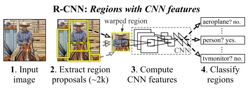
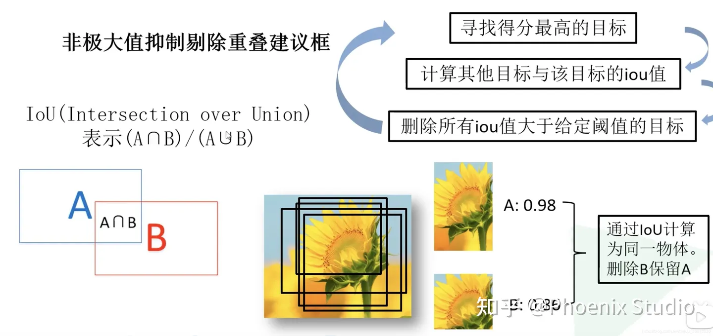
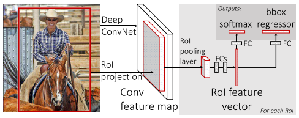
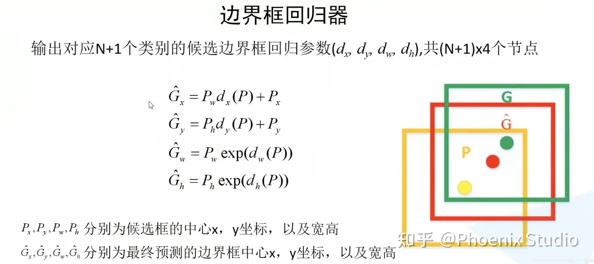
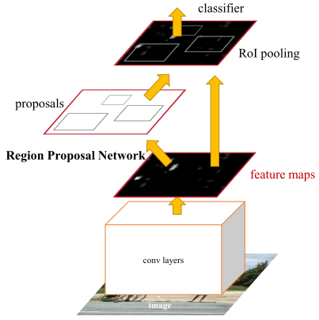

[toc]

# 参考

介绍四种方法：https://zhuanlan.zhihu.com/p/658024219

《PyTorch教程：21个项目玩转PyTorch实践》（王飞 等）

详细说了R-CNN的细节：https://zhuanlan.zhihu.com/p/95097250

非极大值抑制：https://zhuanlan.zhihu.com/p/382831616

# R-CNN

Region-CNN是目标检测领域的第一个深度学习模型。其核心思路如下图

RCNN算法流程可分为4个步骤，对每张图片：

1、生成多个候选区域（使用Selective Search方法）；
2、对每个候选区域，使用卷积层提取图片特征；
3、特征送入SVM 分类器，判别该选区属于的类别，顺便删除重复候选框；
4、对特征使用回归方法，精细修正候选框位置。

接下来介绍一些环节中的细节。为了便于直观理解，设定一些值：检测出的目标共有20个类别（外加一类是背景）；初始划分出2000个目标候选区。

### 寻找候选区(Region of interest)

最传统的做法只能处理单一目标图片，使用不同大小的滑窗，依次滑过图片，每次计算当前位置的得分（可用分类任务的概率得分），最终留下得分高的窗口。这是中非常暴力的方法。

R-CNN利用了 Selective Search 算法来生成候选区，这一算法的主要思想：图像中物体可能存在的区域应该是有某些相似性或者连续性的。于是，首先对输入图像进行分割算法产生许多小的子区域；其次，根据这些子区域之间相似性（相似性标准主要有颜色、纹理、大小等等）进行区域合并，不断的进行区域迭代合并。每次迭代过程中对这些合并的子区域做bounding boxes（外切矩形），这些子区域外切矩形就是通常所说的候选框。

现在还有个疑问：最开始的小区域是怎么来的？这是根据[Efficient Graph-Based Image Segmentation](https://link.zhihu.com/?target=http%3A//people.cs.uchicago.edu/~pff/papers/seg-ijcv.pdf)得到的，就不细讲了。

在合并小区域时，相似度具体怎么计算？参考https://zhuanlan.zhihu.com/p/95097250。

### 提取图片特征

把候选区看作一个新的图片，可以套用成熟的CNN类网络来提取特征。值得注意的是成熟的网络往往限制了输入的图片尺寸，在R-CNN中，当区域尺寸与CNN输入不一致时，会直接将区域变换到成合适的尺寸。变换也就是伸缩与裁剪，这当然导致了精度的丢失。

### 判定选区类别并删除重复选区

用SVM对候选区的特征进行分类是乏善可陈的。在原论文中，有20个SVM来分别计算候选区属于20个类别的概率，归入概率最大的一类。

值得关注的是，Selective Search 得到的候选框很可能是在一定程度上重合，同一个物体呗多个候选框选中了多次，这时我们用非极大值抑制（Non-Maximum Suppress，NMS）算法来解决这个问题。对于2000个候选框应用SVM后，得到的应该是2000*20的矩阵，记录了每个框属于每个类别的概率。采用如下的流程来处理：

1、对于每一个集合类别，按类别分数从高到低对选区进行排序，得到20个降序列表 list；
2、从 list 中取得第一个元素（分数最高），逐个计算该元素与列表中剩余元素的IoU（交并比），若IoU大于给定阈值则将该元素从列表总剔除，同时将第一个元素保留；
3、对处理过后的降序列表 list 重复执行步骤2，直至 list 为空；
4、对每一个类别都执行步骤2~3，直接遍历完所有的类别。

这样操作之后，重复度高的选区都被删除了，只剩下寥寥几个候选区。

### 使用回归器精细修正候选框位置

对 NMS（非极大值抑制）处理后剩余的候选框进行进一步处理，我们希望它的位置更精确。具体来说，我们希望训练一个回归器，它接收候选框（以绝对位置x,y与高宽h,w来表示），输出x和y方向的偏移量，以及高度和宽度的缩放值。

### 损失函数

对预测概率p=(p~1~,...p~20~)，真实类别标签u，预测边框t=(t~x~,t~y~,t~w~,t~h~)，实际边框v=(v~x~,v~y~,v~w~,v~h~)，损失函数为
$$
L(p,u,t,v)=L_{cls}(p,u)+\lambda I[u\ge1] L_{loc}(t,v)
$$
其中L~cls~是分类的损失，用交叉熵来计算。但这里是20个分类器一起判断，只考虑分对的那个，也即$L_{cls}=-log(p_u)$.

后半部分是边界框的回归损失，λ是一个平衡系数，$I[u\ge1]$表示当u≥1 时为1，否则为 0。u≥1说明候选区域确实是目标，u=0说明该框内是背景，就不用管损失了。L~loc~由描述边框的四个分量的 smooth-L1损失相加而成。

# Fast R-CNN

顾名思义，Fast R-CNN比R-CNN快得多，算法流程分三个步骤：

1、一张图像生成1k～2k个候选区域（使用 Selective Search 方法）；
2、对整个图像使用卷积层，得到特征图，再将 Selective Search 算法生成的候选框投影到特征图上获得相应的特征矩阵；
3、将每个特征矩阵通过 ROI pooling 层缩放为$ 7 \times 7$大小的特征图，接着将特征图展平通过一系列全连接层获得预测结果；
4、特征送入SVM 分类器，判别该选区属于的类别，顺便删除重复候选框
5、对特征使用回归方法，精细修正候选框位置

实际上是将R-CNN的步骤2换成了新的步骤2、3来加速特征提取，其余部分不变。接下来着重说2、3步骤也就是ROI pooling做的事情。

### RoI pooling

在RoI pooling之前，得到的应该是一系列选框（称为RoI, region of interest），每个RoI实际是五维向量(id,x,y,w,h)。此外还有全图的特征图（原图尺寸*多个通道）。

通过在特征图上按照RoI的(x,y,w,h)划出区域，就得到了属于该RoI的投影，一个多通道的RoI特征图。这一步称为RoI投影。接下来要通过RoI池化来将投影转化成定长的特征向量。

> RoI池化的前身是SPPNet中的金字塔池化（Spatial Pyramid Pooling，SPP），它的过程可以用如下例子理解：一张特征图的形状为(w,h,c)，首先将它均分成4×4的网格，每个网格的形状是(w/4,h/4,c)，针对4×4的网格做一次最大值池化，则每个通道获得16个值，共得到16c个特征。同理再划分出2×2和1×1来做最大值池化，最后共得到16c+4c+c=21c个特征。由于c是固定值，所以针对不同特征图所得出的特征向量长度是固定的。

RoI池化面对每个形状为(w,h,c)的特征图（投影），将其划分成7×7的网格，执行最大值池化，得到了49c维的特征向量。

### 末端改变

此外，Fast R-CNN在末端使用全连接层+softmax来取代SVM作为分类器，回归器也用全连接层。

关于末端网络层如何根据特征图P得出调整后的边界框参数，参见下图：

# Faster R-CNN

为了进一步加快模型训练，Faster R-CNN用区域生成网络（Region Proposal Network, RPN）取代了selective search算法。算法流程分三个步骤：

1、将图像输入CNN网络得到相应的特征图；
2、使用RPN结构生成候选框，将 RPN 生成的候选框投影到特征图上获得相应的特征矩阵；
3、将每个特征矩阵通过 ROI pooling 层缩放为$7 \times 7$大小的特征图，接着将特征图展平变成特征向量；
4、通过全连接层获得预测结果。

与Fast R-CNN相比，不同之处仅仅在于改变了检测框的提取方式。下面着重描述RPN的工作过程。

### 区域生成网络RPN

RPN的输入是原图特征图，输出多个候选框坐标。