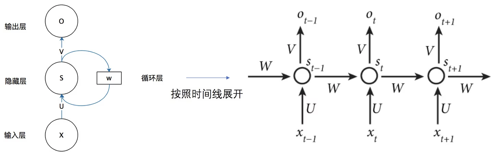
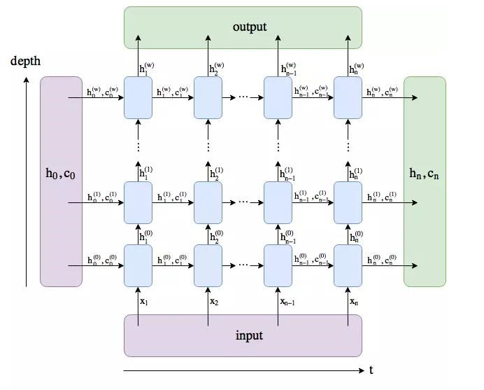

# 循环神经网络极其拓展

循环神经网络（Recurrent Neural Network,  RNN）是一类用来处理“序列”数据的神经网络，它的神经元可以接收同层的信息，可以看做同一层的神经元之间也存在序列关系，在先的会影响在后的。这是有意义的，一个简单的例子是文本分析，在分析“我/吃/苹果”这句话的词性时，如果知道了“吃”是动词，那么“苹果”是名词的概率将大大增加。

## 循环神经网络RNN

### 思路

循环神经网络的结构可以参考下图



其中的$x_t$是输入，$s_t$（也可记为$h_t$）是隐藏层的状态，$o_t$是输出，$U,W,V$是变换时的系数（权重）矩阵。此外还有偏置$b_h,b_o$，激活函数$\phi_h,\phi_o$这些参数。在循环神经网络中，只有一个隐藏层，不过实际上也可以把这一层的每个神经元都看成一层，毕竟它们会产生可传递的影响。

具体来说，在每个时刻$t$，传入参数$x_t$，该时刻的隐藏层状态将会更新为 $$ h_t=s_t=\phi_h(Ux_t+Wh_{t-1}+b_h) $$ 该时刻的输出为 $$ o_t=\phi_o(Vh_t+b_o) $$ 最终得到一系列输出${o_t}$，通过调整参数$W,U,V$等来训练网络。

在理论上RNN可以保留所有历史时刻的信息，但在实际应用中，时间间隔太长将导致信息在传递过程中逐渐衰减，经过多次传递后，信息的实际效益会大大降低了。这意味着普通RNN难以解决信息的长期依赖问题。实际中更常用的是RNN的变体，具有代表性的变体是长短期记忆 (Long Short Term Memory, LSTM) 网络和门限循环单元 (Gated Recurrent Unit, GRU)。

## 长短期记忆网络LSTM

长短期记忆（Long Short Term  Memory）网络是RNN的改进，它不仅可以接收上一时期的数据影响（短期记忆），也可以受很多时期之前的数据影响（长期记忆）。这同样很有意义，比如分析“the clouds are in the sky”时，clouds对预测sky的作用很大，而它们并不是紧挨着的。

以下思路讲解来自[1](https://colah.github.io/posts/2015-08-Understanding-LSTMs/)，翻译可以查看[2](https://zhuanlan.zhihu.com/p/104475016)与[3](https://www.cnblogs.com/xuruilong100/p/8506949.html)。

### 思路

LSTM的图解如下：


图中的A可以对标RNN中用$x_t$计算$s_t$的过程，而在LSTM中，不再是一次计算得出唯一的$s_t$，而有多个隐藏在其中的神经元。图中的A之间有两条箭头，上面的就代表了长期记忆，它被保存在单元状态$C_t$中；下面的则是短期记忆，保存在隐藏状态$h_t$中。

（原博文讲解地非常清楚，我若转述，只能照搬原文，故这一部分暂不继续写下去）

在实际中，往往会叠用多个LSTM网络，将某一层的输入作为下一层的输出，再次运算得到新的输出，以此类推，来增强拟合程度，如下图：



由此，我们知道，实际上的隐藏状态（或曰单次输出）$h_t$与单元状态$C_t$都应该是二维的。我们最终得到的输出，实际上是隐藏状态的最后一层。

总结一下LSTM中的变量以及数组形状：

- 网络超参数有输入通道数、输出通道数、叠用层数
- 输入的形状是 批次容量×序列长度×输入通道数
- 输出的形状是 批次容量×序列长度×输出通道数
- 隐藏状态、单元状态的形状是 叠用层数×序列长度×输出通道数

### 代码

在实践中经常要用到LSTM的代码，这里对pytorch中的nn.lstm做出一些说明。下面的内容参考了[这篇文章](https://lossyou.com/post/pytorch-LSTM)

首先给出一个例子：

```python
# 首先导入LSTM需要的相关模块
import torch
import torch.nn as nn

# 数据向量维数10, 隐藏元维度20, 2个LSTM层串联，需要设置batch为第一维度
net = nn.LSTM(input_size=10, hidden_dim=20, num_layers=2, batch_first=True) 

# 序列长度seq_len=5, batch_size=3, 数据向量维数=10
input = torch.randn(3, 5, 10)

# 初始化的隐藏元和记忆元,通常它们的维度是一样的
# 2个LSTM层，batch_size=3,隐藏元维度20
h_n = torch.randn(3, 2, 20)
c_n = torch.randn(3, 2, 20)

# 这里有2层lstm，output是最后一层lstm的每个词向量对应隐藏层的输出,其与层数无关，只与序列长度相关
# hn,cn是所有层最后一个隐藏元和记忆元的输出
output, (hn, cn) = net(input, (h0, c0))

# 打印output、hn、cn的shape
print(output.size(), hn.size(), cn.size())
>>> torch.Size([3, 5, 20]) torch.Size([3, 2, 20]) torch.Size([3, 2, 20])
```

nn.LSTM作为网络中的一层，使用格式为`output, (hn, cn) = model(input, (h0, c0))`。其接受的（一批）应该是(batch_size, seq_len, dim)或者(seq_len, batch_size, dim)形状的input，具体取决于参数batch_first，在后文中默认设置batch_first=True，也即第一个维度是batch_size；h0与c0是隐藏状态和单元状态的初始值，可以不设置。

返回值有三部分，参考叠用LSTM的那张图，output是每个时间点的ht拼成的张量，设置batch_first=True时形状为(batch_size, seq_len, hidden_dim)。hn和cn是每一层LSTM的隐藏和单元状态拼成，它们的形状相同，这从计算式上也很容易看出来。默认情况下，第一维是num_layers * num_directions，num_layers是我们定义的神经网络的层数，num_directions取值为1或2，表示是否为双向LSTM；第二维表示一批的样本数量(batch_size)，但我还不知道设置batch_first时一二维会不会交换；第三维表示隐藏层的维度，也即参数中的hidden_dim。

接下来解释LSTM的参数。LSTM一共有7个参数，其中前三个是必须的，分别为input_size, hidden_size, num_layers，其余参数常用的是batch_first。

**input_size**：输入的序列维度，在理解上容易和序列长度混淆。举个例子，比如现在有5个句子（批次），每个句子由3个单词组成（长度），每个单词用10维的向量组成，这样参数为：seq_len=3, batch=5, input_size=10.

**hidden_size**：隐藏层尺寸，实际上是隐藏状态的向量维数。

**num_layers**：LSTM的叠用层数，默认是1。含义参见叠用LSTM的那张图。

**bias**：表示是否添加bias偏置，默认为true。

**batch_first**：输入输出的第一维是否为 batch_size，默认值 False。因为 Torch  中，人们习惯使用Torch中带有的dataset，dataloader向神经网络模型连续输入数据，这里面就有一个 batch_size  的参数，表示一次输入多少个数据。 在 LSTM  模型中，输入数据必须是一批数据，为了区分LSTM中的批量数据和dataloader中的批量数据是否相同意义，LSTM  模型就通过这个参数的设定来区分。 如果是相同意义的，就设置为True，如果不同意义的，设置为False。 torch.LSTM 中  batch_size 维度默认是放在第二维度，故此参数设置可以将 batch_size 放在第一维度。如：input  默认是(4,1,5)，中间的 1 是  batch_size，指定batch_first=True后就是(1,4,5)。所以，如果你的输入数据是二维数据的话，就应该将  batch_first 设置为True;

**dropout**：是否进行dropout操作，默认为0，输入值范围为0~1的小数，表示每次丢弃的百分比。一般用来防止过拟合。

**bidirectional**：是否进行双向RNN，默认为false。

## 门控循环网络GRU

GRU网络是LSTM的变式，相比LSTM，它取消了单元状态，细胞之间只传递隐藏状态，而且只有两个门：更新门和输出门。更新门同时进行了遗忘与记忆的操作。结构图与计算公式如下

[](https://github.com/DuskSwan/notes_about_datascience/blob/master/old files/img/LSTM3-var-GRU.png)

其中，$h_t$是隐藏状态，$r_t$是新学到的信息，$z_t$是权重，$\tilde h_t$是新学到的记忆。点号是矩阵乘法，星号是逐元素相乘也即Hadamard乘积。

与LSTM相同，GRU网络也可以堆叠多层，每一层的隐藏状态作为下一层的输入。为了提升泛化能力，还会在传递中随机选择一些隐藏状态置零。