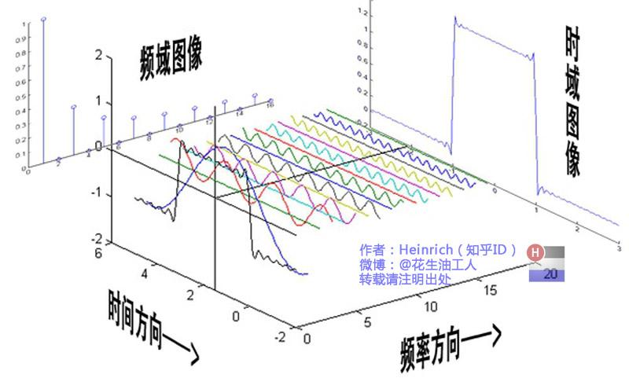
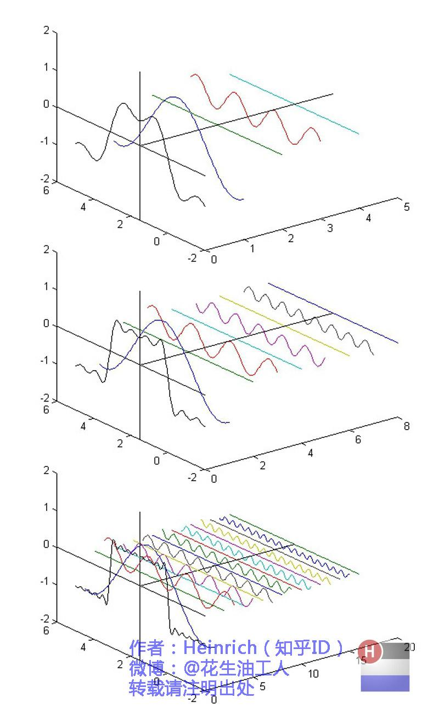
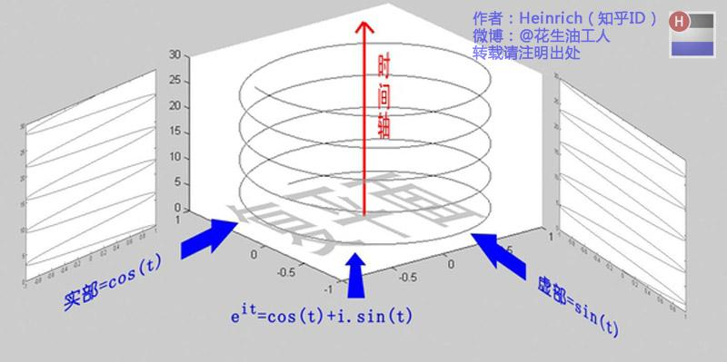
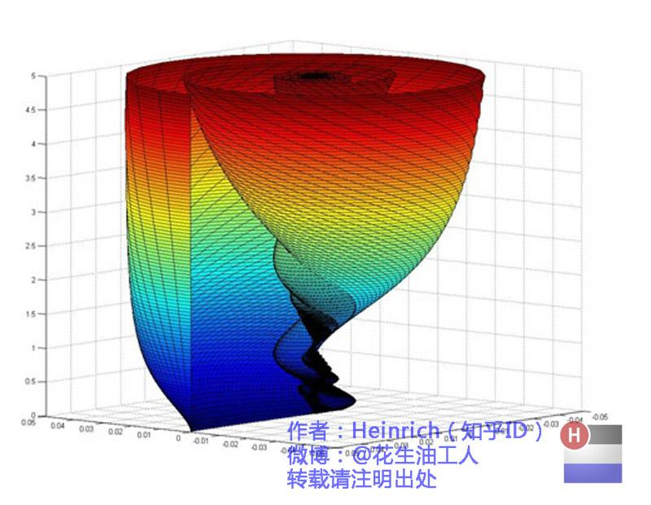

# 傅里叶变换

以下内容参考了

> 理解傅里叶变换：https://zhuanlan.zhihu.com/p/19763358
>
> 公式推导：https://zhuanlan.zhihu.com/p/41875010

和我自己在数分、泛函课上学过的知识。当然还有AI的帮助。

[toc]

## 傅里叶级数

在数分课上我们学到，实数域上很多以$2\pi$为周期的函数，都可以分解为一系列三角函数$\{1,\sin x,\cos x,\sin 2x,\cos 2x,\cdots\}$的线性组合
$$
f(t)=\frac{a_0}{2}+\sum_{n=1}^\infty a_n \cos nx + \sum_{n=1}^\infty b_n \sin nx
$$
其中
$$
\begin{align}
a_0=&\frac1\pi \int_{-\pi}^{\pi}f(t) d t \\ 
a_n=&\frac1\pi \int_{-\pi}^{\pi}f(t)\cos nt \ d t \\
b_n=&\frac1\pi \int_{-\pi}^{\pi}f(t)\sin nt \ d t \\
\end{align}
$$
由于这里有无穷多个三角函数，所以这是一个级数求和的过程，这个级数就叫做傅里叶级数。

> 严谨地说，展开式中并不能用等号，因为傅里叶级数未必收敛到$f(t)$，收敛性的充分必要条件至今没有找到，但是可以给出一些充分条件。比如，在闭区间上满足狄利克雷条件的函数表示成的傅里叶级数都收敛。狄利克雷条件如下：
>
> 1. 在定义区间上，$f(t)$须绝对可积；
> 1. 在任何有限区间中，$f(t)$只能取有限个极值点；
> 1. 在任何有限区间上，$f(t)$只能有有限个第一类间断点.
>
> 满足以上条件的$f(t)$的傅里叶级数不仅收敛，而且：
>
> 1. 当$t$是$f(t)$的连续点时，级数收敛于$f(t)$；
>
> 1. 当$t$是$f(t)$的间断点时，级数收敛于$\frac12[f(t-)+f(t+)]$.
>
> 显然，定义在闭区间上的函数、可微的函数，都满足这一条件。
>
> 此外，1966年，里纳特·卡尔松证明了勒贝格二次可积函数的傅里叶级数一定是几乎处处收敛的，即级数在除了一个勒贝格零测集外均收敛。

推广开来，任何有周期$T$的函数同样可以分解为一系列三角函数的线性组合：
$$
f(t)=\frac{a_0}{2}+\sum_{n=1}^\infty a_n \cos(n\omega t) + \sum_{n=1}^\infty b_n \sin (n\omega t)
$$
> 关于其推导，只需要考虑对周期为$T$的函数$f(t)$，$F(t)=f(\frac{2\pi}T t)$就是一个周期为$2\pi$的函数了，对$F(t)$直接应用之前的结论即可。

其中
$$
\begin{align}
a_0=&\frac2T \int_{-\frac T2}^{\frac T2}f(t) d t \\ 
a_n=&\frac2T \int_{-\frac T2}^{\frac T2}f(t)\cos(n\omega t) \ d t \\
b_n=&\frac2T \int_{-\frac T2}^{\frac T2}f(t)\sin(n\omega t) \ d t \\
\omega=& \frac{2\pi}{T}
\end{align}
$$
显见傅里叶级数是$T=2\pi$时的特殊情况。

> 这里的$\omega$是角频率，它与普通频率$f$的关系是$\omega=2\pi f$。其物理意义是，在一个周期内，单位时间内的角位移（弧度/秒），因此 $\frac{2\pi}{\omega}$ 就是一个完整周期所需要的时间（即 $T$）。
>
> 在周期$T=2\pi$时，$\omega=1$表示每秒走过$1$弧度（同时$f=\frac1{2\pi}$表示每秒完成$\frac1{2\pi}$个循环）。

值得注意的是，由于函数在一个周期上的积分是定值，所以积分区间只要长度为$T$即可，起讫点则无关紧要，这在推导公式的时候会发挥作用。

学习泛函之后，我们对这一分解有了更加本质的理解。事实上，这个分解问题是基于$L^2$空间（平方可积函数空间）考虑的，之所以能够分解，是因为$\{1,\sin x,\cos x,\sin 2x,\cos 2x,\cdots\}$构成了$L^2$空间的一组正交基，一个函数$f(t)$作为该空间中的一个向量，可以被该正交基的线性组合表达，这是容易理解的。

傅里叶级数给我们以看待“函数”的新视角。在传统的时域视角里，函数是随着时间（自变量）变化的值，每个时间点上的函数值（强度）决定了函数的长相。而傅里叶级数将其拆解成不同“频率”的一系列基函数的加和，每个基函数在时间轴上的样貌都是完全确定的，是基函数组成函数的“权重”决定了函数的长相。换言之，是每个频率点上的系数（强度）决定了函数的长相，这些系数就是频域视角下的“函数值”。

维基百科提供的[动图](https://en.wikipedia.org/wiki/File:Fourier_series_and_transform.gif)提供了一个直观的解释。下图则是知乎上的一个教程，出处见水印。

> 原帖还介绍了相位的概念，这里暂时略过，需要了再写。

我们知道，三角函数和复数有着奇妙的关系，于是可以把三角函数替换成带复指数的形式，这会为后面将傅里叶级数推广成连续形式的傅里叶变换提供便利。

> 所谓三角函数和复数的奇妙关系，就是欧拉公式
>
> $$
> e^{ix}=\cos(x)+i\sin(x)
> $$
>
> 简单说一下证明，在复变函数中，指数函数 $e^z$ 和三角函数$\cos(z),\sin(z)$（$z$是复数）都是通过泰勒级数展开定义的：
>
> $$
> e^z 
> =\sum_{n=0}^\infty \frac{z^n}{n!}
> = 1 + z + \frac{z^2}{2!} + \frac{z^3}{3!} + \cdots \\
> \cos(z) 
> =\sum_{n=0}^\infty \frac{(-1)^nz^{2n}}{(2n)!}
> = 1 - \frac{z^2}{2!} + \frac{z^4}{4!} - \cdots \\
> \sin(z) 
> =\sum_{n=0}^\infty \frac{(-1)^nz^{2n+1}}{(2n+1)!}
> = z - \frac{z^3}{3!} + \frac{z^5}{5!} - \cdots \\
> $$
>
> 当 $z = ix$ 时，可以直接计算出
>
> $$
> \begin{align}
> e^{ix} 
> &= 1 + ix + \frac{(ix)^2}{2!} + \frac{(ix)^3}{3!} + \frac{(ix)^4}{4!} + \frac{(ix)^5}{5!}\cdots \\
> &= 1 + ix - \frac{x^2}{2!} - \frac{ix^3}{3!} + \frac{x^4}{4!} + \frac{ix^5}{5!} - \cdots \\
> &= \left(1 - \frac{x^2}{2!} + \frac{x^4}{4!} - \cdots \right) + \left(ix - \frac{ix^3}{3!} + \frac{ix^5}{5!}  - \cdots \right)
> &= \cos(x) + i\sin(x)
> \end{align}
> $$
>

接下来推导傅里叶变换的指数形式。这只需要将
$$
\begin{align}
\cos x &= \frac{e^{ix}+e^{-ix}}{2} \\
\sin x &= \frac{e^{ix}-e^{-ix}}{2i}
\end{align}
$$
代入原本的级数即可，我们直接考虑一个一般的函数，它具有周期$T$和对应的基波角频率$\omega=\frac{2\pi}T$：
$$
\begin{align}
f(t) 
&=\frac{a_0}{2}+\sum_{n=1}^\infty \left[a_n \cos(n\omega t) + b_n \sin (n\omega t) \right] \\
&=\frac{a_0}{2}+\sum_{n=1}^\infty \left[a_n \frac{e^{in\omega t}+e^{-in\omega t}}{2} - ib_n \frac{e^{in\omega t}-e^{-in\omega t}}{2} \right] \\
&=\frac{a_0}{2}+\sum_{n=1}^\infty \left[\frac{a_n-ib_n}{2}e^{in\omega t} + \frac{a_n+ib_n}{2}e^{-in\omega t}\right]
\end{align}
$$
代入$a_n,b_n$的计算式可得
$$
\frac{a_n-ib_n}{2} = \frac1T \int_0^T f(u) e^{-in\omega u} d u \\
\frac{a_n+ib_n}{2} = \frac1T \int_0^T f(u) e^{in\omega u} d u
$$
进而得到
$$
\begin{align}
f(t) 
&=\frac{a_0}{2}+\sum_{n=1}^\infty \left[
	\left(\frac1T \int_0^T f(u) e^{-in\omega u} d u\right)e^{in\omega t} + \left(\frac1T \int_0^T f(u) e^{in\omega u} d u \right)e^{-in\omega t}
	\right] \\
&=\frac1T \int_0^T f(t)d t
	+ \sum_{n=1}^\infty \frac1T \int_0^T f(u) e^{-in\omega u}e^{in\omega t} d u
	+ \sum_{n=1}^\infty \frac1T \int_0^T f(u) e^{in\omega u} e^{-in\omega t}d u \\
&=\frac1T \int_0^T f(t)d t
	+ \sum_{n=1}^\infty \frac1T \int_0^T f(u) e^{-in\omega u}e^{in\omega t} d u
	+ \sum_{m=-\infty}^{-1} \frac1T \int_0^T f(u) e^{-im\omega u} e^{im\omega t}d u \\
&=\sum_{n=-\infty}^{+\infty} \frac1T \int_0^T f(u) e^{-in\omega u}e^{in\omega t} d u \\
f(t)&=\sum_{n=-\infty}^{+\infty} \left(\frac1T \int_0^T f(u) e^{-in\omega u} d u\right)e^{in\omega t} \\
&= \sum_{n=-\infty}^{+\infty} c_n e^{in\omega t}

\end{align}
$$
这便是傅里叶级数的指数形式。有时会将其中的$\omega$用$2\pi f$代替，在不同领域的常用写法不一样，注意到二者的物理意义不同即可。

傅里叶级数的指数形式比三角形式更常用。考虑$T=2\pi$的情况，在原本的基$\{1,\sin nx,\cos nx\}$中，其角频率$\omega$依次是$\{0,1,1,2,2,\cdots\}$；而换成指数形式后，角频率变成了$\{\cdots,-2,-1,0,1,2,\cdots\}$。虽然多了一个方向的无穷，但是也让角频率变成了等差形式，更有利于在数轴上表示出来。

现在，系数$c_n$是复数了，每个频率下的强度也即系数的“大小”由复数的模长来描述，而复数的角度描述了该频率分量的“相位”。由于一对正负频率的复指数项求和之后，虚部相互抵消，所以叠加出的信号才是实函数。正负频率处的系数具有共轭对称性（$c_{-n}=c_n^*$，可以从计算式中直接得到），所以画图时通常只画正半轴。

## 傅里叶变换

傅里叶级数有个限制，那就是它只能针对周期函数来用。但实际生活中周期函数很少见，为了将这一方法应用到非周期函数中，需要一些技巧。

考虑一个仅仅在区间$\left[-\frac{T}{2}, \frac{T}{2}\right]$中有值，其余地方都是$0$的函数$f(t)$，我们可以将$f(t)$不断重复，来构造一个周期为$T$的函数$g(t)$。（在边界处可能会不连续，我们假设$f(\frac{T}{2})=f(-\frac{T}{2})$来规避这个小问题。）这样一来就可以对$g(t)$应用傅里叶级数，把它的结果当作$f(t)$的分解结果。

对于任意的函数$f(t)$，可以认为它的周期是无限大，也即$T\rightarrow\infty$，此时要是能直接套用前面的公式，问题就解决了！

不过，在计算公式之前，先直观感受一下$T\rightarrow\infty$时会发生什么。原本频域上的值是离散的，频域上每个点的横坐标是$\{\cdots,-2\omega,-\omega,0,\omega,2\omega,\cdots\}$，而现在$\omega=\frac{2\pi}T \rightarrow 0$，因此原本离散的频谱线会变得越来越密集，最终形成一条连续的曲线。

同时，由于现在$\omega=\frac{2\pi}T \rightarrow 0$，原本的分量$e^{-in\omega t}$对应的系数$c_n=\frac1T \int_0^T f(u) e^{-in\omega u} d u$的极限变成了$0$（这是自然的，因为信号的“能量”或“功率”分散到无限多的频率分量上），考虑这个系数已经不再有意义。但是，我们注意到$c_n$的倍数
$$
c_n\times T
&=\int_0^T f(u) e^{-in\omega u} d u \\
&= \int_{-\frac T2}^{\frac T2} f(u) e^{-in\omega u} d u \\
&\rightarrow \int_{-\infty}^{\infty} f(u) e^{-in\omega u} d u
$$
似乎是有意义的。

用记号$\omega_0$来代替$\omega$表达$\frac{2\pi}T$这个常量，原本在$n=\{\cdots,-2,-1,0,1,2,\cdots\}$时，频谱上的点的横坐标就是$\{\cdots,-2\omega_0,-\omega_0,0,\omega_0,2\omega_0,\cdots\}$，而现在$\omega_0\rightarrow0$，离散的频率$ nω_0 $会变成一个连续的频率变量。

我们用$ ω $（或者$w$，由于这两个符号很相似，为了避免混淆我们干脆让它们等价）来表示这个连续变化的频率，定义函数
$$
\hat f(w) = \int_{-\infty}^{\infty} f(t) e^{-iwt} dt
$$
现在，函数$\hat f(w)$就描述了频率为$w$时的“强度”，跟傅里叶级数完全类似，只不过现在频率是连续变化的了。这个函数就叫做$f(t)$的傅里叶变换。

离散情况时的$f(t)=\sum_{n=-\infty}^{+\infty} \left(\frac1T \int_0^T f(u) e^{-in\omega u} d u\right)e^{in\omega t}$也可也直接将求和转为积分，得到
$$
\begin{align}
f(t)
&=\sum_{w=-\infty}^{+\infty} \frac1T \hat f(w) e^{iw t} \\
&=\frac1{2\pi} \sum_{w=-\infty}^{+\infty} \hat f(w) e^{iw t} \frac{2\pi}T \\
&=\frac1{2\pi} \int_{-\infty}^{+\infty} \hat f(w) e^{iwt} d w
\end{align}
$$
这也证明了傅里叶变换$\hat f(w)$确实可以像系数$c_n$一样发挥作用。

## 信号的直观感受

（本部分图片出处见水印）

从工程的角度看，函数即是信号，傅里叶级数即是将一个有周期的信号，分解成诸多正弦波的加和，而且这些正弦波的频率$\displaystyle f=\frac1T=\frac{\omega}{2\pi}$是逐步倍增的。

下图是对如此的信号分解的一个直观展示：

但是，既然傅里叶级数有指数形式（求和的基本单位是$e^{in\omega t}$也即一个复指数函数），那就说明信号也可以看做很多复函数的叠加。由于众多复函数求和之后，虚部相互抵消，所以叠加出的信号才是实函数。

如下图，便是一段最简单的信号$e^{it}$的示意图：

傅里叶级数，实际上就是将信号拆解成了很多根这样的线，这些线是离散变化的，而它们相加之后，在实部的投影（事实上也只有实部拥有投影）就是原本的信号。

而傅里叶变换，得到的是无数根连续变化的线，它们实际上构成的是“曲面”，而它们相加同样得到原本的信号，如下图（这里只给画出了正频率的部分）：

看起来很复杂，但这实际上是一段方波（\_Π\_）的分解。

## FFT算法

FFT即快速傅里叶变换。我们希望对一个时域信号$\{x_t\}_{t=1}^{T}$，将其分解为若干个频域成分（正弦波或余弦波），即找到其在不同频率下的“强度”，就像本文第一部分说的那样。

### 连续傅里叶变换 (CFT)

自然地，我们可以直接用前述的结论。前述的连续傅里叶（CFT）变换公式为
$$
\hat f(w) = \int_{-\infty}^{\infty} f(t) e^{-iwt} dt
$$
这里，$f(t)$在时域是连续的，$\hat f(w) $在频域也是连续的。

### 离散时间傅里叶变换 (DTFT)

实际上，我们处理的信号不会是连续的，我们只能通过采样从连续的信号中获取离散的点列。

假设我们从连续的信号$f(t)$中以周期$T$或者说频率$f$采样，得到离散序列$\{x_{nT}\},n\in Z$，此时代入CFT的式子，就有

$$
\hat f(w) = \sum_{n=-\infty}^{\infty} x_{nT} \cdot e^{iwnT}
$$

通常为了简化表示，令$ w_d=wT=w/f $为归一化角频率（一个无单位的量），那么DTFT的表达式为

$$
\hat f(w) = \sum_{n=-\infty}^{\infty} x_{nT} \cdot e^{iw_dn}
$$

### 离散傅里叶变换 (DFT)

在实际应用中，我们无法处理无限长的序列，只能处理有限长度的序列。假设我们只采集了$ N $个样本，即序列$\{x_{nT}\}$只有在$ n=0,1,…,N−1 $时才有值，在其他情况下都是$0$。在这种情况下，DTFT的求和范围就变成了有限的。

尽管时域变成了有限长，但频域（自变量$w_d$）仍然是连续的。DFT的终极目标是让频率也变成离散的，这样才能在计算机中进行处理。我们通过对DTFT的连续频率谱进行采样来实现这一点。

考虑到$e^{ix}=e^{i(x+2\pi)}$，所以$g(x)=e^{-ix}$其实是一个以$2\pi$为周期的函数。我们通常在一个周期内（例如$ w_d\in[0,2π]$）选择$ N $个等间隔的频率点进行采样。这些采样点就是$\{\frac{2\pi k}{N}\}_{k=0}^{N-1}$，将其代入有限长序列的DTFT公式中，就得到了DFT的公式：

$$
X_k = \sum_{n=0}^{N-1} x_n \cdot e^{-i \ \frac{2\pi k}{N} \ n}, \quad k = 0, 1, ..., N-1
$$
其中：

- $X_k$：第 $k$ 个频率分量（复数，含振幅与相位）
- $x_n$：第 $n$ 个时域采样点（$n=0,1,...,N-1$）

> $X_k$对应的归一化角频率是$w_d=\frac{2\pi k}{N}$，换算过来角频率就是$w=\frac{2\pi k}{NT}=\frac{2\pi k}{N}f_s$（$f_s$是采样频率），对应的频率是$f=\frac w {2\pi}=\frac{k}{N}f_s$。

DFT同样有离散形式的逆变换（IDFT），公式为
$$
x[n] = \frac{1}{N} \sum_{k=0}^{N-1} f_k \cdot e^{i \frac{2\pi k}{N} n}
$$
证明暂且略过。

### 快速傅里叶变换 (FFT)

直接根据DFT公式计算，需要大约$ N^2 $次复数乘法和加法。快速傅里叶变换就是为了解决DFT计算量大的问题而诞生的。它利用了DFT计算中的对称性和周期性，将计算复杂度从$ O(N^2) $降到了惊人的 $O(N\log N)$。通常要求$N$是$2$的整数次幂，不然则用$0$补齐。

FFT算法（最常见的是Cooley-Tukey算法，通常要求 N 是2的幂次，称为Radix-2 FFT）的核心思想是分治，具体来说，一个$ N $点的序列$ x[n] $可以分成两部分：

- 偶数下标的子序列：$x_{even}[n]=x[2n]$
- 奇数下标的子序列：$x_{odd}[n]=x[2n+1]$

这两个子序列递归进行$ N/2 $点的FFT。假设我们已经计算出了$ N/2 $点的偶数子序列的FFT结果 $X_{even}[k] $和奇数子序列的结果$ X_{odd}[k]$。 那么原始$ N $点序列的FFT结果$ X[k] $可以表示为：
$$
X[k] &=& X_{even}[k] + e^{-i\frac{2\pi k}N} X_{odd}[k] \\
X[k+N/2] &=& X_{even}[k] - e^{-i\frac{2\pi k}N} X_{odd}[k] \\
$$
其中$k=0,1,...,N/2-1$。

该算法的输出是一个同样长度为$ N $的复数序列$ X[0],X[1],…,X[N−1]$。这些复数代表了原始信号在频域上的分量。第$ k $个输出$ X[k] $对应的实际频率$ f_k $是$\frac kN f_s$，$f_s$是采样频率。

证明暂且略过。
