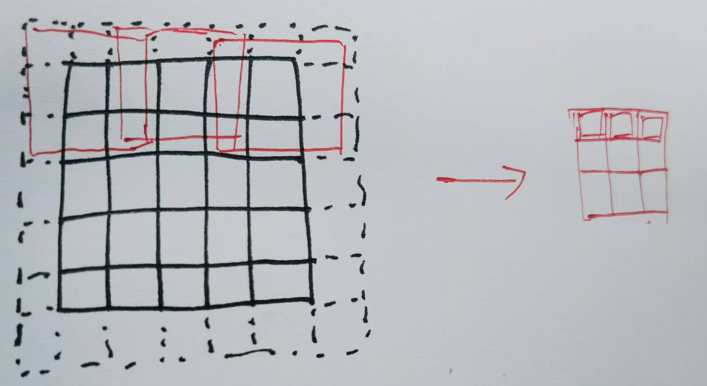

[toc]

# 卷积神经网络CNN/二维卷积

卷积神经网络（Convolutional Neural Network, CNN）专门用来处理具有网格结构的数据（比如图像，时间序列）。其主要结构包括输入层、卷积层、激活层、池化（Pooling）层和全连接层（有时把卷积、激活、池化合起来称为卷积层，有时则把池化和激活合起来成为卷积层，需要根据语义判断）。下图是一个例子

图中每一层的数据都是二维的，为了方便，将它们都看作是图片。分别用高、宽描述图片的大小，而每一层会得到一张图片的多个二维特征，将其数目称为深度或者通道数。

卷积和池化是为了提取特征，之后的全连接层则是利用提取出的特征完成目的。

## 二维卷积

这里的卷积特指二维卷积。每一次卷积操作，会将网格状的数据（图片、矩阵），通过加权平均的方式转变成一组更小的网格状数据。具体来说，假设输入矩阵$I$是$n\times n$规模的，找一规模远小于$n$的权重矩阵（也叫核函数、滤波器、卷积核等）$K$依次与$I$的同阶子矩阵作“内积”（对应元相乘后求和），得到新的数据。与$I$的每个子矩阵都如此运算，就得到新的矩阵$S$。计算出的矩阵$S$也叫特征映射（feature map）。$K$的规模可以叫感受视野（receptive field），而滑动的格数则是步长，实践中往往要选择合理的步长与视野才能保证卷积的顺利进行。这一过程也可以叫滤波。下图是一个简单的例子：

卷积操作实际上相当于一个非全连接的隐藏层，非全连接意味着参数减少；而反复使用同一个核$K$也使得参数变少。此外，由于卷积是加权平均，所以对$I$的平移操作不影响卷积的结果，这称为卷积具有等变表示效果。

虽然看起来卷积是一个循环结构，通过反复移动卷积核来依次计算每个位置的输出，但实际上每个输出分量都是输入分量的线性组合。如果将输入拉成一个向量$X$，输出拉成向量$Y$，卷积实际上就是做了变换$Y=CX$，权重$C$就是卷积层的可学习参数。

事实上，一张图片的每个像素点不止一个数，而是$m$元组（$m$称为输入通道数），代表了RGB色彩值等描述单像素点的向量。所以一个图片是一个三维张量，这也意味着滤波器$K$也得有$m$“层”，才能和图片的每个通道对应起来。假设卷积核边长为$k$，一个卷积核的参数数量为$k\times k\times m$。这个3D的卷积核在3D的图片张量上滑动，每次依然计算“内积”（对应元相乘后求和）得到一个值，这些值组成了结果矩阵。（当然，还可以有另一种理解，就是同时用$m$个2D的卷积核分别去每个通道上滑动，得到$m$个卷积结果矩阵，再作矩阵加法，得到唯一的结果矩阵。从操作上来说，这两种理解的实际效果是一致的。）

更事实上，一个卷积层应该提取出一张图片的多个特征。这表示一个卷积层应该对图片进行多次（具体次数$h$是一个参数，称做卷积层深度、输出通道数）卷积操作，得到多张特征图$S_1,...,S_h$（每个都是二维矩阵）。这意味着需要有$h$个（3D）卷积核，每个卷积核得到通道数为$1$的张量（相当于矩阵）$S_i$，其长宽应该是$s=n-k+1$，其中$k$是滤波器$K$的边长，$h$个这样的矩阵堆叠起来就得到了$s\times s\times h$的张量。

总而言之，一次卷积，实际上是将$n\times n\times m$的图片张量，通过$h$个3D卷积核（或者理解成$m\times h$个2D卷积核）的作用，变成了$s\times s\times h$的隐藏层张量。也可以理解为，将三维的输入张量，通过三维的卷积核作用，变成了三维输出张量。如下图：

> 以上描述了最普通的卷积操作，实际上还有一些改进：
>
> 针对输出的第$i$个通道，计算输出时，可以加上统一的偏置（bias）值$b_i$。
>
> 当$I$的规模$n$无法整除$K$的规模$m$时，通常在$I$周围补充一些$0$来使得可以整除，这叫做零填充或同等填充（same padding）。也可以删除$I$的边边角角，这叫做有效填充。
>
> 卷积核$K$可以是稀疏的矩阵，这意味着矩阵中的元与元之间，均匀地间隔着一些$0$，在卷积时，图片像素会跳跃着参与卷积。这可以称为卷积核的扩张或者膨胀（dilation）。**不扩张的卷积核看作扩张程度为$1$**，也就是说dilation这一参数实际描述的是卷积核相邻值之间的索引之差，而不是填入的$0$的个数。扩张后的卷积核边长实际上是$1+\text{dilation}*(k-1)$。
>
> 移动卷积核时，未必每次只滑动一格，滑动步长stride可以是更多。此时输出矩阵的长宽应该是$(n-k_n+1)/\text{stride}$。在使用多步滑动时，要注意控制输入的长宽，保证能够整除。

激活层则对每个矩阵的每个元都使用激活函数，比如ReLU函数，所得到的仍是结构相同的多个矩阵。

## 池化

池化，指的是将多张图片$S_1,...,S_k$在保留某些信息的前提下压缩，以减少空间。具体操作是，对于$n\times n$规模的输入矩阵$I$，设定一个较小的感受视野（不妨设为$h\times h$），在这个视野将窗口按照选定的步长$d$在$I$上滑动，得到很多小矩阵，每个小矩阵根据一个池化函数给出一个值，这就构成了一个新的、比原来小的矩阵。

为了方便计算长度，通常令$h=d$可以整除输入矩阵的边长，这样一来，输出的每个小矩阵，其边长应该是$n/d$。这个移动的感受视野也可以看做是滤波器。

常用的池化函数有最大值、均值、$2$范数等等。下图是一个最大化池化的例子：

可以想见，池化不改变卷积层输出的深度，只是减少宽和高。

## 全连接

完成多次卷积+池化之后，原本的多张图片变成了一系列矩阵，将这些矩阵拉直成为向量，之后便可以按照多层感知机的方式，全连接形成网络。

假设卷积和池化全部完成之后，得到的是$N$个$o\times s\times s$的矩阵，那么第一个全连接层的输入长度就是$os^2$，这之后的隐藏层长度随意。而最后一个线性层的输出长度，应该与类别数一致，再经过softmax函数，得到的值含义便是归入各个类别的概率。

# 一维卷积

一维卷积神经网络，希望将用于图像的处理方法用到一维序列上来。这其实只需要将二维卷积变成一维卷积。

对于一个序列，卷积操作实际上就是在该序列上设置滑窗，卷积核每次只与滑窗内的部分对应相乘。

在二维卷积神经网络中，输入的实际上是$N$个三维张量（通道数×长×宽），而一维卷积神经网络中，输入的则是$N$个矩阵也即二维张量（通道数×序列长度）。对于文本类数据，长度实际上是单词个数，通道数是单词长度；对于时间序列，通道数就是$1$了。

与二维卷积相同，针对每一条输入，卷积通常不只进行一次，也即输出的通道数不止是$1$。在实际操作中，其实是多个（输出通道数个）矩阵形状的卷积核（输入通道数×卷积核长度），在矩阵形状的输入（输入通道数×序列长度）上左右滑动，每个卷积核给出一个长度为“序列长度-卷集合长度+1”的向量，一共有输出通道数个，组成新的矩阵作为输出。

# 反卷积

反卷积又称转秩卷积(Transposed Convolution)，其作用是将一个小的特征图转变为尺寸更大的特征图。思路上我们希望将卷积变换$Y=XC$直接取逆过程得到$X=C^TY$，因此以转置卷积为名。但实际上并不能做到如此完美的恢复，只能把形状调整成想要的。

> 顺便一提，上采样 (Upsampled)也是一种常用的扩大图像的方法，与反卷积不同的是，上采样是无参数的操作，通常使用插值方法（例如双线性或最近邻插值）直接对输入特征图进行尺寸放大，像素之间的值通过插值方法进行计算，无法像反卷积那样在放大的过程中学习特征。

反卷积的工作过程是先在输入的张量元素之间插入空白，形成一个大得多的张量，然后对这个大得多的张量做普通卷积，卷积之后的尺寸会小一些，但仍然比最初输入的张量要大，这就实现了张量的扩大。下图可以描述其过程：

这里面有几个比较重要的参数：

- stride：在原图中插入空白元素的格数，原图每两个相邻元之间会插入stride-1个空白格。上图是stride=2的情形。注意，这里stride的含义和普通卷积中是不一样的。（不过也可以换个角度来看，仍然将stride看作卷积核移动的步长，只不过这个卷积核是从输出到输入的普通卷积的步长。）
- padding：在原图外侧的零填充宽度。上图是padding=1的情形。

这两个参数决定了原图扩充成的”大得多的张量“到底有多大。这之后再经过一次普通卷积确定其尺寸，因此普通卷积具有的参数，反卷积也都会具有。

此外还有一个值得注意的问题，那就是不同尺寸的输出再经过卷积后可能得到相同尺寸的输出，这就意味着一个图像经过反卷积后，可能对应两个不同的合法输出，这时应该选择谁作为反卷积的结果呢？

以上图为例。我们注意到，一个5x5的图像在使用3x3卷积核、padding=1的填充、stride=2的步长时，输出是3x3的结果。即便将5x5的输入改成6x6，因为步长为2，并不足以让卷积核多移动一次，所以6x6的输入对应的输出还是3x3。

而3x3的图像，在3x3卷积核、padding=1的填充、stride=2的步长下做反卷积，如前面的彩图所示，只会得到5x5的结果。但我们可能希望得到的尺寸的6x6，所以需要再来一个参数，实现我们的需求，这就是out_padding。

还是这个例子，由于3x3的图像，在3x3卷积核、padding=1的填充、stride=2的步长下做反卷积，标准输出是5x5的，如果我们希望得到6x6的结果，就需要设置out_padding=1。out_padding就是给定kernel_size、padding、stride之后的”标准“输出边长，和预期边长之间的差距。

设置out_padding=1后，多出来的一行一列如何计算出？实际上，原本5x5的结果是卷积核移动到边界了，该行只够算出5个数。现在想要再多算一个，那就强行再移动一下卷积核，缺少的数值用0填补，这样就多算出来了一行。本质上是给原始图像加了额外的一层不对称的padding。

# 代码

## 卷积（2D）

在PyTorch中，使用`torch.nn.Conv2d` 来实现在图像上执行二维卷积。这是构建卷积神经网络（CNN）的基本组件之一。下面是 `torch.nn.Conv2d` 的参数及其含义：

1. **in_channels** (`int`): 输入图像的通道数。例如，对于灰度图像，`in_channels=1`；对于RGB图像，`in_channels=3`。
2. **out_channels** (`int`): 卷积产生的输出通道数。这个数字代表了卷积核（或滤波器）的数量，每个卷积核会产生一个输出通道。
3. **kernel_size** (`int` 或 `tuple`): 卷积核的大小。如果只提供一个整数，那么卷积核会是正方形的，即宽度和高度相同。也可以通过一个元组 `(height, width)` 来指定不同的高度和宽度。
4. **stride** (`int` 或 `tuple`, 可选): 卷积核移动的**步长**。默认值是 `1`。如果提供一个整数，那么步长在垂直和水平方向上相同。也可以通过一个元组 `(vertical_stride, horizontal_stride)` 来指定不同的垂直和水平步长。
5. **padding** (`int` 或 `tuple` 或 `'valid'` 或 `'same'`, 可选): 输入数据的**填充**量。默认值是 `0`。填充是在输入数据的周围添加额外的零值，以控制卷积操作后的输出尺寸。也可以指定为 `'same'`，这样卷积操作输出的高度和宽度会与输入相同，或者 `'valid'` 表示不使用填充。
6. **dilation** (`int` 或 `tuple`, 可选): 卷积核元素之间的间距。默认值是 `1`。通过增加这个参数的值，可以使卷积核“**膨胀**”，卷积核的有效尺寸增加，但不增加权重的数量。
7. **groups** (`int`, 可选): 将输入和输出通道分组的数量。默认值是 `1`。通过设置 `groups=in_channels`，每个输入通道与一个输出通道相关联，实现了所谓的深度卷积。这个参数允许网络设计分组卷积，可以减少参数数量和计算量。
8. **bias** (`bool`, 可选): 是否添加偏置项 (`b`) 到输出中。默认值是 `True`。对于某些类型的卷积网络，可能不需要偏置项。

为了计算经过 `nn.Conv2d` 层之后的张量维度，我们可以使用以下公式来计算输出高度和宽度：
$$
输出高度=⌊\frac{输入高度+2×填充−膨胀×(卷积核高度-1)-1}{步长}+1⌋ \\
输出宽度=⌊\frac{输入宽度+2×填充−膨胀×(卷积核宽度-1)-1}{步长}+1⌋
$$

举一个简单的例子，一个形状为为`(N,C,H,W)`的张量`X`，经过`nn.Conv2d(in_channels=C, out_channels=M, 3, 1, 1)`的变换，输出的形状将是`(N,M,H,W)`

## 反卷积（2D）

在PyTorch中，`torch.nn.ConvTranspose2d` 是用来执行二维转置卷积操作的模块，通常被称为反卷积或分数步长卷积。它主要用于图像和视频上采样，以及在生成模型中根据压缩特征重建数据。以下是 `torch.nn.ConvTranspose2d` 的参数及其含义：

1. **in_channels** (`int`): 输入图像的通道数。例如，一个普通的RGB图像的`in_channels`是3。
2. **out_channels** (`int`): 反卷积后的输出通道数。这表示反卷积核（或滤波器）的数量，每个反卷积核产生一个输出通道。
3. **kernel_size** (`int` 或 `tuple`): 反卷积核的大小。可以指定为一个整数，表示卷积核为正方形，或者一个元组`(height, width)`来指定不同的高度和宽度。
4. **stride** (`int` 或 `tuple`, 可选): 反卷积核移动的**步长**。默认为`1`。可以指定一个整数，表示在垂直和水平方向上的步长相同，或者一个元组`(vertical_stride, horizontal_stride)`来分别指定。
5. **padding** (`int` 或 `tuple`, 可选): 输入数据周围的**填充**量，默认为`0`。填充是在输入数据的边缘添加额外的零值，以控制反卷积操作后的输出尺寸。
6. **output_padding** (`int` 或 `tuple`, 可选): 为**输出**设置的**填充**量，用来调整输出尺寸，以确保正确的输出形状，尤其是在使用步长大于1时。
7. **groups** (`int`, 可选): 将输入和输出通道分组的数量。分组卷积可以减少参数的数量和计算量，特别是当`groups=in_channels`时，实现深度卷积。
8. **bias** (`bool`, 可选): 是否在输出中添加偏置项 (`b`)。默认为`True`。
9. **dilation** (`int` 或 `tuple`, 可选): 卷积核元素之间的间距。默认值是 `1`。通过增加这个参数的值，可以使卷积核“膨胀”，卷积核的有效尺寸增加，但不增加权重的数量。

对于`nn.ConvTranspose2d`，输出尺寸的计算稍微复杂，但可以通过以下公式计算：
$$
H_{out} =(H_{in}−1)×步长[0]−2×填充[0]+膨胀[0]×(核尺寸[0]−1)+输出填充[0]+1 \\
W_{out} =(W_{in}−1)×步长[1]−2×填充[1]+膨胀[1]×(核尺寸[1]−1)+输出填充[1]+1 \\
$$
这个式子直接就是正向卷积的逆过程，

考虑一个简单的例子，一个输入张量形状为`(N, C, H, W)`的`X`，经过一个`nn.ConvTranspose2d(in_channels=C, out_channels=M, kernel_size=3, stride=2, padding=1, output_padding=1)`的处理，假设输入尺寸为`(N, C, 32, 32)`，使用上述参数配置，输出的形状将通过公式计算，得到形状为`(N, M, 64, 64)`。

# 更多参考

以下两个链接是同一篇文章的知乎与公众号版本，从非常基础的地方开始讲解了卷积操作。我收藏它的主要原因是，在讲解卷积层时提供了几张很好的动图：

https://www.zhihu.com/question/64494691/answer/2629959362

https://mp.weixin.qq.com/s?__biz=MzAwOTc2NDU3OQ==&mid=2649035573&idx=1&sn=794dfab44613a9e179db75e0713595b7&chksm=834b18b9b43c91af0dad209fe9c19bf3b453fc8b532a197a6cde296294bce38c649f5ae2456e&token=1928848976&lang=zh_CN#rd

这篇文章是上面两篇的参考：https://towardsdatascience.com/intuitively-understanding-convolutions-for-deep-learning-1f6f42faee1

反卷积图片说明：https://cloud.tencent.com/developer/article/2029789

卷积与反卷积动图图解：https://blog.csdn.net/xiaosongshine/article/details/107476724

反卷积参数stride解释：https://www.cnblogs.com/hansjorn/p/14767592.html

反卷积参数out_padding的解释：https://blog.csdn.net/qq_41368247/article/details/86626446