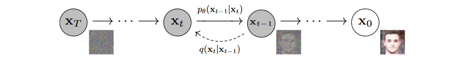

模型原理主要参考：https://zhuanlan.zhihu.com/p/530602852

它的原文是博客：https://lilianweng.github.io/posts/2021-07-11-diffusion-models/

另外，理论推导和解释方面见苏神的博客：https://spaces.ac.cn/archives/9119

关于代码实现，最好的教程是：https://huggingface.co/learn/diffusion-course/unit1/3

[TOC]

# 1. 模型总览

如下图所示。DDPM模型主要分为两个过程：forward加噪过程（从右往左）和reverse去噪过程（从左往右）。加噪过程意思是指向数据集的真实图片中逐步加入高斯噪声，而去噪过程是指对加了噪声的图片逐步去噪，从而还原出真实图片。加噪过程满足一定的数学规律，而去噪过程则采用神经网络来学习。这么一来，神经网络就可以从一堆杂乱无章的噪声图片中生成真实图片了。

# 2. 扩散过程（Forward, 加噪过程）

### 加噪的数学描述

给定初始数据分布$x_0∼q(x)$，我们定义一个前向扩散过程（forward diffusion process）：我们向数据分布中逐步添加高斯噪声，加噪过程持续$ T $次，产生一系列带噪声图片$ x_1,...,x_T $。在由$ x_{t−1} $加噪至$ x_t $的过程中，噪声的标准差/方差是以一个在区间$ (0,1) $内的固定值$ β_t $来确定的，均值是以固定值$ β_t $和当前时刻的图片数据$ x_{t−1} $来确定的。

论文用以下公式描述这一过程：
$$
q(x_t|x_{t−1})= N(x_t;\sqrt{1−β_t}x_{t−1},β_tI) \\
q(x_{1:T}|x_0)= ∏_{t=1}^Tq(x_t|x_{t−1})
$$
> 有几个记号需要说明：
>
> 第一，$x_{1:T}$实际表示的是$x_1,x_2,...x_T$这一系列变量。
>
> 第二，$q$是一个可以表示分布，也可以表示概率密度函数的符号，语义根据上下文确定。由于概率密度函数是分布的一种描述，所以并不对它们加以区分。

第一行中$q(x_t|x_{t-1})$表示$x_t$在条件$x_{t-1}$下的分布；$N(x_t;\sqrt{1−β_t}x_{t−1},β_tI)$是指以$ \sqrt{1−β_t}x_{t−1} $为均值、$ β_tI $为协方差矩阵、关于$x_t$的高斯分布。均值和方差为什么这样定义，其实是反推出来的，这一形式在后续计算中将导致一些便利性。

至于第二行，等号的右边是多个密度的乘积，这是计算联合概率时的链式法则再结合马尔可夫性质的结论。

> 马尔可夫性质指的是$t$时刻的状态$x_t$仅仅和上一时刻有关，和之前的状态无关。数学上可以用（对离散型变量）$P(x_t|x_{t-1},...,x_1)=P(x_t|x_{t-1})$或者是（对连续型变量）$f_{Xt∣Xt−1,Xt−2,…,X1}(x_t∣x_{t−1},x_{t−2},…,x_1)=f_{X_t∣X_{t−1}}(x_t∣x_{t−1})$来表达。

由于每一步的噪声只由$ β_T $和$ x_{t−1} $来确定，因此只要有了$ x_0 $，并且确定$β_1,...,β_T $，我们就可以推出任意一步的加噪数据$ x_1,...,x_T $。这个Forward加噪过程是一个马尔科夫链过程。

随着$ t $的不断增大，最终原始数据$ x_0 $会逐步失去它的特征。当$ T→∞ $时，$ x_T $趋近于一个各向独立的高斯分布。从视觉上来看，就是将原本一张完好的照片加噪很多步后，图片几乎变成了一张完全是噪声的图片。

### 任意时刻数据$x_t$的计算

在逐步加噪的过程中，我们其实并不需要一步一步地从$ x_0,x_1,... $去迭代得到$ x_t $。事实上，我们可以直接从$ x_0 $和固定值序列$ \{β_t∈(0,1)\}_{t=1}^T $直接计算得到。

考虑这样一件事，只需要得到一个服从$N(0,I)$的样本$z$，然后做变换$x=Az+\mu$，就得到了服从$N(\mu,AA')$的样本$x$。这启示我们，$x_t$可以由服从$N(0,I)$的样本$z$做变换$x_t=\sqrt{\beta_t}Iz+\sqrt{1-\beta_t}x_{t-1}$得到。

我们定义$ α_t=1−β_t $，$ \bar α_t=∏_{i=1}^tα_i=∏_{i=1}^t(1−β_i)$，那么根据前述的关系，我们得到：
$$
\begin{align}
x_t &= \sqrt{\alpha_t}x_{t-1}+\sqrt{1-\alpha_t}z_{t-1} \\
&= \sqrt{\alpha_t}(\sqrt{\alpha_{t-1}}x_{t-2}+\sqrt{1-\alpha_{t-1}}z_{t-2})+\sqrt{1-\alpha_t}z_{t-1} \\
&= \sqrt{\alpha_t\alpha_{t-1}}x_{t-2}+\sqrt{\alpha_t(1-\alpha_{t-1})}z_{t-2}+\sqrt{1-\alpha_t}z_{t-1} \\
&= \sqrt{\alpha_t\alpha_{t-1}}x_{t-2}+\sqrt{1-\alpha_{t}\alpha_{t-1}}\bar z_{t-2} \\
&= \cdots \\
&= \sqrt{\bar\alpha_t}x_{0}+\sqrt{1-\bar\alpha_{t}}z \\
\end{align}
$$
先看省略号之前的部分，这里$\bar z_{t-2}=\displaystyle\frac{\sqrt{\alpha_t(1-\alpha_{t-1})}z_{t-2}+\sqrt{1-\alpha_t}z_{t-1}}{\sqrt{1-\alpha_{t}\alpha_{t-1}}}$，由于$z_{t-1},z_{t-2}$都是服从标准正态分布的，因此$\bar z_{t-2}$是两个标准正态分布的变量的线性组合，也服从正态分布。实际上这个正态分布我们可以算出来，其均值还是$0$，方差是$\displaystyle \frac{\alpha_t(1-\alpha_{t-1})I+(1-\alpha_t)I}{1-\alpha_{t}\alpha_{t-1}}=I$，没想到吧，还是个标准正态分布。由此类推，$x_t=\sqrt{a_ta_{t-1}a_{t-2}}x_{t-3}+\sqrt{1-a_ta_{t-1}a_{t-2}}\bar z_{t-3}$时的$\bar z_{t-3}$同样还是标准正态分布。

于是一路替换下去，最终只剩下了$x_0$和$z$两个变量，前者是已知的，后者服从标准正态分布。这又意味着$x_t$服从以$\sqrt{\bar\alpha_t}x_{0}$为均值、$(1-\bar\alpha_t)I$为方差的正态分布，当$t$很大时，$\bar\alpha_t$会接近$0$，这时的$x_t$接近服从标准正态分布，也即完全的白噪声。在计算时，参数$\beta_t,\alpha_t$都给定，只要有$z$就能产生$x_t$了。将这个$z$记作$z_t$，这个下标表示不同的$t$对应不同的$z_t$，在后续讨论中会看到其意义。

### $β_t$的取值设置

一般地，随着$ t $的增大，生成的数据要更加接近随机的高斯分布，所以$ β_t $的取值应该越大。所以取$ β_1<β_2<...<β_T$，也即$\alpha_1>\alpha_2>\cdots>\alpha_T$。由于$\beta_t\in(0,1)$，直接得到$\alpha_t\in(0,1)$，进而$\bar\alpha_1>\bar\alpha_1>\cdots>\bar\alpha_T$。

[Ho et al. (2020)](https://arxiv.org/abs/2006.11239)设置$\beta_t$是线性增加的一系列值，从$\beta_0=10^{-4}$到$\beta^T=0.02$。[Nichol & Dhariwal (2021)](https://arxiv.org/abs/2102.09672) 则给出了如下的基于余弦函数的设置
$$
\beta_t = \text{clip}(1-\frac{\bar{\alpha}_t}{\bar{\alpha}_{t-1}}, 0.999), \quad
\bar{\alpha}_t = \frac{f(t)}{f(0)}, \quad
\text{where }f(t)=\cos\Big(\frac{t/T+s}{1+s}\cdot\frac{\pi}{2}\Big)^2
$$
比起线性，这样的好处是$\bar\alpha_t$不会太快收敛到$0$。其中clip(a,b)这一函数指的是，小于a和大于b的值被分别改写成a和b。

# 3. 逆扩散过程（Reverse, 去噪过程）

### 逆扩散过程近似模型$p_θ$

如果我们能将上述过程转换方向，即找到一个分布$ q(x_{t−1}|x_t) $，它描述了已知$x_t$时$x_{t-1}$的分布情况，逐步从中采样，那么就可以从一个随机的服从高斯分布$ N(0,I) $的样本$x_T$出发，重建出一个原始样本$x_0$，也就是从一个完全杂乱无章的噪声图片中得到一张真实图片。

但是，$ q(x_{t−1}|x_t) $应该根据数据集给定，我们没办法给出它的计算方法，所以考虑搞出一个“模型”$p_θ$来近似模拟这个条件概率，从而运行逆扩散过程。具体来说，假设$q(x_{t−1}|x_t)$同样应该是一个高斯分布，其均值为$\mu_\theta(x_t,t)$，方差为$\Sigma_\theta(x_t,t)$，我们希望模型$p_\theta$可以根据$(x_t,t)$给出分布$q(x_{t−1}|x_t)$下的一个抽样作为$x_{t-1}$。与扩散过程相似，逆扩散过程用数学符号表示为（原论文中如此）
$$
p_θ(x_{t-1}|x_t)=N(x_{t−1};μ_θ(x_t,t),\Sigma_θ(x_t,t)) \\
p_θ(x_{0:T})=p(x_T)∏_{t=1}^Tp_θ(x_{t−1}|x_t) \\
$$
这两行作为数学公式是令人迷惑的，其根源在于我们习惯性的将模型当成“函数”来理解。而这里的$p_\theta$应该当作分布/密度函数来理解（它还没有具体化成一个算法）。另外$p(x_T)$也没有解释，但$p$理应表示一个分布，所以它是$x_T$的分布/密度函数（同时按照前述的思路，这应该是一个标准高斯分布）。而$p_\theta(x_{0:T})$是$x_0,...,x_T$的联合分布，或者说联合密度。

不过，我们最终得出的模型，并不是直接输出采样样本的。后续的讨论中可以看到，实际上这个模型给出的是不同的$z_t$，或者记作$z_\theta(x_t,t)$。此处先用$p_\theta$来理解思路。

下图为扩散过程和逆扩散过程的图示：

### 后验扩散条件概率$q(x_{t−1}|x_t,x_0)$

我们先来分析一下$x_{t-1}$与$x_t$的关系。假设我们的目标$x_0$已知，当前有$ x_t $，考虑$ x_{t−1} $如何计算。

这个条件分布可以写成：
$$
q(x_{t-1} \vert x_t, x_0)
= 
N(x_{t-1}; {\tilde{{\mu}}}(x_t, x_0), {\tilde{\beta}_t} I)
$$
使用贝叶斯公式，可以得到：
$$
\begin{align}
q(x_{t−1}|x_t,x_0)
&= q(x_t|x_{t−1},x_0)\frac{q(x_{t−1}|x_0)}{q(x_t|x_0)} \\
& \propto \exp⁡\left[ -\frac12 \left(
	\frac{(x_t−\sqrt{α_t}x_{t−1})^2}{β_t} + 
	\frac{(x_{t−1}−\sqrt {\bar α_{t−1}}x_0)^2}{1−\bar α_{t−1}} − 
	\frac{(x_t−\sqrt{\bar α_t}x_0)^2}{1−\bar α_t}
	\right)\right] \\
& = \exp⁡\left[ -\frac12 \left(
	(\frac{\alpha_t}{\beta_t}+\frac{1}{1−\bar α_{t−1}})x_{t-1}^2 - 
	(\frac{2\sqrt{\alpha_t}}{\beta_t}x_t+\frac{2\sqrt{\bar\alpha_{t-1}}}{1−\bar α_{t−1}}x_0)x_{t-1} +
	C(x_t,x_0)
	\right)\right] \\
\end{align}
$$
> 这里的$q$当作密度函数来理解，套用贝叶斯公式在连续型变量下的公式即可。

其中，正比符号是因为省略了系数（比如单个正态分布会有系数$1/\sigma\sqrt{2\pi}$），$ C(x_t,x_0) $是一个关于$ x_t $和$ x_0 $，而不包含$ x_{t−1}$的函数。

由这个概率密度函数的形式就可以看出，$q(x_{t−1}|x_t,x_0)$仍然是一个高斯分布（相差一个系数的情况下）。根据高斯分布的概率密度函数，通过配方，可以整理出方差$\tilde\beta_t$与均值$\tilde\mu_t$：
$$
\begin{aligned}
\tilde{\beta}_t 
&= 1/(\frac{\alpha_t}{\beta_t} + \frac{1}{1 - \bar{\alpha}_{t-1}}) 
= 1/(\frac{\alpha_t - \bar{\alpha}_t + \beta_t}{\beta_t(1 - \bar{\alpha}_{t-1})})
= \color{green}{\frac{1 - \bar{\alpha}_{t-1}}{1 - \bar{\alpha}_t} \cdot \beta_t} \\
\tilde{\boldsymbol{\mu}}_t (\mathbf{x}_t, \mathbf{x}_0)
&= (\frac{\sqrt{\alpha_t}}{\beta_t} \mathbf{x}_t + \frac{\sqrt{\bar{\alpha}_{t-1} }}{1 - \bar{\alpha}_{t-1}} \mathbf{x}_0)/(\frac{\alpha_t}{\beta_t} + \frac{1}{1 - \bar{\alpha}_{t-1}}) \\
&= (\frac{\sqrt{\alpha_t}}{\beta_t} \mathbf{x}_t + \frac{\sqrt{\bar{\alpha}_{t-1} }}{1 - \bar{\alpha}_{t-1}} \mathbf{x}_0) \color{green}{\frac{1 - \bar{\alpha}_{t-1}}{1 - \bar{\alpha}_t} \cdot \beta_t} \\
&= \frac{\sqrt{\alpha_t}(1 - \bar{\alpha}_{t-1})}{1 - \bar{\alpha}_t} \mathbf{x}_t + \frac{\sqrt{\bar{\alpha}_{t-1}}\beta_t}{1 - \bar{\alpha}_t} \mathbf{x}_0\\
\end{aligned}
$$
由前面Forward过程我们推导得到的$ x_0 $和$ x_t $的关系，我们有$ x_0=\frac1{\sqrt{\bar α_t}}(x_{t}−\sqrt{1-\bar α_t}z_t)$ ，代入上式后得到：
$$
\begin{aligned}
\tilde{\boldsymbol{\mu}}_t
&= \frac{\sqrt{\alpha_t}(1 - \bar{\alpha}_{t-1})}{1 - \bar{\alpha}_t} \mathbf{x}_t + \frac{\sqrt{\bar{\alpha}_{t-1}}\beta_t}{1 - \bar{\alpha}_t} \frac{1}{\sqrt{\bar{\alpha}_t}}(\mathbf{x}_t - \sqrt{1 - \bar{\alpha}_t}\boldsymbol{z}_t) \\
&= \color{red}{\frac{1}{\sqrt{\alpha_t}} \Big( \mathbf{x}_t - \frac{1 - \alpha_t}{\sqrt{1 - \bar{\alpha}_t}} \boldsymbol{z}_t \Big)}
\end{aligned}
$$
现在，$x_{t-1}$所服从的条件高斯分布，其方差$\tilde\beta_t$与均值$\tilde\mu_t$都可以由$x_t$与标准正态分布采样的变量$z_t$得到。这里$x_t$是已知的，$z_t$则来自$x_0$与$x_t$的关系。如果我们能“学出”$z_t$，那就可以直接算出$\tilde\mu_t$来作为$x_{t-1}$的无偏估计了。这也就是上面提过的，并不需要真的给出一个分布$p_\theta$，只要模型能给出$z_\theta$来近似$z_t$，那么$p_\theta$可以由$z_\theta$得到。

### 以目标数据分布的似然函数作为损失函数

先从理论上分析一下用$p_\theta(x_0)$来近似真实分布$q(x_0)$时的损失。

首先考虑分布$p_\theta(x_0)$在已知样本$x_0$时的负对数似然函数，这是一个最小化目标。此外真实分布$q(x_{1:T}|x_0)$与模型$p_\theta(x_{1:T}|x_0)$的差距也可以衡量模型效果，这个差距用KL散度来描述。二者的自变量都是$\theta$。分析它们的性质，会帮助我们在后续得出模型的损失。

就像VAE中一样，考虑$p_\theta(x_0)$的负对数似然，满足下面的不等式：
$$
\begin{aligned}
- \log p_\theta(\mathbf{x}_0) 
&\leq - \log p_\theta(\mathbf{x}_0) + D_\text{KL}(q(\mathbf{x}_{1:T}\vert\mathbf{x}_0) \| p_\theta(\mathbf{x}_{1:T}\vert\mathbf{x}_0) ) & \small{\text{; KL is non-negative}}\\
&= - \log p_\theta(\mathbf{x}_0) + \mathbb{E}_{\mathbf{x}_{1:T}\sim q(\mathbf{x}_{1:T} \vert \mathbf{x}_0)} \Big[ \log\frac{q(\mathbf{x}_{1:T}\vert\mathbf{x}_0)}{p_\theta(\mathbf{x}_{0:T}) / p_\theta(\mathbf{x}_0)} \Big] \\
&= - \log p_\theta(\mathbf{x}_0) + \mathbb{E}_q \Big[ \log\frac{q(\mathbf{x}_{1:T}\vert\mathbf{x}_0)}{p_\theta(\mathbf{x}_{0:T})} + \log p_\theta(\mathbf{x}_0) \Big] \\
&= \mathbb{E}_q \Big[ \log \frac{q(\mathbf{x}_{1:T}\vert\mathbf{x}_0)}{p_\theta(\mathbf{x}_{0:T})} \Big] \\
\text{Let }L_\text{VLB} 
&= \mathbb{E}_{q(\mathbf{x}_{0:T})} \Big[ \log \frac{q(\mathbf{x}_{1:T}\vert\mathbf{x}_0)}{p_\theta(\mathbf{x}_{0:T})} \Big] \geq - \mathbb{E}_{q(\mathbf{x}_0)} \log p_\theta(\mathbf{x}_0)
\end{aligned}
$$
使用 Jensen 不等式也很容易得到相同的结果，假设我们想将最小化交叉熵作为学习目标，那么：
$$
\begin{aligned}
L_\text{CE}
&= - \mathbb{E}_{q(\mathbf{x}_0)} \log p_\theta(\mathbf{x}_0) \\
&= - \mathbb{E}_{q(\mathbf{x}_0)} \log \Big( \int p_\theta(\mathbf{x}_{0:T}) d\mathbf{x}_{1:T} \Big) \\
&= - \mathbb{E}_{q(\mathbf{x}_0)} \log \Big( \int q(\mathbf{x}_{1:T} \vert \mathbf{x}_0) \frac{p_\theta(\mathbf{x}_{0:T})}{q(\mathbf{x}_{1:T} \vert \mathbf{x}_{0})} d\mathbf{x}_{1:T} \Big) \\
&= - \mathbb{E}_{q(\mathbf{x}_0)} \log \Big( \mathbb{E}_{q(\mathbf{x}_{1:T} \vert \mathbf{x}_0)} \frac{p_\theta(\mathbf{x}_{0:T})}{q(\mathbf{x}_{1:T} \vert \mathbf{x}_{0})} \Big) \\
&\leq - \mathbb{E}_{q(\mathbf{x}_{0:T})} \log \frac{p_\theta(\mathbf{x}_{0:T})}{q(\mathbf{x}_{1:T} \vert \mathbf{x}_{0})} \\
&= \mathbb{E}_{q(\mathbf{x}_{0:T})}\Big[\log \frac{q(\mathbf{x}_{1:T} \vert \mathbf{x}_{0})}{p_\theta(\mathbf{x}_{0:T})} \Big] = L_\text{VLB}
\end{aligned}
$$
可见$L_\text{VLB}$是一个可行的最小化目标，其中变量是$\theta,x_0$，参数是$T,x_t$，不妨把他写成$L(\theta,x_0;T,x_T)$。进一步计算，将等式中的每个项转换为可分析计算的，可以将目标进一步改写为多个 KL-发散项和熵项的组合（详细步骤见 [Sohl-Dickstein et al., 2015](https://arxiv.org/abs/1503.03585)）：
$$
\begin{aligned}
L_\text{VLB} 
&= \mathbb{E}_{q(\mathbf{x}_{0:T})} \Big[ \log\frac{q(\mathbf{x}_{1:T}\vert\mathbf{x}_0)}{p_\theta(\mathbf{x}_{0:T})} \Big] \\
&= \mathbb{E}_q \Big[ \log\frac{\prod_{t=1}^T q(\mathbf{x}_t\vert\mathbf{x}_{t-1})}{ p_\theta(\mathbf{x}_T) \prod_{t=1}^T p_\theta(\mathbf{x}_{t-1} \vert\mathbf{x}_t) } \Big] \\
&= \mathbb{E}_q \Big[ -\log p_\theta(\mathbf{x}_T) + \sum_{t=1}^T \log \frac{q(\mathbf{x}_t\vert\mathbf{x}_{t-1})}{p_\theta(\mathbf{x}_{t-1} \vert\mathbf{x}_t)} \Big] \\
&= \mathbb{E}_q \Big[ -\log p_\theta(\mathbf{x}_T) + \sum_{t=2}^T \log \frac{q(\mathbf{x}_t\vert\mathbf{x}_{t-1})}{p_\theta(\mathbf{x}_{t-1} \vert\mathbf{x}_t)} + \log\frac{q(\mathbf{x}_1 \vert \mathbf{x}_0)}{p_\theta(\mathbf{x}_0 \vert \mathbf{x}_1)} \Big] \\
&= \mathbb{E}_q \Big[ -\log p_\theta(\mathbf{x}_T) + \sum_{t=2}^T \log \Big( \frac{q(\mathbf{x}_{t-1} \vert \mathbf{x}_t, \mathbf{x}_0)}{p_\theta(\mathbf{x}_{t-1} \vert\mathbf{x}_t)}\cdot \frac{q(\mathbf{x}_t \vert \mathbf{x}_0)}{q(\mathbf{x}_{t-1}\vert\mathbf{x}_0)} \Big) + \log \frac{q(\mathbf{x}_1 \vert \mathbf{x}_0)}{p_\theta(\mathbf{x}_0 \vert \mathbf{x}_1)} \Big] \\
&= \mathbb{E}_q \Big[ -\log p_\theta(\mathbf{x}_T) + \sum_{t=2}^T \log \frac{q(\mathbf{x}_{t-1} \vert \mathbf{x}_t, \mathbf{x}_0)}{p_\theta(\mathbf{x}_{t-1} \vert\mathbf{x}_t)} + \sum_{t=2}^T \log \frac{q(\mathbf{x}_t \vert \mathbf{x}_0)}{q(\mathbf{x}_{t-1} \vert \mathbf{x}_0)} + \log\frac{q(\mathbf{x}_1 \vert \mathbf{x}_0)}{p_\theta(\mathbf{x}_0 \vert \mathbf{x}_1)} \Big] \\
&= \mathbb{E}_q \Big[ -\log p_\theta(\mathbf{x}_T) + \sum_{t=2}^T \log \frac{q(\mathbf{x}_{t-1} \vert \mathbf{x}_t, \mathbf{x}_0)}{p_\theta(\mathbf{x}_{t-1} \vert\mathbf{x}_t)} + \log\frac{q(\mathbf{x}_T \vert \mathbf{x}_0)}{q(\mathbf{x}_1 \vert \mathbf{x}_0)} + \log \frac{q(\mathbf{x}_1 \vert \mathbf{x}_0)}{p_\theta(\mathbf{x}_0 \vert \mathbf{x}_1)} \Big]\\
&= \mathbb{E}_q \Big[ \log\frac{q(\mathbf{x}_T \vert \mathbf{x}_0)}{p_\theta(\mathbf{x}_T)} + \sum_{t=2}^T \log \frac{q(\mathbf{x}_{t-1} \vert \mathbf{x}_t, \mathbf{x}_0)}{p_\theta(\mathbf{x}_{t-1} \vert\mathbf{x}_t)} - \log p_\theta(\mathbf{x}_0 \vert \mathbf{x}_1) \Big] \\
&= \mathbb{E}_q [\underbrace{D_\text{KL}(q(\mathbf{x}_T \vert \mathbf{x}_0) \parallel p_\theta(\mathbf{x}_T))}_{L_T} + \sum_{t=2}^T \underbrace{D_\text{KL}(q(\mathbf{x}_{t-1} \vert \mathbf{x}_t, \mathbf{x}_0) \parallel p_\theta(\mathbf{x}_{t-1} \vert\mathbf{x}_t))}_{L_{t-1}} \underbrace{- \log p_\theta(\mathbf{x}_0 \vert \mathbf{x}_1)}_{L_0} ]
\end{aligned}
$$
我们给$L_\text{VLB}$中的每个分量起个名字：
$$
\begin{aligned}
L_\text{VLB} &= L_T + L_{T-1} + \dots + L_0 \\
\text{where } L_T &= D_\text{KL}(q(\mathbf{x}_T \vert \mathbf{x}_0) \parallel p_\theta(\mathbf{x}_T)) \\
L_t &= D_\text{KL}(q(\mathbf{x}_t \vert \mathbf{x}_{t+1}, \mathbf{x}_0) \parallel p_\theta(\mathbf{x}_t \vert\mathbf{x}_{t+1})) \text{ for }1 \leq t \leq T-1 \\
L_0 &= - \log p_\theta(\mathbf{x}_0 \vert \mathbf{x}_1)
\end{aligned}
$$
$L_\text{VLB}$ 中的每个KL项（也即除了$L_0$的每个$L_t$）都比较了两个高斯分布，因此可以以封闭形式（closed form）计算它们。$L_T$是常数，因为$ q(x_T|x_0) $中没有可学习的参数$\theta$，而$ x_T $是一个高斯噪声，所以$p_\theta(x_T)$是确定的，$L_T$在训练期间可以忽略。 至于$L_0$，[Ho et al. 2020](https://arxiv.org/abs/2006.11239) 使用一个从$ N(x_0;μ_θ(x_1,1),\Sigma_\theta(x_1,1)) $推导出的独立的离散解码器来建模$ L_0 $。

> 所谓的封闭形式（closed form），指的是计算两个高斯分布的KL散度时，有更加直接的形式。比如对于两个一元高斯分布$p=N_0(\mu_0,\sigma_0^2)$和$q=N_1(\mu_1,\sigma_1^2)$，其KL散度为
> $$
> D_\text{KL} (p\|q) = 
> \log\frac{\sigma_1}{\sigma_0} +
> \frac{\sigma_0^2+(\mu_0-\mu_1)^2}{2\sigma_1^2} - \frac12
> $$

现在，得到了损失函数$L(\theta,x_0;T,x_T)$的计算式。不过实际上，在训练中使用的损失只是$L_t$，它描述了每一步去噪时的模型损失。

# DDPM的训练

### 1. 训练损失$ L_t $的参数化

下来要给出具体的模型形式，以及训练目标了。

回忆一下，之前说到我们希望模拟逆扩散过程中的条件概率分布 $p_θ(x_{t−1}|x_t)=N(x_{t−1};μ_θ(x_t,t),\Sigma_θ(x_t,t)) $。事实上，只需要有模型$ μ_θ $来近似这个分布的均值$\tilde μ_t=\frac1{\sqrt{α_t}}(x_t−\frac{β_t}{\sqrt{1−\bar α_t}}z_t)$，就可以用$\mu_\theta$作为$ x_{t-1} $的预测。因为我们已经有了$x_t$作为训练时的输入，又可以将高斯噪声项$z_t$也看作与$(x_t,t)$有关的函数，建模$\mu_\theta$就转化成了建模$z_\theta$来近似$z_t$。

要用模型$z_\theta$来近似$z_t$，首先来看看怎么描述$z_\theta$的损失。由于$L_t$描述了$p_\theta(x_t|x_{t+1})$和$(q(x_t|x_{t+1},x_0)$的近似程度，我们希望可以从中推出$z_\theta$和$z_t$的近似程度描述。

考虑时间为$t$时的单步损失$L_t=D_{KL}(q(x_{t-1}|x_{t},x_0)\|p_\theta(x_{t-1}|x_{1}))$，依然不是一个可直接计算的形式。

> 注意，这里的$L_t$和上面拆解$L_\text{VLB}$时的$L_t$不一样，下标差了一位。

不过我们前面已经推导了$q(x_{t-1}|x_t,x_0)$，同时又知道$p_\theta(x_{t-1}|x_{t})$有均值$μ_\theta(x_t,t)=\frac1{\sqrt{α_t}}(x_t−\frac{β_t}{\sqrt{1−\bar α_t}}z_\theta)$，不妨设其方差为$\Sigma_\theta(x_t,t)$，根据正态分布的KL散度计算式，进一步将其写成
$$
\begin{aligned}
L_t 
&= \mathbb{E}_{\mathbf{x}_0, \boldsymbol{z}} \Big[\frac{1}{2 \| \boldsymbol{\Sigma}_\theta(\mathbf{x}_t, t) \|^2_2} \| \color{blue}{\tilde{\boldsymbol{\mu}}_t(\mathbf{x}_t, \mathbf{x}_0)} - \color{green}{\boldsymbol{\mu}_\theta(\mathbf{x}_t, t)} \|^2 \Big] \\
&= \mathbb{E}_{\mathbf{x}_0, \boldsymbol{z}} \Big[\frac{1}{2  \|\boldsymbol{\Sigma}_\theta \|^2_2} \| \color{blue}{\frac{1}{\sqrt{\alpha_t}} \Big( \mathbf{x}_t - \frac{1 - \alpha_t}{\sqrt{1 - \bar{\alpha}_t}} \boldsymbol{z}_t \Big)} - \color{green}{\frac{1}{\sqrt{\alpha_t}} \Big( \mathbf{x}_t - \frac{1 - \alpha_t}{\sqrt{1 - \bar{\alpha}_t}} \boldsymbol{\boldsymbol{z}}_\theta(\mathbf{x}_t, t) \Big)} \|^2 \Big] \\
&= \mathbb{E}_{\mathbf{x}_0, \boldsymbol{z}} \Big[\frac{ (1 - \alpha_t)^2 }{2 \alpha_t (1 - \bar{\alpha}_t) \| \boldsymbol{\Sigma}_\theta \|^2_2} \|\boldsymbol{z}_t - \boldsymbol{z}_\theta(\mathbf{x}_t, t)\|^2 \Big] \\
&= \mathbb{E}_{\mathbf{x}_0, \boldsymbol{z}} \Big[\frac{ (1 - \alpha_t)^2 }{2 \alpha_t (1 - \bar{\alpha}_t) \| \boldsymbol{\Sigma}_\theta \|^2_2} \|\boldsymbol{z}_t - \boldsymbol{z}_\theta(\sqrt{\bar{\alpha}_t}\mathbf{x}_0 + \sqrt{1 - \bar{\alpha}_t}\boldsymbol{z}_t, t)\|^2 \Big] 
\end{aligned}
$$
> 虽然前面提到了这是按照封闭形式（closed form）计算的，但是好像和公式不完全一样吧( ╯□╰ )这个推导暂时存疑。

现在损失项$ L_t $表示成与$(x_t,t)$有关的函数，它就可以用了表示模型$\mu_\theta$的结果与理论结果$ \tilde μ_t $的差距。

根据经验，[Ho et al. (2020)](https://link.zhihu.com/?target=https%3A//arxiv.org/abs/2006.11239) 发现，在忽略系数的简化目标函数下，扩散模型可以训练得效果更好，也即只用
$$
\begin{aligned}
L_t^\text{simple}
&= \mathbb{E}_{t \sim [1, T], \mathbf{x}_0, \boldsymbol{z}_t} \Big[\|\boldsymbol{z}_t - \boldsymbol{z}_\theta(\mathbf{x}_t, t)\|^2 \Big] \\
&= \mathbb{E}_{t \sim [1, T], \mathbf{x}_0, \boldsymbol{z}_t} \Big[\|\boldsymbol{z}_t - \boldsymbol{z}_\theta(\sqrt{\bar{\alpha}_t}\mathbf{x}_0 + \sqrt{1 - \bar{\alpha}_t}\boldsymbol{z}_t, t)\|^2 \Big]
\end{aligned}
$$
在这个最终的损失函数中，$z_t$来自$x_t$与$x_0$的关系式，可以直接算出，$z_\theta$则是模型的产出。

### 2. 训练与推理过程伪代码

图中的$\epsilon_\theta$即为前述的$z_\theta$，原论文是用$\epsilon$来表示噪声的。

假设我们的模型是一个U-net，表示为$z_\theta(x_t,t)$，其目的是输出$z_\theta$来作为$z_t$的估计。按理来说$z_t$由$x_t$与$x_0$算出，但是考虑到，$x_t$本就是是$x_0$加随机噪声产生的，$z_t$的分布又已知是标准整体分布，那么不如直接从标准正态分布中采样出$z_t$。所以图中并未出现$\epsilon_t$的计算，而是直接采样$\epsilon\sim N(0,I)$。

另一方面，训练时每次梯度下降只有$t$在变，而不涉及$x_t$，所以也没必要按照$t=1,2,...$的顺序来计算，因此图中的$t$是每次直接从${1,2,...,T}$中抽取的。

训练完成后，就可以用$z_\theta(x_t,t)$代替$z_t$了。于是用式$x_{t-1}=\frac{1}{\sqrt{\alpha_t}} \Big(x_t - \frac{1-\alpha_t}{\sqrt{1 - \bar{\alpha}_t}} z_\theta \Big)+\sigma_tz$来计算$x_{t-1}$。其中，$\sigma_t z$的意义是给出方差。$\sigma_t$被设定成常数$\beta_t$或者$\tilde{\beta}_t = \frac{1 - \bar{\alpha}_{t-1}}{1 - \bar{\alpha}_t} \cdot \beta_t$，这是[Ho et al. (2020)](https://arxiv.org/abs/2006.11239)所选择的，后来也有人给出了学习$\sigma_t$或者说$\Sigma_\theta$的方法。
