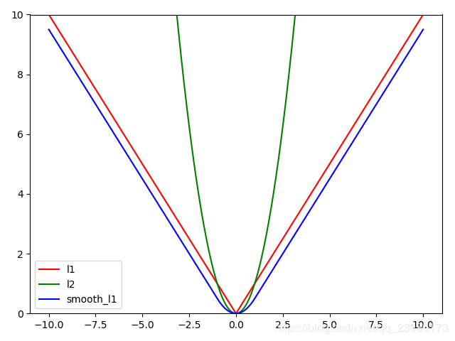

交叉熵函数：https://www.zhihu.com/tardis/zm/art/35709485?source_id=1003

以下均假设样本数为$N$，所谓的损失是针对一个样本的。

对于回归任务，以下均假设真实标签是$y=(y_1,...,y_p)$，预测结果是$\hat y=(\hat y_1,...,\hat y_p)$，维数为$p$。

对于分类任务，以下均假设真实标签是$u$，预测结果是$\hat u$，共有$c$个类别。更一般的，模型输出的是各个类别的概率$p=(p_1,p_2,...,p_c)$

### L1损失

$$
L_1(\hat y,y)=\frac1p\sum_{i=1}^p |\hat y_i -y_i|
$$

### L2损失

$$
L_2(\hat y,y)=\frac1p\sum_{i=1}^p (\hat y_i -y_i)^2
$$

### smooth L1

$$
smooth_{L_1}=\frac1p\sum_{i=1}^p \text{smooth}(\hat y_i -y_i)\\
\text{smooth}(x)=\begin{cases}
0.5x^2, &|x|<1\\
|x|-0.5, &|x|\ge1
\end{cases}
$$

