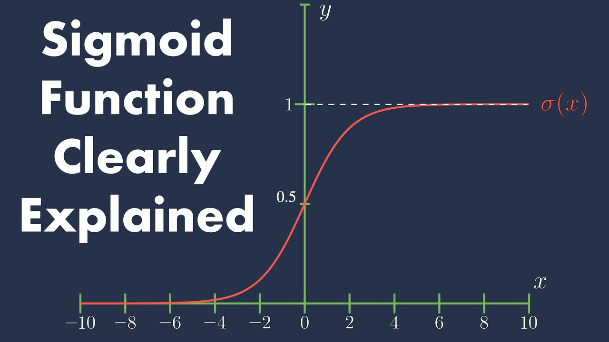
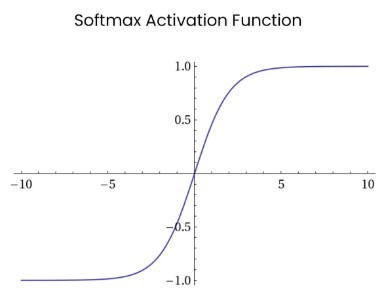

（本文在生成式AI的帮助下完成）

[toc]

# sigmoid

在神经网络中，Sigmoid函数经常被用作激活函数，尤其是在传统的神经网络结构中。它的数学表达式是：
$$
σ(x)=\frac1{1+e^{−x}}
$$

这个函数的输出范围在0到1之间，使其在某些情况下非常有用，尤其是在需要将输出解释为概率时，比如二分类问题中。

其优点包括

- **输出解释性强**：因为其输出范围为[0, 1]，可以直接被解释为概率。
- **平滑梯度**：Sigmoid函数是可微的，并且其导数形式简单，这意味着可以使用梯度下降等方法进行有效的训练。

其缺点包括

- **梯度消失问题**：Sigmoid函数在输入值较大或较小的情况下，导数接近0，这会导致在深层网络中梯度无法有效回传，从而使训练过程变得非常慢。
- **非零中心输出**：Sigmoid函数的输出不是以0为中心的，这会导致网络在训练过程中的优化更加困难。

# Softmax

Softmax函数通常用于多分类网络模型的输出层，可以将输出值转化为概率分布，适用于分类问题中的类别预测。

$$
f(x_i) = \frac{e^{x_i}}{\sum_{j} e^{x_j}}
$$

Softmax 是用于多类分类问题的激活函数，在多类分类问题中，超过两个类标签则需要类成员关系。对于长度为 K 的任意实向量，Softmax 可以将其压缩为长度为 K，值在（0，1）范围内，并且向量中元素的总和为 1 的实向量。

# Hyperbolic Tangent (tanh)

 tanh函数在输出层之前的隐藏层中较为常见，尤其是在需要输出值范围为[-1, 1]的情况下。它的中心化特性有助于数据处理和网络的收敛。
$$
f(x) = \tanh(x) = \frac{e^x - e^{-x}}{e^x + e^{-x}}
$$

在一般的二元分类问题中，tanh 函数用于隐藏层，而 sigmoid 函数用于输出层，但这并不是固定的，需要根据特定问题进行调整。

# Rectified Linear Unit (ReLU)

ReLU是目前最广泛使用的激活函数之一，主要用于隐藏层。由于其在正数部分是线性的，它可以帮助减少梯度消失问题，提高网络的训练速度。
$$
f(x) = \max(0, x)
$$

它具有如下优点：

- 当输入为正时，不存在梯度饱和问题。
- 计算速度快得多。ReLU 函数中只存在线性关系，因此它的计算速度比 sigmoid 和 tanh 更快。

当然，它也有缺点：

- Dead ReLU 问题。当输入为负时，ReLU 完全失效，在正向传播过程中，这不是问题。有些区域很敏感，有些则不敏感。但是在反向传播过程中，如果输入负数，则梯度将完全为零，sigmoid 函数和 tanh 函数也具有相同的问题。

# Leaky ReLU

Leaky ReLU是ReLU的一个变种，它允许负数部分有一个非零斜率 $α$，通常很小（如0.01）。这个特性可以避免ReLU中的神经元死亡问题，适用于深层网络。

$$
f(x) = \begin{cases} x & \text{if } x > 0 \\ \alpha x & \text{if } x \leq 0 \end{cases}
$$

