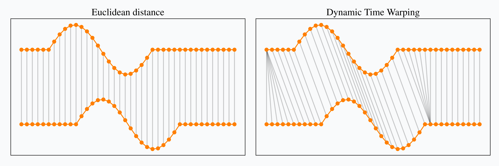

[toc]

本文部分内容在AI帮助下完成。

# 相关性系数

假设要衡量相关性的两列数据是$x=(x_1,x_2,...,x_n)$和$y=(y_1,y_2,...,y_n)$。

## 皮尔逊相关系数 (Pearson correlation coefficient)

皮尔逊相关系数衡量两个定量变量间的线性关系程度。它反映的是当一个变量增加或减少时，另一个变量的趋势变化。
$$
r = \frac{\sum_{i=1}^{n} (x_i - \overline{x})(y_i - \overline{y})}{\sqrt{\sum_{i=1}^{n} (x_i - \overline{x})^2 \sum_{i=1}^{n} (y_i - \overline{y})^2}}
$$
其中$\bar x,\bar y$分别是$x,y$的均值。这个公式本质上是协方差和标准差的比值，是用样本估计出的相关性系数，反映两个变量共变动的方向和程度。

## 斯皮尔曼等级相关系数 (Spearman's rank correlation coefficient)

斯皮尔曼等级相关系数是一种非参数的相关性度量，用于评估两个变量的秩（或排序）之间的相关性，适用于数据不满足正态分布的情况或当数据为序数级别时。

首先将每个变量的数据转换为秩。如果两个数据点有相同的值，将它们赋予平均秩。然后使用公式计算：
$$
\rho = 1 - \frac{6 \sum d_i^2}{n(n^2 - 1)}
$$
其中，$d_i$是$x_i$和$y_i$的秩之差，$n$是数据点的数量。

> 所谓秩，是这样定义的：对于一组数（标量）$\{x_1,x_2,\dots,x_n\}$，将其排序（升序和降序不影响结果）成为$\{x_{i_1},x_{i_2},\dots,x_{i_n}\}$，那么$x_{i_k}$的秩就是$k$。考虑到相同的值应该具有相同的秩，所以对相同的值$x_{i_{k+1}},x_{i_{k+2}},\dots,x_{i_{k+m}}$，它们的秩应该取均值$\frac{\sum_{j=1}^m {k+j}}{m}$。

## Kendall排位相关系数 (Kendall's tau coefficient)

Kendall 的$\tau$系数是一个用来度量两个数据集合中的相对等级之间关联性的统计量，它评估在任意两个观察对中，观测值的排列是否一致。
$$
\tau = \frac{2}{n(n-1)} \sum_{i < j} \text{sgn}(x_i - x_j) \text{sgn}(y_i - y_j)
$$
其中$\text{sgn}$函数是符号函数。

## 距离相关系数 (Distance correlation)

距离相关系数用于度量两个变量之间的总体关联，包括线性和非线性的关系。它基于原始数据点之间的距离，而不仅仅是秩或直线距离。
$$
\text{dCor}(X,Y) = \frac{\text{dCov}(X,Y)}{\sqrt{\text{dCov}(X,X) \text{dCov}(Y,Y)}}
$$
其中，$\text{dCov}(X,Y)$ 是距离协方差，定义为：
$$
\text{dCov}^2(X,Y) = \frac{1}{n^2} \sum_{a,b} A_{ab} B_{ab}
$$
$A_{ab}$和$B_{ab}$是距离矩阵$(a_{ij})$和$(b_{ij})$的中心化矩阵，其中$a_{ij}=|x_i−x_j|, b_{ij}=|y_i−y_j|$。

> 此部分待议，GPT给出的公式与我在其他处查到的不一样

# 总体典型相关分析

## 思路

有两组变量分别是$X_1,...,X_p$和$Y_1,...,Y_q$，如何衡量它们之间的相关性？考虑分别做线性变换$V=a'X,W=b'Y$（其中$X=(X_1,...,X_p)',Y=(Y_1,...,Y_q)'$），尽可能使$V$与$W$的相关系数最大，这个最大的相关性就可以衡量两组变量之间的相关性。

考虑到$\rho(V,W)=\rho(cV+d,eW+f)$，这说明使得相关系数最大的$a,b$不唯一，于是加以限制$D(V)=D(W)=1$。

给出数学定义：

> 设$p+q$维随机向量$\begin{pmatrix}X \\ Y\end{pmatrix}$的均值向量为$0$，协方差矩阵$\Sigma>0$，不妨设$p\le q$，如果存在向量$a_1=(a_{11},...,a_{p1})'$和$b_1=(b_{11},...,b_{q1})'$使得
> $$
> \rho(a_1'X,b_1'Y)=\max\limits_{D(a'X)=1,D(b'Y)=1}\rho(a'X,b'Y)
> $$
> 则称$a_1'X$和$b_1'Y$分别是$X,Y$的第一对典型相关变量，$\rho(a_1'X,b_1'Y)$称为第一个典型相关性系数。
>
> 进一步，如果存在向量$a_k=(a_{1k},...,a_{pk})'$和$b_k=(b_{1k},...,b_{qk})'$使得
>
> （1）$a_k'X,b_k'Y$与之前$k-1$对典型相关变量都不相关
> （2）$D(a_k'X)=D(b_k'Y)=1$
> （3）$a_k'X$与$b_k'Y$的相关性系数最大
>
> 则称$a_1'X$和$b_1'Y$分别是$X,Y$的第$k$对典型相关变量，$\rho(a_1'X,b_1'Y)$称为第$k$个典型相关性系数（$k=2,...,p$）。

## 计算

记$Z=\begin{pmatrix}X \\ Y\end{pmatrix},D(Z)=\Sigma=\begin{pmatrix}\Sigma_{11}&\Sigma_{12}\\ \Sigma_{21}&\Sigma_{22}\end{pmatrix}>0$，其中$\Sigma_{11}$是$p\times p$的矩阵，已知$E(Z)=0,p\le q$，我们不加证明地给出下述结论：

令$M_1=\Sigma_{11}^{-1}\Sigma_{12}\Sigma_{22}^{-1}\Sigma_{21},M_2=\Sigma_{22}^{-1}\Sigma_{21}\Sigma_{11}^{-1}\Sigma_{12}$，它们的特征值$\lambda_1^2\ge\lambda_2^2\ge\cdots\ge\lambda_p^2>0$是相同的，那么$a_1$将是$M_1$的属于$\lambda_1^2$的特征向量，且要满足$a_1'\Sigma_{11}a_1=1$（可以通过先求特征向量，再乘系数$1/\sqrt{a_1'\Sigma_{11}a_1}$来实现），而$b_1$将是$M_2$的属于$\lambda_1^2$的特征向量，且要满足$b_1'\Sigma_{22}b_1=1$。这是求第一对典型相关变量的方法，第一典型相关系数则是$\lambda_1$。（自然的想，$M_1,M_2$的属于$\lambda_k^2$的特征值，同理经过放缩，得到的会是$a_k,b_k$吗？书上并未提到，私以为是的。）

更一般的，记$T=\Sigma_{11}^{-\frac12}\Sigma_{12}\Sigma_{22}^{-\frac12}$，这是一个$p\times q$的矩阵，再设$p$解方阵$TT'$的特征值依次为$\lambda_1^2\ge\lambda_2^2\ge\cdots\ge\lambda_p^2>0$，其中每个$\lambda_i>0$，而对应的单位正交特征向量分别是$l_1,l_2,...,l_p$。令
$$
a_k = \Sigma_{11}^{-\frac12} l_k,\ \ \ 
b_k = \lambda_k^{-1}\Sigma_{22}^{-1}\Sigma_{21}a_k\ \ 
(k=1,2,...,p)
$$
则$V_k=a_k'X,W_k=b_k'Y$是$X,Y$的第$k$对典型相关变量，$\lambda_k$是第$k$个典型相关系数。

在上述结果中，有条件$\Sigma>0$，但实际中的协方差矩阵只能保证非负定（半正定），无法保证正定，因而$\Sigma_{11}^{-1},\Sigma_{22}^{-1}$未必存在。对于更一般的情况，应该在上述结果中一切逆运算出现的场合，使用广义逆（也可称伪逆、加号逆）来代替逆矩阵。

## 性质

记$V_k=a_k'X,W_k=b_k'Y$是$X,Y$的第$k$对典型相关变量，$\lambda_k$是第$k$个典型相关系数，记$V=(V_1,...,V_p)'$，$W=(W_1,...,W_p)'$，$A=(a_1,...,a_p)$为$p\times p$阶矩阵，$B=(b_1,...,b_p)$为$q\times p$阶矩阵，那么可以写成
$$
V=(V_1,...,V_p)'=(a_1'X,...,a_p'X)'=
\begin{pmatrix}
a_1' \\ a_2' \\ \vdots \\ a_p'
\end{pmatrix}X = A'X \\
W=(W_1,...,W_p)'=(b_1'X,...,b_p'Y)'=
\begin{pmatrix}
b_1' \\ b_2' \\ \vdots \\ b_p'
\end{pmatrix}X = B'Y \\
$$
有以下性质：

1. （典型变量之间的相关性）$\rho(V_i,V_j)=\rho(W_i,W_j)=1(i\ne j),\rho(V_i,W_i)=\lambda_i$

1. （典型变量与原始变量的相关性）记$Z=\begin{pmatrix}X \\ Y\end{pmatrix}$的协方差矩阵为$\Sigma=\begin{pmatrix}\Sigma_{11}&\Sigma_{12}\\ \Sigma_{21}&\Sigma_{22}\end{pmatrix}>0$，则有
   $$
   \text{COV}(X,V)=\text{COV}(X,A'X)=\Sigma_{11}A \\
   \text{COV}(X,W)=\text{COV}(X,B'Y)=\Sigma_{12}B \\
   \text{COV}(Y,V)=\text{COV}(Y,A'X)=\Sigma_{21}A \\
   \text{COV}(Y,W)=\text{COV}(Y,B'Y)=\Sigma_{22}B \\
   $$
   
1. （线性变换后的典型变量）略
   

## 分析过程

要进行典型相关分析，首先应该检验$\Sigma_{12}=0$与否，如果等于零，则根本不相关，无需分析相关性。

# 相似度衡量算法

对于两个序列$x=(x_1,x_2,...,x_n)$和$y=(y_1,y_2,...,y_n)$，如何描述它们的相似程度？这就是相似度衡量算法解决的问题。

## 余弦相似度

余弦相似性通过测量两个向量的夹角的余弦值来度量它们之间的相似性。它不考虑向量的“长度”，而只关注“方向”。因此，非常适合用于文本、语义嵌入、用户画像等高维稀疏向量之间的相似度比较。

设有两个向量 $\mathbf{A} = (a_1, a_2, ..., a_n)$，$\mathbf{B} = (b_1, b_2, ..., b_n)$，它们的余弦相似度定义为：
$$
\text{cosine\_similarity}(A, B) 
= \cos(\theta) 
= \frac{\mathbf{A} \cdot \mathbf{B}}{\|\mathbf{A}\| \cdot \|\mathbf{B}\|} 
= \frac{\sum_{i=1}^{n} a_i b_i}{\sqrt{\sum_{i=1}^{n} a_i^2} \cdot \sqrt{\sum_{i=1}^{n} b_i^2}}
$$
其值越大，则两个向量越相似，取值范围为$[-1.1]$。

## 动态时间规整DTW

（本部分参考[An introduction to Dynamic Time Warping](https://rtavenar.github.io/blog/dtw.html)，作者Romain Tavenard。注意，本文中为了简化记号，部分记法与原博文和原论文不一致。）

动态时间规整 (Dynamic Time Warping, DTW) 最初用于语音领域，用来代替欧氏距离，以解决两个序列时间不对齐的问题。

举个例子说明所谓的时间不对齐，下图中上下两个序列的形状完全相同，但是存在时间上的偏移。若用欧氏距离相当于将同一时刻的点做匹配，算出来的距离就会大。DTW希望可以“按形状”来匹配两个序列中的点，这样在形状相似但时间不对齐的序列上表现更好。

用数学语言描述，DTW算法给出的$x=(x_1,\cdots,x_n)$和$y=(y_1,\cdots,y_m)$两序列距离为
$$
DTW(x,y) = 
\min_{\pi \in \mathcal{A}(x,y)} \left(
\sum_{(i,j) \in \pi} d(x_i,y_j)^q
\right)^\frac1q
$$
其中$\pi$表示对齐路径，它包含$K$个下标对，也即$\pi=\{(i_1,j_1),\cdots,(i_K,j_K)\}$，每个下标对表示两序列中对应下标的点做匹配。$\mathcal{A}(x,y)$表示序列$x,y$中的点能构成的全部可能的路径集合。$d(a,b)$表示两个值$a,b$的距离，可以简单地用欧氏距离（二范数）。$q$带来了类似$p$-范数的形式，原作者在这里放个参数可能只是为了提供更高的自由度，实际用的时候取$q=1$就行。

一个路径自然地拥有以下约束：

- 边界条件：两个序列的第一个元只能匹配第一个元，最后一个元只能匹配最后一个元。也即任何路径$\pi$必然以$(1,1)$开头，$(n,m)$结尾。（注意，前文假设序列的首位下标是$1$。）

- 单调性：匹配序列时保持序列的先后顺序不变，也即下标对中的索引是单调递增的。也即$i_{k-1} \le i_k,j_{k-1} \le j_k$.
- 连续性：两个序列中的每个索引都得在路径里出现，不能跳着匹配。这要求路径中相邻的下标之间不能差$1$以上，也即$i_k\le x_{k-1}+1,j_k\le j_{k-1}+1$.

考虑用一个$n\times m$的矩阵$A$来表示出$\mathcal{A}(x,y)$，令第$i$行$j$列的元为$d(x_i,y_j)$，此时一个路径$\pi$就是从$A$左上角走到右下角的路，且每次移动只能选择向下、向右或向右下移动一格，将路径上所有点都加起来就是$\sum_{(i,j) \in \pi} d(x_i,y_j)$.

这样一来，问题就变成了如何根据$A$找到总距离最小的路径$\pi$。幸运的是，可以使用动态规划找到此优化问题的精确解决方案。由于路径有连续性，所以每个点要么是从左边，要么是从上边，要么是从左上来的，于是抵达第$i$行$j$列元素的最小总距离为
$$
R_{i,j} = d(x_i,y_j) + \min\{R_{i-1,j}, R_{i,j-1}, R_{i-1,j-1},\}
$$
边界条件为$R_{1,1}=d(x_1,y_1)$，这样求出的$R_{n,m}$就是DTW给出的两序列距离了。