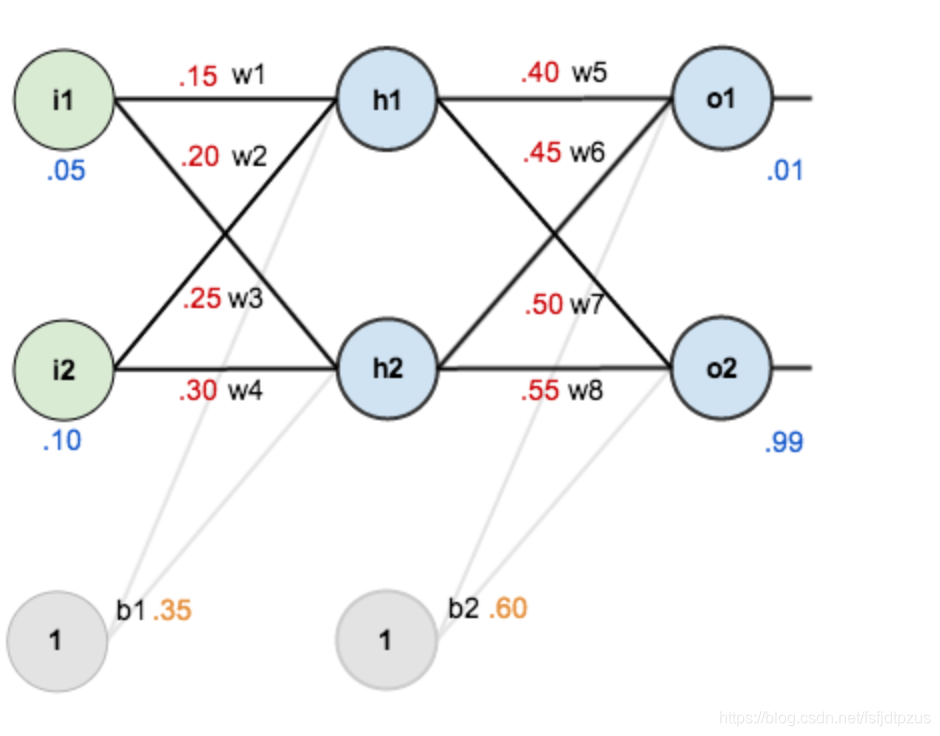

[toc]

# 基本概念

在统计学中，一个输入数据集由很多条（行）向量（variable）组成，每个向量的分量实际上是自由变量的观测值（observation），这样一条数据叫样本（sample）。

在机器学习中，将一条（行）向量称为样本（sample），或者实例（instance）、观测（observation）、输入向量（input vector）、特征向量（feature vector），其每个分量称为特征（feature）。

在训练模型时，训练集往往要反复使用多次，每一次用全部训练样本进行一次训练，就称一个纪元（epoch）。在每个纪元中，训练样本被分成多组，每次只用一组，一组就叫一个批次（batch），批次的容量（batch size）应该是训练样本总数除以批次数目。比如一共有$50000$条样本，共训练$10$纪，每一纪分$50$批训练，每一批次的容量都应该是$1000$。

~~特别的，批次数目仅为1（也即批次容量是全部训练样本数）时称为批次梯度下降（batch gradient descent, BGD）；批次容量仅为1（也即批次数目是全部训练样本数）时称为随机梯度下降（stochastic gradient descent, SGD）；批次数目与容量均不为1时称为微型批次梯度下降（mini-batch gradient descent）。~~

> 为什么要训练多个epoch和分batch？
>
> 我们使用一个迭代过程即梯度下降来优化模型参数，一个epoch意味着整个数据集完整地通过了一次模型。通常情况下，仅训练一个epoch是不够的，因为这样模型只看了一次所有的数据，很难达到最优。多个epoch可以确保模型有足够的机会（迭代次数）学习数据集中的各种特征和模式。
>
> 分batch则有硬件和软件两方面好处：
>
> 1. **内存效率**：通常，训练数据集非常大，一次性加载所有数据进行训练需要非常大的内存，这对于大多数硬件来说是不可行的。通过分批处理，每次只加载一个小批次的数据，可以有效减少内存的使用。
> 2. **加速收敛**：使用小批量数据可以使得梯度更新更频繁，加快收敛速度。与每次只用一个样本更新模型（随机梯度下降）相比，批处理可以减少训练过程中的方差，使训练更稳定。
> 3. **避免局部最小值和鞍点**：相对于使用整个数据集的梯度下降，批处理由于其固有的噪声性，可以帮助模型跳出局部最小值或鞍点，寻找到更好的全局最小值。

# 神经网络的训练过程

神经网络的训练过程是一个系统且复杂的过程，涉及多个关键步骤。以下是从数据准备到模型训练完毕的详细步骤：

1. 数据收集与预处理

	- **数据收集**：首先需要收集足够的数据来训练模型。这些数据可以来自多种来源，如在线数据集、实验测量或实时系统。
	- **数据清洗**：清除数据中的错误、重复值或无用信息。
	- **数据预处理**：包括归一化（将数据缩放到一定的数值范围，常见的如0到1或-1到1）、标准化（将数据转换为均值为0，标准差为1的分布）、编码类别数据、处理缺失值等。

2. 数据分割

	- **训练集、验证集与测试集**：数据被分为三部分。训练集用于模型训练，验证集用于调整模型参数和防止过拟合，测试集用于在训练完成后评估模型的性能。

3. 模型设计

	- **选择网络架构**：根据问题的性质选择适当的神经网络类型，如全连接网络、卷积神经网络、循环神经网络等。
	- **配置层和节点**：设计网络的层数和每层的节点数。

4. 批处理数据

	- **批次大小选择**：确定每个批次包含的样本数量。批次大小会影响训练的效率和模型的最终性能。

5. 编译模型

	- **选择优化器**：如SGD、Adam等，优化器会影响模型的训练速度和效果。
	- **设定损失函数**：如均方误差、交叉熵等，损失函数用来计算预测值和真实值之间的差距。
	- **评价指标**：如准确率、召回率等，用于在训练过程中评估模型的表现。

6. 模型训练

	- **前向传播**：数据通过网络，从输入层传到输出层。
	- **损失计算**：计算输出层的预测值和真实值之间的差异。
	- **反向传播**：根据损失函数对网络中的权重进行调整。
	- **权重更新**：使用优化器根据反向传播得到的梯度更新权重。

7. 迭代优化

	- **多个周期**：整个数据集通常需要多次通过网络（称为epoch），每次迭代都会尝试减少损失函数的值。

8. 模型评估与调整

	- **使用验证集**：定期使用验证集检查模型性能，避免过拟合。
	- **超参数调整**：调整学习率、批次大小、层数、节点数等参数，以获得更好的训练结果。

9. 测试与部署

	- **模型测试**：在独立的测试集上评估模型性能。
	- **模型部署**：将训练好的模型部署到实际应用中。

# 反向传播算法/梯度传播

神经网络本质上是一个带参数$\theta$的函数$f_\theta(x)$，在参数$\theta$确定之前”$f$“代表了一个广阔的函数空间，我们希望找到最佳的参数$\theta$使得$f_\theta$能够达到很好的拟合或者预测效果，也即$\hat y=f_\theta(x)$与希望的输出$y$接近，也即损失函数$\text{Loss}(\hat y,y)$尽量小。如何”找到最好的$\theta$“呢？这就要用反向传播算法了。

### 思路

反向传播算法 (Backpropagation，简称BP算法) 是“误差反向传播”的简称，是计算神经网络最优参数的一种学习算法，它建立在梯度下降法的基础上。严格来说梯度下降法才是计算最优参数的方法，反向传播算法是用于计算梯度的算法。

梯度下降法是一切寻优算法的基础，许多的训练方法都是基于梯度下降法改良出来的。梯度下降法通过计算损失函数的梯度，并让参数向这个负梯度方向移动来更新参数以最小化损失函数。

梯度方向是函数上升最快的方向，使自变量沿着负梯度方向移动，就可以令函数值减小。如果用损失函数来评价模型的优劣，损失函数值越小就说明模型越好，那么我们需要让模型参数移动到某个最优解，使得损失函数值最小。

为了获取最优的模型参数$w$，我们需要用最终的损失函数$loss$对$w$求导，求出的导数（梯度）$\nabla_{loss}$应该是与$w$同形状的向量（矩阵、张量），这之后更新$w$为$w-\alpha\nabla_{loss}$，以此迭代得到最优的$w$。

为了实现上述的梯度下降法，我们总是需要求出$loss$对$w$的导数。从$w$算到$loss$会经过很多步骤，可以用链式法则来递归或者迭代地计算出全部中间变量的梯度，进而获取最终结果$loss$关于变量$w$的梯度。这一过程称为反向传播算法。

比如$L=l(y),y=f(w,x)$，此时要计算$l$关于$w$的梯度，考虑到$\frac{\part l}{\part w}=\frac{\part l}{\part y}\frac{\part y}{\part w}$，只要先算出$\frac{\part l}{\part w}$，再算出$\frac{\part y}{\part w}$后相乘即可。

### 实现

为了实现反向传播算法，我们首先按照计算图正序，从各个叶子结点算出全部节点的值，这一过程叫前向传播。之后，沿着计算图从上往下，依次算出每个节点关于其邻接节点的导数（梯度），这之后立刻根据链式法则更新最终结果$y$关于该节点的邻接节点的梯度。如此一路延伸，最终就可以算得$y$关于叶子结点的梯度。每个节点保存下来的梯度，都是$y$关于其值的梯度。这一过程叫反向传播。

> 可以这样想，每个变量都是一个类，它有着值和梯度两个属性，分别记录自身的值以及关于loss的梯度。不论是网络的参数还是每一层的结果，此时都视为一样的”变量“。只不过只有参数需要记录梯度结果，中间节点的梯度用完即清理。

在实际中，由于输入输出都是数组，也即函数都是向量值函数而非一元函数，所以求出来的导数会有雅可比矩阵，乃至更高维数的张量。这在编写程序上是很难实现的，为了解决这个问题，我们规定，只能直接实现标量对张量的求导。这样一来，标量对张量的导数，就是由对分量的导数所形成的一个同维的张量，这是容易做到的。

然而，在计算过程中，难免会有张量形式的中间变量，张量对张量求导是难以避免的。为了在这种情况下依然能求出最终的标量对初始张量的导数，实际程序中求张量对张量的导数时，需要给出一个与自变量同形状的张量$v$作为参数，输出的则是这个参数与“张量对张量导数”的乘积。具体细节可以参考以下的例子。

>设$l=f(y),y=g(x)$，其中$l$是标量，$y=(y_1,...,y_m)^T$是$m$维向量，$x=(x_1,...,x_n)^T$是$n$维向量。为求出$\frac{\part l}{\part x}$，首先应该求出$\frac{\part l}{\part y}$与$\frac{\part y}{\part x}$。
>
>理论上我们知道，求出来的结果应该是
>$$
>\frac{\part l}{\part y}=\left( \frac{\part l}{\part {y_1}},...,\frac{\part l}{\part {y_m}} \right) \\
>\frac{\part y}{\part {x}}=
>\begin{pmatrix}
>\frac{\part {y_1}}{\part {x_1}} & \cdots & \frac{\part {y_1}}{\part {x_n}}\\
>\vdots & \ddots &\vdots \\
>\frac{\part {y_m}}{\part {x_1}} & \cdots & \frac{\part {y_m}}{\part {x_n}}\\
>\end{pmatrix}
>$$
>所以
>$$
>\frac{\part l}{\part x}
>=\frac{\part l}{\part y}\frac{\part y}{\part x}
>=\left( \frac{\part l}{\part {y_1}},...,\frac{\part l}{\part {y_m}} \right)
>
>\begin{pmatrix}
>\frac{\part {y_1}}{\part {x_1}} & \cdots & \frac{\part {y_1}}{\part {x_n}}\\
>\vdots & \ddots &\vdots \\
>\frac{\part {y_m}}{\part {x_1}} & \cdots & \frac{\part {y_m}}{\part {x_n}}\\
>\end{pmatrix}
>=\begin{pmatrix}
>\frac{\part {l}}{\part {y_1}}\frac{\part {y_1}}{\part {x_1}}+\cdots+\frac{\part {l}}{\part {y_m}}\frac{\part {y_m}}{\part {x_1}} \\
>\vdots \\
>\frac{\part {l}}{\part {y_1}}\frac{\part {y_1}}{\part {x_n}}+\cdots+\frac{\part {l}}{\part {y_m}}\frac{\part {y_m}}{\part {x_n}} \\
>\end{pmatrix}^T
>$$
>注意，在上式中，导数的符号是严格按照数学中雅可比矩阵的定义写的，因而”梯度向量“是一个行向量，而不是机器学习中常用的列向量。或者说，数学上习惯将向量默认为列向量，但对机器学习来说，一个样本通常被看作行向量。
>
>由此可见，如果我们不想写出高维的$\frac{\part y}{\part {x}}$，又要计算出$\frac{\part l}{\part {x}}$，只要把$\frac{\part l}{\part {y}}$传递给$y$，直接通过$\frac{\part l}{\part {y}}$和$y=g(x)$来计算出结果$\frac{\part l}{\part {x}}$即可。体现在程序上，就是将$\frac{\part l}{\part {y}}$作为一个参数，在计算$$\frac{\part y}{\part {x}}$$时传递给计算用的函数Func，让这个Func直接返回$\frac{\part l}{\part x}$。
>
>为了方便理解，可以这样看待：在计算张量$y$对张量$x$的梯度（导数）时，函数Func需要接收一个与$y$维数相同的参数（实际上是最终目标$l$关于$y$的导数），记为$v$，在计算出导数$J=\frac{\part y}{\part x}$后，Func实际返回的是$v$与$J$的乘积。
>
>更进一步，可以把$J$看作是$(\frac{\part {y_1}}{\part x},\frac{\part {y_2}}{\part x},...,\frac{\part {y_m}}{\part x})^T$，也即是一个与$v$、与$y$都同维数的“向量”，其每个“分量”都是标量对$x$求导，因而也是与$x$同维数的向量。所谓的“$v$与$J$的乘积”，实际上是二者的对应项相乘再求和，得到的还是与$x$同形状的张量。

### 例子

为了理解反向传播的过程，考虑下面的例子：

其中：

- 输入数据：$i_1=0.05，i_2=0.10$ 
- 初始权重系数：$w_1=0.15，w_2=0.20，w_3=0.25，w_4=0.30，w_5=0.40，w_6=0.45，w_7=0.50，w_8=0.55$
- 隐藏层神经元：h1，h2 
- 输出层神经元：o1，o2 
- 偏置项(bias)：b1=0.35，b2=0.60
- 激活函数：sigmoid

给出输入数据(i1, i2)=(0.05, 0.10)，我们希望输出尽可能与原始输出(o1, o2)=(0.01, 0.99)接近。

将激活前的值用小写字母记，激活后的用大写字母记，第一次前向传播，得到
$$
h = \left(\begin{matrix} h_1 \\ h_2 \end{matrix}\right)
= W_1i + b_1
= \left(\begin{matrix} w_1 & w_2\\ w_3 & w_4 \end{matrix}\right)
  \left(\begin{matrix} i_1 \\ i_2 \end{matrix}\right) + \left(\begin{matrix} b_1 \\ b_1 \end{matrix}\right)
= \left(\begin{matrix} w_1i_1+w_2i_2+b_1 \\ w_3i_1+w_4i_2+b_1 \end{matrix}\right)
= \left(\begin{matrix} 0.3775 \\ 0.3925 \end{matrix}\right) 
\\
H = \sigma(h) 
= \left(\begin{matrix} \frac1{1+e^{-0.3775}} \\ \frac1{1+e^{-0.3925}} \end{matrix}\right)
= \left(\begin{matrix} 0.5933 \\ 0.5969 \end{matrix}\right)
\\
o = \left(\begin{matrix} o_1 \\ o_2 \end{matrix}\right)
= W_2H + b_2
= \left(\begin{matrix} w_5 & w_6\\ w_7 & w_8 \end{matrix}\right)
  \left(\begin{matrix} H_1 \\ H_2 \end{matrix}\right) + \left(\begin{matrix} b_2 \\ b_2 \end{matrix}\right)
= \left(\begin{matrix} w_5H_1+w_6H_2+b_2 \\ w_7H_1+w_8H_2+b_2 \end{matrix}\right)
= \left(\begin{matrix} 1.1059 \\ 1.2249 \end{matrix}\right) 
\\
O = \sigma(o) 
= \left(\begin{matrix} \frac1{1+e^{-1.1059}} \\ \frac1{1+e^{-1.2249}} \end{matrix}\right)
= \left(\begin{matrix} 0.7514 \\ 0.7729 \end{matrix}\right)
\\
L = \frac12\|y-O\|^2_2 = \frac12\sum_i(y_i-O_i)^2
$$
接下来进行第一次反向传播，按照如下顺序进行
$$
\frac{\part L}{\part O} 
= \left(\frac{\part L}{\part O_1} , \frac{\part L}{\part O_2}  \right)
= \left( O_1-y_1 , O_2-y_2 \right) 
\\
\frac{\part O}{\part o} 
= \left(\begin{matrix} 
		\frac{\part O_1}{\part o_1} & \frac{\part O_1}{\part o_2} \\ 
		\frac{\part O_2}{\part o_1} & \frac{\part O_2}{\part o_2}
  \end{matrix}\right)
= \left(\begin{matrix} 
		\sigma'(o_1) & 0 \\ 
		0 & \sigma'(o_2)
  \end{matrix}\right)
= \left(\begin{matrix} 
		\sigma(o_1)(1-\sigma(o_1))  & 0 \\ 
		0 & \sigma(o_2)(1-\sigma(o_2)) 
  \end{matrix}\right)
= \left(\begin{matrix} 
		O_1(1-O_1)  & 0 \\ 
		0 & O_2(1-O_2) 
  \end{matrix}\right)
$$
从而
$$
\frac{\part L}{\part o} = \frac{\part L}{\part O} \frac{\part O}{\part o} 
=\left(\frac{\part L}{\part O_1} , \frac{\part L}{\part O_2}  \right) \left(\begin{matrix} 
		\frac{\part O_1}{\part o_1} & \frac{\part O_1}{\part o_2} \\ 
		\frac{\part O_2}{\part o_1} & \frac{\part O_2}{\part o_2}
  \end{matrix}\right)
= \Big(\begin{matrix} 
		O_1(1-O_1)(O_1-y_1), &
		O_2(1-O_2)(O_2-y_2)
  \end{matrix}\Big)
$$
这就可以算出损失函数关于中间变量$o$的偏导数$\frac{\partial L}{\partial o}$。进一步，由
$$
\frac{\partial o}{\partial W_2} 
= \left(\begin{matrix} 
		\frac{\part o_1}{\part w_5} & \frac{\part o_1}{\part w_6} & 
		\frac{\part o_1}{\part w_7} & \frac{\part o_1}{\part w_8} \\ 
		\frac{\part o_2}{\part w_5} & \frac{\part o_2}{\part w_6} & 
		\frac{\part o_2}{\part w_7} & \frac{\part o_2}{\part w_8} 
  \end{matrix}\right)
= \left(\begin{matrix} 
		H_1 & H_2 & 0 & 0 \\ 
		0 & 0 & H_1 & H_2 
  \end{matrix}\right) \\
\frac{\partial L}{\partial W_2} 
= \frac{\partial L}{\partial o} \frac{\partial o}{\partial W_2} 
= \left(\begin{matrix} 
		O_1(1-O_1)(O_1-y_1)H_1 \\
		O_1(1-O_1)(O_1-y_1)H_2 \\
		O_2(1-O_2)(O_2-y_2)H_1 \\
		O_2(1-O_2)(O_2-y_2)H_2
  \end{matrix}\right)^T
$$
这就算出了关于参数（权重矩阵）$W_2$的梯度，同理可以算出
$$
\frac{\partial o}{\partial b_2} 
= \left(\begin{matrix} 
		\frac{\part o_1}{\part b_2}  \\ 
		\frac{\part o_2}{\part b_2} 
  \end{matrix}\right)
= \left(\begin{matrix} 
		1 \\ 
		1 
  \end{matrix}\right) \\
\frac{\partial L}{\partial b_2} 
= \frac{\partial L}{\partial o} \frac{\partial o}{\partial b_2} 
= \left(\begin{matrix} 
		O_1(1-O_1)(O_1-y_1) \\
		O_2(1-O_2)(O_2-y_2)
  \end{matrix}\right)^T
$$
继续，算出关于$W_1,b_1$的梯度：
$$
\frac{\partial o}{\partial H} 
= \left(\begin{matrix} 
		\frac{\part o_1}{\part H_1} & \frac{\part o_1}{\part H_2} \\ 
		\frac{\part o_2}{\part H_1} & \frac{\part o_2}{\part H_2}
  \end{matrix}\right)
= W_2 \\

\frac{\partial H}{\partial h} 
= \left(\begin{matrix} 
		\frac{\part H_1}{\part h_1} & \frac{\part H_1}{\part h_2} \\ 
		\frac{\part H_2}{\part h_1} & \frac{\part H_2}{\part h_2}
  \end{matrix}\right)
= \left(\begin{matrix} 
		\sigma'(h_1) & 0 \\ 
		0 & \sigma'(h_2)
  \end{matrix}\right)
= \left(\begin{matrix} 
		H_1(1-H_1)  & 0 \\ 
		0 & H_2(1-H_2) 
  \end{matrix}\right) \\
  
\frac{\partial h}{\partial W_1} 
= \left(\begin{matrix} 
		\frac{\part h_1}{\part w_1} & \frac{\part h_1}{\part w_2} & 
		\frac{\part h_1}{\part w_3} & \frac{\part h_1}{\part w_4} \\ 
		\frac{\part h_2}{\part w_1} & \frac{\part h_2}{\part w_2} & 
		\frac{\part h_2}{\part w_3} & \frac{\part h_2}{\part w_4} 
  \end{matrix}\right)
= \left(\begin{matrix} 
		i_1 & i_2 & 0 & 0 \\ 
		0 & 0 & i_1 & i_2 
  \end{matrix}\right) \\
  
  \frac{\partial h}{\partial b_1} 
= \left(\begin{matrix} 
		\frac{\part h_1}{\part b_1}  \\ 
		\frac{\part h_2}{\part b_1} 
  \end{matrix}\right)
= \left(\begin{matrix} 
		1 \\ 
		1 
  \end{matrix}\right) \\
  
\frac{\partial L}{\partial W_1} 
= \frac{\partial L}{\partial o} \frac{\partial o}{\partial H} \frac{\partial H}{\partial h} \frac{\partial h}{\partial W_1} \\
\frac{\partial L}{\partial b_1} 
= \frac{\partial L}{\partial o} \frac{\partial o}{\partial H} \frac{\partial H}{\partial h} \frac{\partial h}{\partial b_1} 
$$
最后的结果表达式过于繁琐，我就不列出来了，上述计算过程已足以表明，所有需要的梯度都确实可以计算出来。

