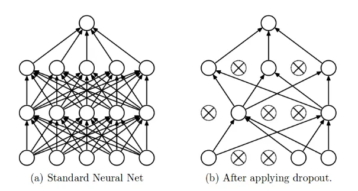

dropout：https://zhuanlan.zhihu.com/p/38200980

梯度爆炸问题：https://blog.csdn.net/qq_40765537/article/details/106063941

权重初始化：Glorot初始化（Xavier初始化），He初始化

梯度裁剪（gradient clipping）：设置梯度范围阈值，避免梯度过大导致的梯度爆炸。

标签平滑：将标签与一定的噪声混合，提高泛化能力。

混合精度训练：维持损失不变，训练速度提升。


[toc]


# 结构设置

## dropout

### 参考

https://zhuanlan.zhihu.com/p/38200980

https://towardsdatascience.com/dropout-in-neural-networks-47a162d621d9

### 思路

dropout用于解决神经网络的过拟合问题。

什么是过拟合？深度神经网络有不同的架构，有时很浅，有时很深，试图对给定的数据集进行泛化。但是，在过于努力地从数据集中学习不同特征的过程中，它们有时会学习数据集中的统计噪声。这无疑会提高模型在训练数据集上的性能，但在新数据点（测试数据集）上却大为失败。这就是过拟合问题。为了解决这个问题，我们有各种正则化技术来惩罚网络的权重，但这还不够。

减少过拟合的最佳方法，是从所有可能的参数设置中获得最好的平均预测结果。但是这在计算上变得过于昂贵，并且对于实时推理/预测来说是不可行的。另一种方案是受到集成技术（例如 AdaBoost、XGBoost 和随机森林）的启发，使用不同架构的多个神经网络共同计算。但这需要训练和存储多个模型，随着时间的推移，随着网络的加深，这将成为一个巨大的挑战。

dropout则采用这样的思想：以 p 的丢弃概率被丢弃神经网络中的节点（输入层和隐藏层），被删除节点的所有前向和后向连接都被暂时删除，然后再进行一次前向传播和反向传播，传播过程中被删除节点的值不更新。这样一来模型不会太依赖某些局部的特征，也即一些关键的节点，而是所有节点得发挥不错的作用。



>为什么说Dropout可以解决过拟合？
>
>（1）取平均的作用： 先回到标准的模型即没有dropout，我们用相同的训练数据去训练5个不同的神经网络，一般会得到5个不同的结果，此时我们可以采用  “5个结果取均值”或者“多数取胜的投票策略”去决定最终结果。例如3个网络判断结果为数字9,那么很有可能真正的结果就是数字9，其它两个网络给出了错误结果。这种“综合起来取平均”的策略通常可以有效防止过拟合问题。因为不同的网络可能产生不同的过拟合，取平均则有可能让一些“相反的”拟合互相抵消。dropout掉不同的隐藏神经元就类似在训练不同的网络，随机删掉一半隐藏神经元导致网络结构已经不同，整个dropout过程就相当于对很多个不同的神经网络取平均。而不同的网络产生不同的过拟合，一些互为“反向”的拟合相互抵消就可以达到整体上减少过拟合。
>
>（2）减少神经元之间复杂的共适应关系：  因为dropout程序导致两个神经元不一定每次都在一个dropout网络中出现。这样权值的更新不再依赖于有固定关系的隐含节点的共同作用，阻止了某些特征仅仅在其它特定特征下才有效果的情况 。迫使网络去学习更加鲁棒的特征  ，这些特征在其它的神经元的随机子集中也存在。换句话说假如我们的神经网络是在做出某种预测，它不应该对一些特定的线索片段太过敏感，即使丢失特定的线索，它也应该可以从众多其它线索中学习一些共同的特征。从这个角度看dropout就有点像L1，L2正则，减少权重使得网络对丢失特定神经元连接的鲁棒性提高。
>
>（3）Dropout类似于性别在生物进化中的角色**：**物种为了生存往往会倾向于适应这种环境，环境突变则会导致物种难以做出及时反应，性别的出现可以繁衍出适应新环境的变种，有效的阻止过拟合，即避免环境改变时物种可能面临的灭绝。

### 代码

以下是使用torch.nn.Dropout来实现dropout的一个例子

```python

import torch.nn as nn

class MyModel(nn.Module):
    def __init__(self):
        super(MyModel, self).__init__()
        self.layer1 = nn.Linear(10, 50)
        self.dropout = nn.Dropout(p=0.25)  # 25% 的概率丢弃
        self.layer2 = nn.Linear(50, 2)

    def forward(self, x):
        x = self.layer1(x)
        x = nn.functional.relu(x)
        x = self.dropout(x)  # 应用 dropout
        x = self.layer2(x)
        return x
```

在这个例子中，dropout只对上一层（layer1）生效。

> 既然dropout只对layer1生效，为什么不把 x = self.dropout(x)放在x = nn.functional.relu(x)之前，而是放在之后？
>
> 1. **保留激活特征的完整性**：
>    - ReLU 激活函数的作用是引入非线性并将所有负值置为零，这有助于模型学习复杂的模式。在 ReLU 之后应用 `dropout`，意味着您是在非线性激活后的结果上进行随机的神经元丢弃。这样可以保持激活后的特征表示的完整性，然后再从这些特征中随机选择子集，这可能有助于网络在训练过程中更好地泛化。
> 2. **避免激活前的值被随机抑制**：
>    - 如果在 ReLU 之前应用 `dropout`，那么负值和正值都有相同的机会被随机丢弃。这可能导致一些本应通过 ReLU 激活为零的负值被保留，而一些有益的正值被丢弃，从而扭曲了模型在该层的学习表达。
> 3. **实验结果和经验**：
>    - 大多数研究和实际应用中发现，在 ReLU 之后使用 `dropout` 往往能获得更好的训练效果。这是因为激活后的特征通常更有信息量，对于后续层的学习更为重要。通过在激活后应用 `dropout`，模型被迫学习使用这些非线性激活后的部分特征来进行预测，从而可能增强模型对输入数据的理解和泛化能力。


## 残差连接

### 参考

https://blog.csdn.net/u014665013/article/details/81985082

### 思路

残差连接（Residual Connections）是深度学习中一种重要的结构创新，最著名的应用是在深度残差网络（Residual  Networks，简称ResNet）中。ResNet由微软研究院的Kaiming  He等人在2015年提出，该架构通过引入残差连接解决了深度神经网络训练过程中的退化问题，即随着网络深度的增加，网络的训练误差反而上升。

其核心思想是每一层都可以表示为学习残差函数$F(x)$，而不是学习一个直接的映射函数$H(x)$。考虑这样的情况，如果一个恒等映射是最优的，那么让层去逼近0的残差比去逼近恒等映射要容易得多。因此，ResNet让这些层去拟合残差$F(x)=H(x)−x$，而非直接去拟合输出$H(x)$。这种结构称为“残差块”，它允许信息通过“捷径”（shortcut connection）或“直连通道”（identity connection）直接传递，避免了深度网络中梯度消失的问题。

### 实现

假设我们想要的映射为$H(x)$，我们把网络层设计成学习一个残差映射$F(x):=H(x)−x$。因此，原始的映射就被重写为$F(x)+x$。以下面的结构为例，假设网络是一个简单的全连接层：


可以看到一个弯弯的弧线，这个就是所谓的”shortcut connection“。实际的forward过程就是
$$
F(x) = W_2\sigma(W_1x+b_1)+b_2 \\
H(x) = \sigma(F(x) + x)
$$
上述例子中的$F(x)$与$x$是向量。但残差连接作为一种思想，可以用在各种网络层上，比如在卷积神经网络中，它们是特征图，$F(x)$与$x$可能是特征图等等。

当$F(x)$与$x$的形状不一致时，直接相加会遇到问题。在ResNet中，这个问题通过引入一个调整维度的操作来解决，这个操作通常在捷径连接（shortcut connection）中实现。

这个调整维度的操作通常有两种方式：

1. 卷积调整: 使用一个卷积层来改变$x$的维度（比如通道数、高度、宽度等），使其与$F(x)$的维度匹配。这个卷积层通常有一个$1 \times 1$的卷积核，步长和$F(x)$的计算过程中使用的步长相匹配，以确保空间维度的一致性。这种方式不仅能调整通道数，还能调整特征图的尺寸。但这样会增加参数，也会增加计算量。
2. 零填充调整: 如果只是通道数不一致，而空间维度（即高度和宽度）相同，另一种较为简单的方式是通过在通道维度上添加额外的零来增加$x$的通道数，使其与$F(x)$匹配。这种方式不引入额外的参数，但仅限于通道数的调整。

这两种方式中，卷积调整更为通用，可以处理通道数和空间维度的不一致问题，而零填充调整则更简单，适用于特定情况。在实际的ResNet实现中，通常采用卷积调整方法。


## Batch Normalization（BN层）

### 参考

具体讲了过程：https://blog.csdn.net/Superstar02/article/details/101537792

提供了意义层面的解释：https://blog.csdn.net/qq_40765537/article/details/105548340

### 思想

神经网络学习过程本质是为了学习数据分布，一旦训练数据与测试数据的分布不同，则网络的泛化能力也大大降低；其次，一旦每批训练数据的分布各不相同，那么网络就要在每次迭代都去学习适应不同的分布（新的数据分布），这样将会大大降低网络的训练速度。
神经网络训练，参数就会发生变化，除了输入层，后面网络每一层的输入数据分布是一直在发生变化的，因为在训练的时候，前面层训练参数的更新将导致后面层输入数据分布的变化。作者将这种数据分布的改变称之为Internal Covariate Shift（内部协变量偏移）。
同时，之前的研究表明如果在图像处理中对输入图像进行白化（Whiten）操作的话——所谓白化，就是对输入数据分布变换到0均值，单位方差的正态分布——那么神经网络会较快收敛。所以受白化启发，batch normalization被提出。

白化是在输入层对数据进行变换使其服从标准正态分布。对深度神经网络来说，其中某个隐层的输出就是下一层的输入，那么能不能对每个隐层都做白化呢？BN确实就是这么做的，并且在模型训练中取得了良好的效果。

### 算法

一个样本是对一个随机向量的采样，随机向量的方差实际上是协方差矩阵。作者为了简化计算，并不对层输入和层输出的特征进行联合白化，仅独立的对每个分量特征进行标准化，这同样加快了收敛速度。

Batch Normalization通常在网络的全连接层或卷积层之后、激活函数之前执行。其步骤可以概括为以下几点：

给定一个batch的数据$B = {x_1, x_2, ..., x_m}$，其中每个$x_i$是一个$d$维的向量（而不是标量），代表一个样本。

1. **计算小批量的均值向量** $\mu_B$： $\mu_B=\frac1m\sum_{i=1}^mx_i$，这里$\mu_B$也是一个$d$维的向量，每个元素是对应维度上所有样本特征的均值。
2. **计算小批量的方差向量** $\sigma^2_B$： $\sigma_B^2 = \frac1m \sum_{i=1}^m (x_i-\mu_B)\odot(x_i-\mu_B)$，这里$\odot$表示Hadamard积（即元素对元素的乘积），结果$\sigma^2_B$是一个$d$维的向量，每个元素表示对应维度上的方差。这里使用Hadamard积实际计算出的是每个特征分量的方差。
3. **归一化** $x_i$： $\hat x_i^{(k)} = \frac{x_i^{(k)}-\mu_B^{(k)}}{\sqrt{(\sigma_B^2)^{(k)}+\epsilon}}$，这意味着在每个维度上独立进行归一化，其中$\epsilon$是一个很小的数，用来防止分母为零。结果$\hat{x}_i=(\hat x_i^{(1)}, \cdots, \hat x_1^{(d)})$是归一化后的向量。
4. **缩放和平移**： $y_i=γ⊙\hat x_i+β$ ，其中$\gamma$和$\beta$是可学习的参数向量，$y_i$是最终的输出向量。

解释一下第四步，如果仅对层的每个输入进行标准化可能会改变层所能表示的内容。作者举了一个例子来说明：对一个sigmoid的输入进行归一化会破坏其分布，本来学习后的特征数据分布在S激活函数的两侧，归一化处理后，数据变换成分布于S函数的中间部分，把学习到的特征分布损坏了。通过引入缩放和平移操作，可以确保即便经过归一化，数据分布也能够在激活函数的有效范围内变化，从而利用非线性特性。

简单来说，即使归一化改变了数据分布，缩放和平移步骤允许模型有能力恢复到任意的均值和方差，从而保留或增强网络的表达能力。在特殊情况下，如果数据不需要归一化处理，模型可以通过调整$\gamma$和$\beta$值来接近取消Batch  Normalization的效果（例如，如果$\gamma$接近$\sqrt{\sigma^2_B +  \epsilon}$，$\beta$接近$\mu_B$，那么$y_i$可以接近原始输入$x_i$）。

$\gamma$和$\beta$值是通过网络训练过程中的反向传播和梯度下降（或其他优化算法）直接学习得到的，而不是通过训练一个额外的网络获得的。它们作为模型的参数（类似于网络中的权重和偏置），在训练过程中与其他参数一起更新。


## Layer Normalization

### 参考

https://zhuanlan.zhihu.com/p/74516930

### 思路

> Batch 顾名思义是对一个batch进行操作。假设我们有 10行 3列  的数据，即我们的batchsize =  10，每一行数据有三个特征，假设这三个特征是【身高、体重、年龄】。那么BN是针对每一列（特征）进行缩放，例如算出【身高】的均值与方差，再对身高这一列的10个数据进行缩放。体重和年龄同理。这是一种“列缩放”。
>
> 而layer方向相反，它针对的是每一行进行缩放。即只看一笔数据，算出这笔所有特征的均值与方差再缩放。这是一种“行缩放”。
>
> 细心的你已经看出来，layer normalization  对所有的特征进行缩放，这显得很没道理。我们算出一行这【身高、体重、年龄】三个特征的均值方差并对其进行缩放，事实上会因为特征的量纲不同而产生很大的影响。但是BN则没有这个影响，因为BN是对一列进行缩放，一列的量纲单位都是相同的。
>
> 那么我们为什么还要使用LN呢？因为NLP领域中，LN更为合适。
>
> 如果我们将一批文本组成一个batch，那么BN的操作方向是，对每句话的**第一个**词进行操作。但语言文本的复杂性是很高的，任何一个词都有可能放在初始位置，且词序可能并不影响我们对句子的理解。而BN是**针对每个位置**进行缩放，这**不符合NLP的规律**。
>
> 而LN则是针对一句话进行缩放的，且**LN一般用在第三维度**，如[batchsize, seq_len, dims]中的dims，一般为词向量的维度，或者是RNN的输出维度等等，这一维度各个特征的量纲应该相同。因此也不会遇到上面因为特征的量纲不同而导致的缩放问题。


# 参数设置

## 正交初始化（Orthogonal Initialization）

网络参数的正交初始化（Orthogonal  Initialization）是一种在初始化神经网络权重时使用的技术，其核心思想是通过正交矩阵来初始化权重矩阵，从而帮助模型在训练初期有更好的收敛性。这种方法尤其适用于深层网络，可以有效减少训练过程中的梯度消失或爆炸问题。

实现正交初始化通常可以通过以下步骤进行：

1. **生成随机矩阵**：首先生成一个随机的权重矩阵 W。
2. **矩阵正交化**：使用数学方法（如Gram-Schmidt正交化过程）对矩阵 W 进行正交化处理，确保矩阵的行或列向量互相正交。
3. **归一化处理**：对正交化后的矩阵进行归一化处理，确保每个向量的范数为1。

在PyTorch等现代深度学习框架中，通常已经内置了正交初始化的函数（如`torch.nn.init.orthogonal_`），可以直接使用这些函数来初始化网络的权重。

正交初始化主要影响模型训练的初期阶段，而且权重矩阵在经过训练更新后，很可能不再保持正交性。然而，正交初始化还是有其重要价值和作用的。虽然权重会在训练过程中逐渐失去正交性，但初始的正交性对网络的早期行为影响巨大。良好的初始状态可以使网络更快地进入一个“好”的收敛区域，即使后期权重不再正交，早期的优势依然可以让网络比较稳定地继续训练。

那么最初的时候正交矩阵又为何有利于保证梯度稳定呢？从梯度传播的角度看，在神经网络尤其是深层网络和循环神经网络中，初始的权重如果能保持较好的独立性和均匀性，可以显著减少梯度消失或爆炸的风险，而正交矩阵的条件数（最大奇异值与最小奇异值之比）为1，这有助于梯度流通过网络时保持其规模，从而保持有效的学习速率。从信息熵的角度看，正交初始化帮助在参数空间中均匀地分布概率质量，这使得每个方向的学习初期都是相互独立的。这种均匀分布有助于搜索过程中避免某些方向上的过早饱和，提高了训练过程中的探索效率。

## warm-up

训练初期学习率逐渐升高，之后再按照正常流程逐渐降低。初期设置较低的学习率可以避免初始参数因为更新过大导致的不稳定。

# 训练设置
