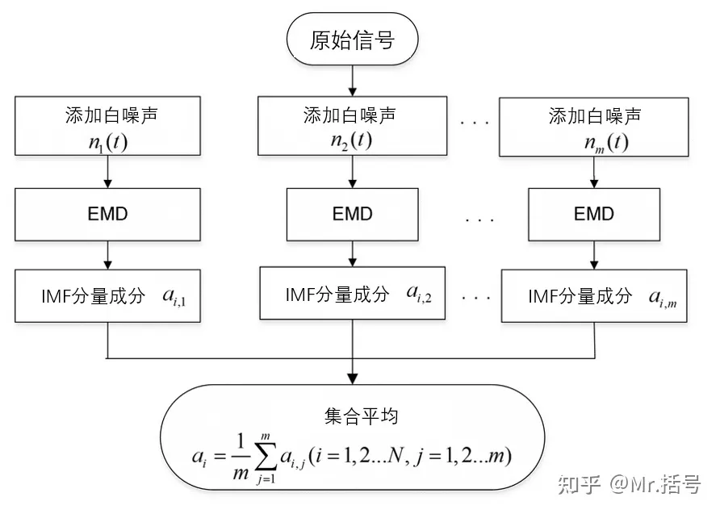
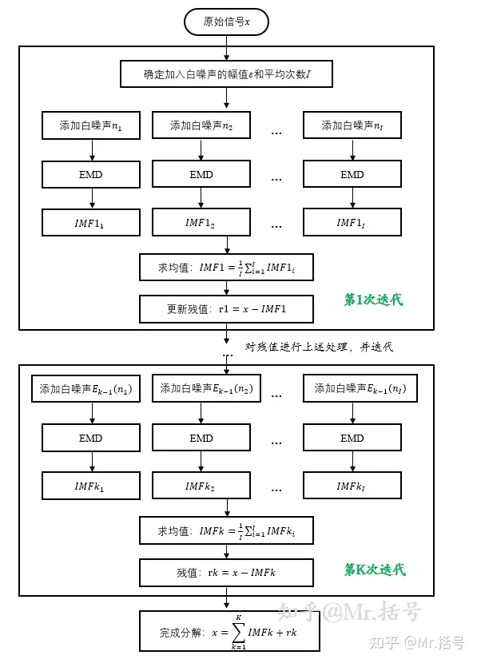

主要参考知乎用户[Mr.看海](https://www.zhihu.com/people/feng-zhu-38)的专栏[与信号处理有关的那些东东](https://www.zhihu.com/column/xinhao)，以下内容来自专栏中不同的文章。

[toc]

# 经验模态分解EMD

## 思路与算法

经验模态分解 (Empirical Mode Decomposition, EMD)，希望将一段任意的信号分解成众多内涵模态分量 (Intrinsic Mode Functions, IMF，也翻译为本征模态函数) 和一个残差的加和，其中每个IMF的性质较好（平稳）。

IMF是原始信号被EMD分解之后得到的各层信号分量。EMD的提出人黄锷认为，任何信号都可以拆分成若干个内涵模态分量之和。而内涵模态分量有两个约束条件：

1）在整个数据段内，极值点的个数和过零点的个数必须相等或相差最多不能超过一个。也即图像要反复跨越x轴，不能在x的一侧出现振荡。

2）在任意时刻，由局部极大值点形成的上包络线和由局部极小值点形成的下包络线的平均值为零，即上、下包络线相对于时间轴局部对称。

EMD的分解过程是简单直观的：

1）根据原始信号上下极值点，分别画出上、下包络线（可能是用插值吧）。

2）求上、下包络线的均值，画出均值包络线。

3）原始信号减均值包络线，得到中间信号。

4）判断该中间信号是否满足IMF的两个条件，如果满足，该信号就是一个IMF分量；如果不是，以该信号为基础，重新做1~4步，最终迭代出一个可行的IMF。IMF分量的获取通常需要若干次的迭代。

使用上述方法得到第一个IMF后，用原始信号减IMF1，作为新的原始信号，再通过1~4的分析，可以得到IMF2，以此类推，完成EMD分解。

最终得到的是多个IMF分量，和一个剩余的残差，残差可以理解为趋势项。

用更加数学的语言来描述：对信号$f(t)$使用EMD分解，利用三次样条曲线构造两个平滑插值函数，分别是极大值点处的插值函数$\bar f(t)$与极小值点处的插值函数$\underline f(t)$，再计算出其平均$m(t)=[\bar f(t)+\underline f(t)]/2$，记$r_1(t)=f(t)-m(t)$，我们希望$r_1(t)$就是一个合格的、满足某些条件的IMF分量。如果$r_1(t)$并不满足，对$r_1(t)$再次重复以上过程，直至得出符合条件的$r_n(t)$，作为第一个分解出的IMF分量，记为$f_1(t)$。再对$f(t)-f_1(t)$做上述处理得到$f_2(t)$……如此便可以得到一系列IMF。

## 应用

如果原始信号是众多不同频率信号的加和，可以想见，提取出的IMF就反应了这些不同频率的“成分”，越靠前的IMF频率越大。所以EMD是一种对信号的时频分析手段。

有一些指标可以衡量IMF分量的重要性：

1. 方差贡献率，即IMF方差与原序列方差的比值。方差贡献率大的分量对原数据影响相较于其他分量更大。需要注意的是，贡献率之和并不等于1。
1. 平均周期，一个IMF的平均周期定义为该IMF的样本点数与其极大值点（或极小值点）个数的比值，该指标可以用来显示IMF分量的周期长短。
1. IMF分量与原数据的相关系数，显然相关系数大的分量与原数据关系更密切。

有分解，自然有重构，将一切IMF分量与残差加起来，就得到了原信号。选取不同的IMF分量加和，可以得到原始信号的不同分解方式。最常见的一种是将原始信号分成高频、低频、趋势项三部分。趋势项自然就是残差，高频部分是前$k$个IMF的加和，低频部分是后$m-k$个IMF的加和，其中$m$是IMF总个数。

现在，需要确定$k$的值。考虑到高频部分基本上是平稳的噪声，记$S_k=\sum_{i=1}^k\text{IMF}_i$是前$k$个IMF之和，检验$S_k$的均值是否为$0$（可以用t检验方法），检验结果应该是$S_k$的均值为零而$S_{k+1}$的均值不为零，由此确定$k$。

# 集合经验模态分解EEMD

EEMD（Ensemble Empirical Mode Decomposition）是最常见的一种EMD改进方法。他的优势主要是解决EMD方法中的模态混叠现象。

模态混叠，顾名思义就是不同模态（也即IMF）中的信号混叠在一起，一般有两种情况：一是不同特征尺度（可理解为不同频率）的信号在一个IMF分量中出现，另一种是同一个特征尺度的信号被分散到不同的IMF分量中。

EEMD主要的改进思路是，利用白噪声均值为零的特性，通过在分解的过程中多次引入均匀分布的白噪声，将信号本身的噪声通过多次人为添加的噪声掩盖过去，从而得到更加精准的上下包络线。同时对分解结果进行平均处理，平均处理次数越多，噪声给分解带来的影响就越小。

EEMD分解主要分为4步：

（1）设定原始信号的处理次数m
（2）对原始信号添加随机白噪声，组成新的信号，重复m次，共得到m个新信号
（3）对这一系列的新信号分别进行EMD分解，得到一系列的IMF分量
（4）对相应模态的IMF分量分别求均值，得到EEMD分解结果

分解得到的结果同样是一系列IMF分量与残差，不过，现在这些IMF分量与残差的加和不再是原信号了。只能说在m趋于无穷时，加和会趋于原始信号。

相较于EMD的自适应分解，EEMD就有一些参数需要调试了：分别是用于平均处理的次数m、添加的白噪声的幅值。其中白噪声的幅值通常用“白噪声幅值的标准差与原始信号幅值标准差之比”来表征。

https://zhuanlan.zhihu.com/p/121803211给出了一个模态混叠的例子，以及它用EMD、EEMD处理的结果。

# 互补集合经验模态分解CEEMD

互补集合经验模态分解（Complementary Ensemble Empirical Mode Decomposition, CEEMD）是EEMD的进一步改进。

EEMD的前提是认为“多组白噪声的叠加近似等于零”。然而当处理的次数不够多的时候，白噪声往往不能被降低到忽略不计的程度，而想要消除噪声就得增大计算量。针对这个问题，CEEMD的解决思路是，将一对互为相反数的正负白噪声作为辅助噪声加入源信号当中，以消除原来 EEMD 方法分解后重构信号当中残留的多余的辅助白噪声。

基于这个思路，CEEMD计算过程只需要对EEMD做微小的改动：

（1）设定原始信号的处理次数n
（2）获取一个随机白噪声ε，对原信号分别添加ε和-ε，组成新的信号，重复n次，共得到2n个新信号
（3）对这一系列的新信号分别进行EMD分解，得到一系列的IMF分量
（4）对相应模态的IMF分量分别求均值，得到CEEMD分解结果

分解得到的结果同样是一系列IMF分量与残差，这些IMF分量与残差的加和收敛到原信号的速度比EEMD快很多。需要调整的参数与EEMD也相同。

# 自适应噪声完备集合经验模态分解CEEMDAN

CEEMDAN（Complete Ensemble Empirical Mode Decomposition with Adaptive Noise）的中文名称是自适应噪声完备集合经验模态分解，要注意这个方法并不是在CEEMD方法上改进而来的，而是在EMD的基础上加以改进，同时借用了EEMD方法中加入高斯噪声和通过多次叠加并平均以抵消噪声的思想。

CEEMDAN的流程图如下：

用语言叙述则是：确定了白噪声幅值和平均处理的次数I后，每次只提取一个IMF，提取这个IMF的方法是对原始信号的多个副本分别添加多个白噪声，对添加后得到的新信号分别使用EMD方法提取IMF，再取平均，这样得到原始信号的IMF，用原始信号和这个IMF的差值（残差）重复上一过程，提取新的IMF分量，直到残差单调。

# 变分模态分解VMD

## 思路

变分模态分解 (Variational Mode Decomposition, VMD) 与EMD有相似之处，该方法同样假设任何的信号都是由一系列具有特定中心频率的IMF组成。不过，VMD的数学理论更坚实，相比EMD，有着可以指定模态数、避免模态混叠等优势，往往能取得更好的效果。

VMD的假设是，原始信号$f(t)$可分解为$K$个模态$u_k$的加和，我们希望每个模态都具有中心频率和有限带宽，同时每个模态分量中心频率的估计带宽之和最小（这个假设称为VMD约束变分模型）。“每个模态分量中心频率的带宽之和”实际上是关于函数的函数，也即泛函，所谓变分问题，就是求泛函的极值。

以上描述的约束变分表达式为
$$
\min\limits_{\{\mu_k\},\{w_k\}} \sum_{k=1}^K \left\|
\part_t \left[\left(\delta(t)+\frac{i}{\pi t}\right)* u_k(t)\right] e^{-i\omega_k t}
\right\|^2_2 \quad s.t. \sum_{k=1}^K u_k(t)=f(t)
$$
其中$u_k$为分解出的模态，$w_k$为各模态的中心频率，$\delta(t)$为狄利克雷函数。该问题的最优解$\{u_k\}$即是分解的结果。

解释一下，$\left(\delta(t)+\frac{i}{\pi t}\right)* u_k(t)$是对$u_k(t)$做了希尔伯特变换和单边谱分析得到的信号，再乘$e^{-i\omega_k t}$是将信号的中心频率调整成$w_k$。对$\left[\left(\delta(t)+\frac{i}{\pi t}\right)* u_k(t)\right] e^{-i\omega_k t}$求关于$t$的梯度，再计算范数平方，可以估计出这一模态的带宽。

要求解这个变分问题，需要很多数学工具，此处略过不表。

## 参数

该方法的参数为模态数目$K$，惩罚系数$\alpha$，收敛容tol。

K是预先指定的，换言之，分解出的IMF数目是指定的。若设定的K小于待分解信号中有用成分的个数（欠分解），会造成分解不充分，导致模态混叠；若设定的K值大于待分解信号中有用成分的个数（过分解），就导致产生一些没有用的虚假分量。因此，K值的确定对于VMD非常重要。可以穷举查看不同K的效果，也可以用一峭度最大原理、能量差值原则等进行筛选。

惩罚系数 α 决定着 IMF 分量的带宽。惩罚系数越小， 各 IMF 分量的带宽越大，过大的带宽会使得某些分量包含其他分量信号；α值越大，各IMF分量的带宽越小，过小的带宽是使得被分解的信号中某些信号丢失。该系数常见取值范围为1000~3000。

K有一些可以参考的选择方法：

（来自https://blog.csdn.net/weixin_46062179/article/details/124786926）根据能量变化率来选择。在分解$K$层时，第$k$个IMF（记为$u_k(t)$）的能量为$E_K^{(k)}=\sqrt{\frac{1}{n}\sum_{t=1}^nu_k^2(t)}$，所以分解K层的总能量为$E_K=\sum_{k=1}^KE_K^{(k)}$，定义总能量的变化率$\theta_{K,K-1}=\frac{|E_K-E_{K-1}|}{E_{K-1}}(K=2,3,...)$。现在，可以画出$\theta_{K,K-1}$关于$K$变化的图像，如果某个$\theta_{K,K-1}$比上一个显著增大了，则$K-1$就是合适的分解层数。这是因为，根据VMD分解的最优理论结果，每个分量的能量之和应该等于原始信号，而$K$值过大时，多余分量的产生会导致各分量的能量之和过高，所以总能量显著增加就意味着分解次数过高。